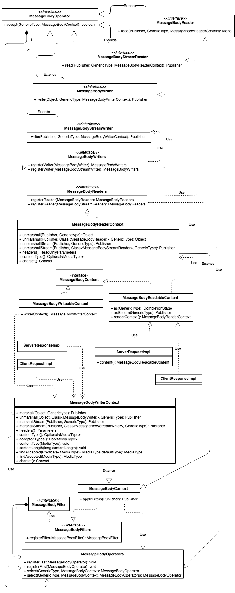

* [Helidon Message Body API](#helidon-message-body-api)
   * [Overview](#overview)
   * [Headers abstraction](#headers-abstraction)
   * [Unmarshalling](#unmarshalling)
   * [Marshalling](#marshalling)
   * [GenericType Support](#generictype-support)
   * [Content subscription events](#content-subscription-events)
   * [MessageBodyContent](#messagebodycontent)
   * [MessageBodyFilter](#messagebodyfilter)
   * [MessageBodyReaderContext](#messagebodyreadercontext)
   * [MessageBodyOperator](#messagebodyoperator)
   * [MessageBodyReader and MessageBodyStreamReader](#messagebodyreader-and-messagebodystreamreader)
   * [MessageBodyWriter and MessageBodyStreamWriter](#messagebodywriter-and-messagebodystreamwriter)
   * [MessageBodyWriterContext](#messagebodywritercontext)
   * [MessageBodyWriteableContent](#messagebodywriteablecontent)
   * [Naming](#naming)
   * [Modules](#modules)
   * [Primitive type](#primitive-type)
   * [Explicit operator selection](#explicit-operator-selection)
   * [Media Support Configuration](#media-support-configuration)
   * [Built-in core conversions](#built-in-core-conversions)
   * [Backward compatibility](#backward-compatibility)

| Revision | Helidon version | Date       | Comment          |
| -------- |:---------------:| :---------:| :---------------:|
| 1        | 1.1.1           | 06/05/2019 | Initial revision |
| 2        | 1.2.0           | 08/01/2019 | 2nd pass         |

## Helidon Message Body API

This document describes an API proposal for the Helidon SE Media support.

The API provides a re-usable mechanism to consume and generate HTTP payload for both the Helidon HTTP server (webserver) and future HTTP client.

See the diff for the POC at https://github.com/oracle/helidon/compare/master...romain-grecourt:multipart-take2

### Overview

The message body API is composed of the existing Helidon Webserver content API and new mechanisms to help implement media support across Helidon modules.

The main way to consume and return payload remains unchanged from a user perspective:

```java
// consume a server request payload
serverRequest.content().as(Foo.class).thenAccept(foo -> response.send("foo: " + foo));

// send a server response payload
serverResponse.send(new Foo());
```

However there is now an new alternative way:

```java
GenericType<Foo> fooType = GenericType.create(Foo.class);

// consume a server request payload
MessageBodyReadableContent content = serverRequest.content();
Mono<Foo> mono = content.readerContext().unmarshall(content, fooType);
mono.toFuture().thenAccept(foo -> response.send("foo: " + foo));

// send a server response payload
Publisher<DataChunk> payload = serverResponse.writerContext().marshall(new Foo(), fooType, null);
serverResponse.send(payload);
```

See the following UML class diagram:
<p align="center"></p>

`ServerResponseImpl`, `ServerRequestImpl`, `ClientRequestImpl` and `ClientResponseImpl` are pseudo classes used to illustrate the use of the API with the implementation of server and client request / response interfaces.

### Headers abstraction

In order to make reader and writer implementations work with both client or server, the API needs not to depend on either.
Both `MessageBodyReaderContext` and `MessageBodyWriterContext` can abstract headers by using the API provided by the `common-http` module and provide implementation of common tasks for the operators to use.

The context instance is passed to every method of all operators: `accept`, `read` and `write`. Depending on the operator the use of the headers is different:

- readers work against inbound HTTP headers ; e.g. server request or client response
- writers work against outbound HTTP headers ; e.g. server response or client request

Every operator has two methods:

1. `accept`: implements the selection mechanism
2. `read` or `write` implements the unmarshalling or marshalling operation

Headers play a role in both methods, an operator should be selected based on the requested type and based on the value of the headers (e.g. typically Content-Type).

Let's define a common algorithm for all readers such that they are usable for both client and server:

1. `accept`: the requested type is supported by the writer AND (the inbound `Content-Type` header is supported OR is not set)
2. `read`: if a charset is needed, derive it from the inbound `Content-Type` header is set defines a charset, otherwise use the server default charset

Inbound headers should be read-only so that they are not modified by the readers. 

Let's define a common algorithm for all writers such they are usable for both client and server:

1. `accept`: the requested type is supported by the writer AND (the outbound `Content-Type` is set and accepted OR the writer's default `Content-Type` is accepted)
2. `write`:
  - a: if the outbound `Content-Type` header is not set, find the accepted `Content-Type` using the writer's default `Content-Type` as a fallback (in case of wildcard matching). This may throw an exception if not accepted value is found as a selected reader **must** have an accepted value
  - b: if the outbound `Content-Type` header is not set, set it to the accepted `Content-Type` value
  - c: if a charset is needed, derive it from the accepted `Content-Type` value if it defines a charset, otherwise use the server default charset

An "accepted" `Content-Type` header is a header that is matching an `Accept` header value. A server response has a corresponding request which may have an `Accept` header value. If there no `Accept` header value (e.g. the request did not provide one, or it is a client request), then the everything is accepted ; i.e '*/*'.

The underlying outbound headers should be writeable, writers can set any arbitrary header.

Here are the header related methods provided by `MessageBodyReaderContext`:

```java
public ReadOnlyParameters headers() {
  // uses ReadOnlyParameters to enforce read-only headers
}

public Optional<MediaType> contentType() {
  // returns the Content-Type header value as a MediaType instance
  // caches for optimization to avoid re-parsing every time
}

public boolean hasContentType(MediaType default) {
  // designed to be used when implementing the accept method of a reader
  // if the Content-Type header is set, return true if the default matches, false if not
  // otherwise return true
}

@Override
public Charset charset() throws IllegalStateException {
  // designed to be used when implementing the read method of a reader
  // derive the charset from the `Content-Type` value if set and the charset parameter is defined
  // throws an IllegalStateException exception if the charset cannot be loaded
  // otherwise use the server default
}
```

Here are the header related methods provided by `MessageBodyWriterContext`:

```java
public Parameters headers() {
  // uses Parameters to allow writes
}

public Optional<MediaType> contentType() {
  // returns the Content-Type header value as a MediaType instance
  // caches for optimization to avoid re-parsing every time
}

public void contentType(MediaType contentType) {
  // sets the Content-Type header value if not already set
}

public void contentLength(long contentLength) {
  // sets the Content-Length header value if not already set
}

public List<MediaType> acceptedTypes() {
  // returns the list of accepted types
  // never null, empty means any type is accepted
}

public boolean isAccepted(Predicate<MediaType> predicate)  {
  // designed to be used when implementing the accept method of a writer
  // apply the given predicate against the accepted types
  // return true if a match, false if not
}

public boolean isAccepted(MediaType defaultType)  {
  // designed to be used when implementing the accept method of a writer
  // match the supplied default against the accepted types and return true if it matches, false if not
}

public MediaType findAccepted(Predicate<MediaType> predicate, MediaType defaultType)
  throws IllegalStateException {

  // designed to be used when implementing the write method of a writer
  // if the Content-Type is set, return it
  // otherwise test each accepted type with the given predicate
  // return the first match as "type/subtype" if it does not have wildcards, otherwise return the
  // given defaultType.
  // throw an exception if no accepted type is found since selected writer must have an accepted type
}

public MediaType findAccepted(MediaType defaultType) throws IllegalStateException {
  // designed to be used when implementing the write method of a writer
  // if the Content-Type is set, return it
  // otherwise find an accepted type that matches the given type and return the default type
  // throw an exception if no accepted type is found since selected writer must have an accepted type
}

@Override
public Charset charset() throws IllegalStateException {
  // designed to be used when implementing the write method of a reader
  // derive the charset from the `Content-Type` value if set and the charset parameter is defined
  // throws an IllegalStateException exception if the charset cannot be loaded
  // otherwise use the server default
}
```

### Unmarshalling

Note that `ClientResponse` is a pseudo class, Helidon currently does not have an HTTP client API.
Assuming that `ClientResponse` would be modeled after `ServerRequest` and thus would have a "content" method:

```java
MessageBodyReadableContent content();
```

Consume a server request payload:

```java
request.content().as(Foo.class).thenAccept((Foo foo) -> response.send("foo: " + foo));
```

Consume a client response payload:

```java
response.content().as(Foo.class).thenAccept(Foo foo) -> System.out.prinltn("foo: " + foo));
```

Consume a payload as a collection of objects: 

```java
GenericType<List<Foo>> foosType = new GenericType<List<Foo>>() {};
request.content().as(foosType).thenAccept((List<Foo> foo) -> response.send("foos: " + foo));
```

Consume a payload as a reactive stream of object:

```java
request.content().asStream(foo.class).subscribe(new Subscriber<Foo>() {
  
  @Override
  public void onSubscribe(Subscription subscription) {
    subscription.request(Long.MAX_VALUE);
  }

  @Override
  public void onNext(Foo foo) {
    System.out.println("foo: " + foo);
  }

  @Override
  public void onError(Throwable throwable){
    request.next(throwable);
  }

  @Override
  public void onComplete(){
    res.send("OK");
  }
});
```

NOTE: consuming or returning a "stream" payload implies that the serialization format supports streaming. It uses a different set of readers and writers that support such formats.

### Marshalling

Note that `ClientRequest` is a pseudo class, Helidon currently does not have an HTTP client API.
Assuming that `ClientRequest` would be modeled after `ServerResponse` and thus would have a set of "send" methods:

```
send(T content);
send(Publisher<T> content);
send(Publisher<DataChunk> content);
send();
```

Send a server response with payload:

```
response.send(foo);
```

Send a server response with payload as a collection of objects:

```
GenericType<List<Foo>> foosType = new GenericType<List<Foo>>() {};
List<Foo> foos = /* ... */ ;
response.send(foos, foosType);
```

Send a server response with payload as a reactive stream of objects:

```
Publisher<Foo> fooPublisher = /* ... */;
response.send(fooPublisher, new GenericType<>(Foo.class));
```

Note that this implies that the serialization format supports streaming. It uses a different set of writers aka `stream writers` that support such formats.

### GenericType Support

The underlying reader / writer API uses `GenericType` as a first-class citizen. This allows for generic collection mapping.

```java
public class Person {

    private String name;

    public String getName() {
        return this.name;
    }

    public void setName(final String name) {
        this.name = name;
    }

    @Override
    public String toString() {
      return "Person{ " + name " } ";
    }
}

// generic type representing List<Person>
GenericType<List<Person>> personsType = new GenericType<List<Person>>() {};

// HTTP post handler for a list of foo.
Routing.builder()
  .register(JsonBindingSupport.create())
  .post("/persons", (req, res) -> {
      req.content().as(personsType).thenAccept((List<Person> persons) -> {
          res.send("persons: " + persons);
      });
  }).build();
```

### Content subscription events

The reactive publishers provided as part of Helidon only support a single subscriber. Content subscription events are a glorified work-around for this limitation, they generalize a delegating reactive subscriber mechanism. It is intended to be used by the server request implemention to provide tracing for content-read events and by the server response implementation to provide tracing for content-write events as well as for sending the response headers lazily.

This event mechanism is part of the public API, however it is more of an internal API ; the end-user exposure is very minimal.

```java
public interface EventListener {
    void onEvent(Event event);
}

public enum EventType {
    BEFORE_ONSUBSCRIBE,
    AFTER_ONSUBSCRIBE,
    BEFORE_ONNEXT,
    AFTER_ONNEXT,
    BEFORE_ONERROR,
    AFTER_ONERROR,
    BEFORE_ONCOMPLETE,
    AFTER_ONCOMPLETE
}

public interface Event {

    EventType eventType();
    Optional<GenericType<?>> entityType();
}

public interface ErrorEvent extends Event {
    Throwable error();
}
```

### MessageBodyContent

```java
public interface MessageBodyContent extends Publisher<DataChunk> {
}
```

This interface extends `Publisher<DataChunk>` and does not add any other method. It is used to model the "raw" message body, it is a base interface for readable message body and writeable message body. The use of this interface is not forced onto the end users, instead it is only used as part of classes and interfaces definition ; methods consuming or returning "raw" payload use `Publisher<DataChunk>`.

This interface is also used as a place holder to clarify some behavior aspect of the provided publisher implements with Javadocs comment. Such behaviors are: single subscriber and non resumable (i.e cancel the subscription and request more items later on).

### MessageBodyFilter

The new style of filter. It is now a reactive processor instead of a `Function<Publisher<DataChunk>, Publisher<DataChunk>`.

```java
public interface MessageBodyFilter extends Processor<DataChunk, DataChunk> {
}
```

Because of the single subscriber limitation of the Helidon provided publishers, the filters must be registered using a special mechanism. They can now be implemented as reactive processor, but cannot be registered as reactive processor.

### MessageBodyReaderContext

This is a new class that exposes a re-usable configured mechanism to unmarshall the message body "raw" payload into objects with reactive constructs.
It uses 2 `MessageBodyOperators` registry, one for the regular readers (i.e the registered `MessageBodyReader` instances) and one for the stream readers (i.e the registered `MessageBodyStreamReader` instances).

It provides the following methods:

```java
@Override
public MessageBodyReaderContext registerReader(MessageBodyReader<?> reader) {
  // ...
}

@Override
public MessageBodyReaderContext registerReader(MessageBodyStreamReader<?> reader) {
  // ...
}

@Deprecated
public <T> void registerReader(Class<T> type,
  io.helidon.common.http.Reader<T> reader) {
  // ...
}

@Deprecated
public <T> void registerReader(Predicate<Class<?>> predicate,
  io.helidon.common.http.Reader<T> reader) {
  // ...
}

public <T> Mono<T> unmarshall(Publisher<DataChunk> payload,
  GenericType<T> type) {
  // ...
}

public <T> Mono<T> unmarshall(Publisher<DataChunk> payload,
  Class<? extends MessageBodyReader<T>> readerType, GenericType<T> type) {
  // ...
}

public <T> Publisher<T> unmarshallStream(Publisher<DataChunk> payload,
  GenericType<T> type) {
  // ...
}

public <T> Publisher<T> unmarshallStream(Publisher<DataChunk> payload,
  Class<? extends MessageBodyStreamReader<T>> readerType, GenericType<T> type) {
  // ...
}
```

- Note that it does provide methods to register old style readers for backward compatibility, these are marked as deprecated and would be effectively removed as part of the 2.0 release (as per semantic versioning rules).

- Note that the type requested by the user is only expressed using `GenericType`, this allows to retain parameters and enables advanced usecases (e.g. unmarshalling into a collection).

- Note the use of `Mono` to express a single item item publisher ; this is not the reactor project's Mono but Helidon's own simplified version.

- Note the two variants that accept `Class<? extends MessageBodyReader<T>>` and `Class<? extends MessageBodyStreamReader<T>>`. These methods are provided to help with overlapping operators, this is a very minor use case and thus these methods are currently limited to this class.

### MessageBodyOperator

This interface represents a message body "operator", i.e a reader or a writer. It exposes a predicate method named `accept` to select a reader.

```java
public interface MessageBodyOperator<T extends MessageBodyContext> {
    boolean accept(GenericType<?> type, T context);
}
```

### MessageBodyReader and MessageBodyStreamReader

```java
public interface MessageBodyReader<T>
  extends MessageBodyOperator<MessageBodyReaderContext> {

    <U extends T> Mono<U> read(Publisher<DataChunk> publisher, GenericType<U> type,
      MessageBodyReaderContext context);
}
```

The reader interface inherits the `accept` method from `MessageBodyOperator`, and defines a `read` method for the unmarshalling.
It defines a type parameter `<T>` as well as a method parameter `<U extends T>`.

This allows to register a reader that supports covariants types. I.e one can register a reader supporting multiple types that share a common super type.
The parameter `<T>` represents the common super type, and the parameter `<U extends T>` represents the actual subtype for a given unmarshall invocation.

See the following pseudo reader implementation:

```java
interface Pet {
  <U extends Pet> U parse(String text) {
    // ...
  }
}

class Cat implements Pet {
  // ...
}

class Dog implements Pet {
  // ...
}

public class PetBodyReader implements MessageBodyReader<Pet> {

    @Override
    public boolean accept(GenericType<?> type, MessageBodyReaderContext context) {
        return Pet.class.isAssignableFrom(type.rawType());
    }

    @Override
    public <U extends Pet> Mono<U> read(Publisher<DataChunk> publisher,
      GenericType<U> type, MessageBodyReaderContext context) {

        return ContentReaders.readString(publisher, context.charset()).map(Pet::parse);
    }
}
```

`MessageBodyStreamReader` is a variant of `MessageBodyReader` with the return type of the `read` method being `Publisher<U>` instead of `Mono<U>`.

```java
public interface MessageBodyStreamReader<T>
  extends MessageBodyOperator<MessageBodyReaderContext> {

    <U extends T> Publisher<U> read(Publisher<DataChunk> publisher,
      GenericType<U> type, MessageBodyReaderContext context);
}
```

This interface could potentially extends `MessageBodyReader` and override the `read` method with `Publisher<U>` as the return type (java supports overriding with covariant return types), however this is not possible to do for the message body writers ; these interfaces are kept separate to keep the API symetrical between readers and writers.

### MessageBodyWriter and MessageBodyStreamWriter

```java
public interface MessageBodyWriter<T>
  extends MessageBodyOperator<MessageBodyWriterContext> {

    Publisher<DataChunk> write(T content, GenericType<? extends T> type,
      MessageBodyWriterContext context);
}
```

Similar to `MessageBodyReader`, the writer interface inherits the `accept` method from `MessageBodyOperator`. It defines a `write` method for the marshalling.
It defines a type parameter `<T>`, but unlike `MessageBodyReader` does not define a method parameter for the actual type invocation. Instead we use a wildcard and specify a covariant range.

See the following pseudo reader implementation:

```java
interface Pet {
  String asString();
}

class Cat implements Pet {
  // ...
}

class Dog implements Pet {
  // ...
}

public class PetBodyWriter implements MessageBodyWriter<Pet> {

    @Override
    public boolean accept(GenericType<?> type, MessageBodyWriterContext context) {
        return Pet.class.isAssignableFrom(type.rawType());
    }

    @Override
    public Publisher<DataChunk> write(Pet pet, GenericType<? extends Object> type,
      MessageBodyWriterContext context) {

        context.contentType(context.findAccepted(MediaType.TEXT_PLAIN));
        return ContentWriters.writeCharSequence(pet.asString(), context.charset());
    }
}
```

`MessageBodyStreamWriter` is a variant of `MessageBodyWriter` with the first parameter of type `Publisher<T>` instead of `T`.
Java does not support overriding method with covariant parameter (only for return type), thus it's not possible to use `Mono<T>` instead of `T` for `MessageBodyWriter` and have the writer interface specialize the stream interface.

```java
public interface MessageBodyStreamWriter<T>
  extends MessageBodyOperator<MessageBodyWriterContext> {

    Publisher<DataChunk> write(Publisher<T> publisher, GenericType<? extends T> type,
      MessageBodyWriterContext context);
}
```

### MessageBodyWriterContext

This is a new class that exposes a re-usable configured mechanism to marshall objects into a "raw" message body payload using reactive constructs.
It uses 2 `MessageBodyOperators` registry, one for the regular writers (i.e the registered `MessageBodyWriter` instances) and one for the stream writers (i.e the registered `MessageBodyStreamWriter` instances).

It provides the following methods:

```java
@Override
public MessageBodyWriterContext registerWriter(MessageBodyWriter<?> writer) {
    // ...
}

@Override
public MessageBodyWriterContext registerWriter(MessageBodyStreamWriter<?> writer) {
    // ...
}

@Deprecated
public <T> MessageBodyWriterContext registerWriter(Class<T> type,
Function<T, Publisher<DataChunk>> function) {
    // ...
}

@Deprecated
public <T> MessageBodyWriterContext registerWriter(Class<T> type,
  MediaType contentType, Function<? extends T, Publisher<DataChunk>> function) {
    // ...
}

@Deprecated
public <T> MessageBodyWriterContext registerWriter(Predicate<?> accept,
  Function<T, Publisher<DataChunk>> function) {
    // ...
}

@Deprecated
public <T> MessageBodyWriterContext registerWriter(Predicate<?> accept,
  MediaType contentType, Function<T, Publisher<DataChunk>> function) {
    // ...
}

public <T> Publisher<DataChunk> marshall(T content, GenericType<T> type,
  MessageBodyWriterContext fallback) {
    // ...
}

public <T> Publisher<DataChunk> marshall(T content,
  Class<? extends MessageBodyWriter<T>> writerType,
  GenericType<T> type, MessageBodyWriterContext fallback) {
    // ...
}

public <T> Publisher<DataChunk> marshallStream(Publisher<T> content,
  GenericType<T> type, MessageBodyWriterContext fallback) {
    // ...
}

public <T> Publisher<DataChunk> marshallStream(Publisher<T> content,
  Class<? extends MessageBodyWriter<T>> writerType, GenericType<T> type,
  MessageBodyWriterContext fallback) {
    // ...
}
```

- Note that, similar to `MessageBodyReaderContext`, it provides methods to register old style writers for backward compatibility, these are marked as deprecated and would be effectively removed as part of the 2.0 release (as per semantic versioning rules).

- Note that the type requested by the user is only expressed using `GenericType`, this allows to retain parameters and enables advanced usecases (e.g. unmarshalling into a collection).

- Note that, similar to `MessageBodyReaderContext`, there are two variants that accept `Class<? extends MessageBodyWriter<T>>` and `Class<? extends MessageBodyStreamWriter<T>>`. These methods are provided to help with overlapping operators, this is a very minor use case and thus these methods are currently limited to this class.

- Note the `fallback` parameter to the `unmarshall` methods. This parameter is not present in the `MessageBodyReaderContext` class. This parameter allows to defer the registration of writers for "writeable content fragments". E.g. Craft a user API where the user can build reactive content fragments without registering any writer and use the writers from a parent writer context at a later time to marshall out the fragments (see the section about `MessageBodyWriteableContent` below). Content fragment can only exist when  generating payload, this is why this `fallback` parameter is only present in the writer context.

This class also abstracts the outbound HTTP headers, see below.

### MessageBodyWriteableContent

This class represents an entity that is a reactive fragment of message body payload.
It holds a value that is either an object, a publisher of object or a raw publisher, and it can marshall out to a raw publisher using a fallback context.

```java
public Publisher<DataChunk> toPublisher(MessageBodyWriterContext fallback) {
  //...
}
```

E.g. Compose a message body payload from multiple fragments represented as publishers.

```java
// End user creates fragments...
MessageBodyWriteableContent fragment1 = MessageBodyWriteableContent.create(new Foo(), new HashParameters());
MessageBodyWriteableContent fragment2 = MessageBodyWriteableContent.create(new Bar(), new HashParameters());

// later on a stream writer or writer converts each fragment to a chunk publisher
MessageBodyWriterContext parentWriterContext = serverResponse.writerContext();
Publisher<DataChunk> fragmentPublisher1 = framents1.toPublisher(parentWriterContext);
Publisher<DataChunk> fragmentPublisher2 = framents2.toPublisher(parentWriterContext);
```

### Naming

The naming revolves around the term "message body", inspired from the code in Jersey.

See the following classe and interface names:

- MessageBodyContent
- MessageBodyReadableContent
- MessageBodyWriteableContent
- MessageBodyContext
- MessageBodyReaderContext
- MessageBodyWriterContext
- MessageBodyOperator
- MessageBodyOperators
- MessageBodyFilters
- MessageBodyReader
- MessageBodyStreamReader
- MessageBodyWriter
- MessageBodyStreamWriter
- MessageBodyFilter

Acceptable suffixes for implementation classes are "BodyWriter", "BodyReader", "Writer" and "Reader".
The naming recommendation is to use "BodyWriter" and "BodyReader" when the name length is acceptable and "body" isn't redudant ; otherwise use "Writer" or "Reader" if it does not conflict with a well known name.

E.g.
- `StringReader` is a bad name for a `MessageBodyReader` implementation since it could be confused with `java.io.StringReader`. Prefer `StringBodyReader` in this case.
- `InputStreamReader` is a terrible name for a `MessageBodyReader` implementation since it could be confused with `java.io.InputStreamReader`. Prefer `InputStreamBodyReader` in this case.
- `BodyPartBodyReader` is not a great name since it repeat `Body` twice. Prefer `BodyPartReader` in this case.

### Modules

The MessageBody* classe and interfaces are all located in the media-common module.

This provides a neutral location that both the webserver and client can depend on.
It is also consistent with the idea of a media support API.

### Primitive type

The new "reader" interface declares has a method with a type parameter bound to a `GenericType` argument:

```
public interface MessageBodyReader<T>
  extends MessageBodyOperator<MessageBodyReaderContext> {

    <U extends T> Mono<U> read(Publisher<DataChunk> publisher, GenericType<U> type,
      MessageBodyReaderContext context);
}
```

This effectively prevents implementation of a reader for supporting a primitive type, e.g. `byte[]`.

E.g. The following does not compile:

```
public class ByteArrayReader implements MessageBodyReader<byte[]> {

    @Override
    public <U extends byte[]> Mono<U> read(Publisher<DataChunk> publisher, GenericType<U> type,
      MessageBodyReaderContext context) {

      return Mono.empty();
    }

    @Override
    public boolean accept(GenericType<?> type, MessageBodyReaderContext context) {
      return byte[].class.isAssignableFrom(type.rawType());
    }   
}
```

Unmarshalling a message body message to a `byte[]` is likely not a common use-case for the end-user, however the following code must be supported:

```
// HTTP post handler
Routing.builder()
  .post("/bytes", (req, res) -> {
      req.content().as(byte[].class).thenAccept((byte[] bytes) -> {
          res.send(new String(bytes));
      });
  })
  .build();
```

This will be supported out of the box without registration of a reader. I.e it's a special case hard-coded within the unmarshalling logic.

### Explicit operator selection

Operators may overlap, the selection mechanism relies on the registration order.
If conflicting operators are registered, there need to be a way to explicitly select an operator.

If the readers and writers were to be discovered from the class-path with an SPI, such a mechanism could be used as a safeguard.

This is however not a primary use-case, overloading all the marshall and unmarshalling methods could potentially clutter the main API. Instead it should be only available with the low-level API, i.e `MessageBodyReaderContext` and `MessageBodyWriter.context`.

```java
public class Person {

    private String name;

    public String getName() {
        return this.name;
    }

    public void setName(final String name) {
        this.name = name;
    }
}

Routing.builder()
  // both JacksonSupport and JsonBindingSupport overlap for Person.class
  // JsonBindingSupport is registered last, thus it is the one selected
  .register(JacksonSupport.create())
  .register(JsonBindingSupport.create())

  // HTTP post handler that uses Jackson explicitly to unmarshall
  .post("/person", (req, res) -> {
    MessageBodyReadableContent content = request.content();
    Mono<Person> personMono = content.readerContext().unmarshall(content, JacksonBodyReader.class,
      GenericType.create(Person.class));
    personMono.toFuture().thenAccept((Person p) -> {
      res.send(p.getName());
    });
  })
  // HTTP get handler that uses Jackson explicitly to marshall
  .get("/person", (req, res) -> {
    Publisher<DataChunk> payload = res.writerContext.marshall(new Person("Bob"), JacksonBodyWriter.class,
      GenericType.create(Person.class), /* writer context fallback */ null)
    res.send(payload);
  })
  .build();
```

This problem can be solved by registering the conflicting media supports separately.

They can be registered on their respective path, e.g.

```java
Routing.builder()
  .register("/foo", JacksonSupport.create())
  .register("/bar", JsonBindingSupport.create())
  //...
```

One could decide to invoke a reader explicitly, however that would result in skipping all the filters and error handling logic.

### Media Support Configuration

Application wide media support. Provides a way to configure the readers and writers once for the application.

- Avoids registering the body readers and body writers for every request.
- Configured Body readers and writers can re-used for both client and server

```java
WebServer server = WebServer.builder(createRouting())
        .config(config)
        .mediaSupport(MediaSupport.builder()
                .registerDefaults()
                .registerReader(MultiPartBodyReader.get()))
        .build();
```

### Built-in core conversions

Some message body operators work off a "core conversions" such as `byte[]` or a `String`. Such operators should not rely other operators for these core conversions.

The existing classes `io.helidon.media.common.ContentReaders` and `io.helidon.media.common.ContentWriters` shall provide the API for these "core conversions" so that the operators can standalone. The existing API provided by these two classes is retained but marked deprecated.

```java
public final class ContentReaders {
  
    private ContentReaders() { }

    public static Mono<byte[]> readBytes(Publisher<DataChunk> chunks) {
      // ...
    }

    public static Mono<String> readString(Publisher<DataChunk> chunks, Charset charset) {
      // ...
    }
}
```

```java
public final class ContentWriters {
  
    private ContentWriters() { }
  
    public static Mono<DataChunk> writeBytes(byte[] bytes, boolean copy) {
      // ...
    }

    public static Mono<DataChunk> writeCharSequence(CharSequence cs, Charset charset) {
      // ...
    }

    public static Mono<DataChunk> writeCharBuffer(CharBuffer buffer, Charset charset) {
      // ...
    }
}
```

It is acceptable for Helidon code to depend on `ContentReaders` or `ContentWriters` directly to ensure the marshalling / unmarshalling behavior.

Helidon code that uses the end-user API for marshalling / unmarshall HTTP payload is actually customizeable. For example, since the webserver static content support uses the registered writer for `Path` ; users can register their own writer.

### Backward compatibility

This goal is to aim for a feature update (i.e increment minor version number) with compile time backward compatible changes.

See below a summary of the deprecated methods and their new counter part:

| Name                                                                  | Replacement                                                           |
| --------------------------------------------------------------------- |:---------------------------------------------------------------------:|
| `io.helidon.common.http.Reader`                                       | `io.helidon.media.common.MessageBodyReader`                           |
| `io.helidon.common.http.Content`                                      | `io.helidon.media.common.MessageBodyReadableContent`                  |
| `io.helidon.common.http.Content.registerFilter()`                     | `io.helidon.media.common.MessageBodyReadableContent.registerFilter()` |
| `io.helidon.common.http.Content.registerReader()`                     | `io.helidon.media.common.MessageBodyReadableContent.registerReader()` |
| `io.helidon.media.common.MessageBodyReadableContent.registerFilter()` | with parameter `io.helidon.media.common.MessageBodyFilter`            |
| `io.helidon.media.common.MessageBodyReadableContent.registerReader()` | with parameter `io.helidon.media.common.MessageBodyReader`            |
| `io.helidon.webserver.ServerResponse.registerFilter()`                | with parameter `io.helidon.media.common.MessageBodyFilter`            |
| `io.helidon.webserver.ServerResponse.registerWriter()`                | with parameter `io.helidon.media.common.MessageBodyWriter`            |
| `io.helidon.media.common.ContentReaders.stringReader()`               | `io.helidon.media.common.ContentReaders.readString()`                 |
| `io.helidon.media.common.ContentReaders.byteArrayReader()`            | `io.helidon.media.common.ContentReaders.readBytes()`                  |
| `io.helidon.media.common.ContentReaders.inputStreamReader()`          | `io.helidon.media.common.PublisherInputStream`                        |
| `io.helidon.media.common.ContentWriters.byteArrayWriter()`            | `io.helidon.media.common.ContentWriters.writeBytes()`                 |
| `io.helidon.media.common.ContentWriters.charSequenceWriter()`         | `io.helidon.media.common.ContentWriters.writeCharSequence()`          |
| `io.helidon.media.common.ContentWriters.charBufferWriter()`           | `io.helidon.media.common.ContentWriters.writeCharBuffer()`            |
| `io.helidon.media.common.ContentWriters.byteChannelWriter()`          | `io.helidon.media.common.ByteChannelBodyWriter`                       |

New methods on existing API:

| Name                                                                    |
| ------------------------------------------------------------------------|
| `io.helidon.webserver.ServerRequest.content().as(GenericType<T>)`       |
| `io.helidon.webserver.ServerRequest.content().asStream(Class<T>)`       |
| `io.helidon.webserver.ServerRequest.content().asStream(GenericType<T>)` |
| `io.helidon.webserver.ServerRequest.content().readerContext()`          |
| `io.helidon.webserver.ServerResponse.send(Publisher<T>)`                |
| `io.helidon.webserver.ServerResponse.send(T, GenericType<T>)`           |
| `io.helidon.webserver.ServerResponse.writerContext()`                   |
| `io.helidon.webserver.WebServer.mediaSupport()`                         |
| `io.helidon.webserver.WebServer.Builder.mediaSupport(MediaSupport)`     |

Non public code updated and made public:

| Before                                       | Now                                     |
| ---------------------------------------------|:---------------------------------------:|
| `io.helidon.webserver.HashParameters`        | `io.helidon.common.http.HashParameters` |
| `io.helidon.common.http.MediaType.Tokenizer` | `io.helidon.common.http.Tokenizer`      |
| `io.heliodn.common.http.CharMatcher`         | `io.heliodn.common.http.CharMatcher`    |
