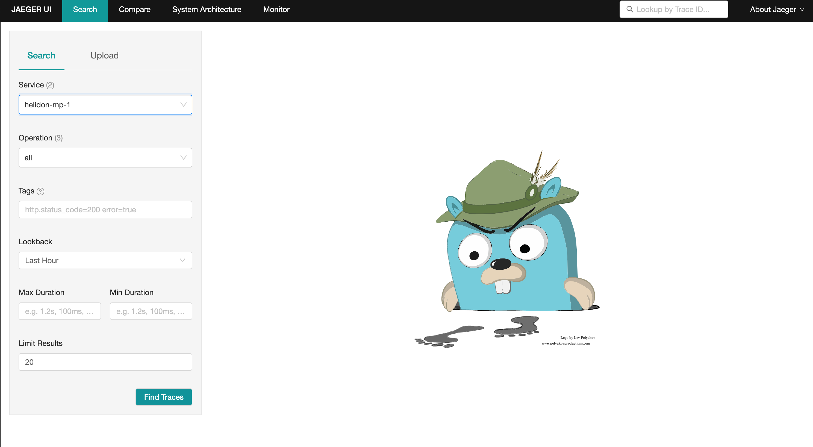
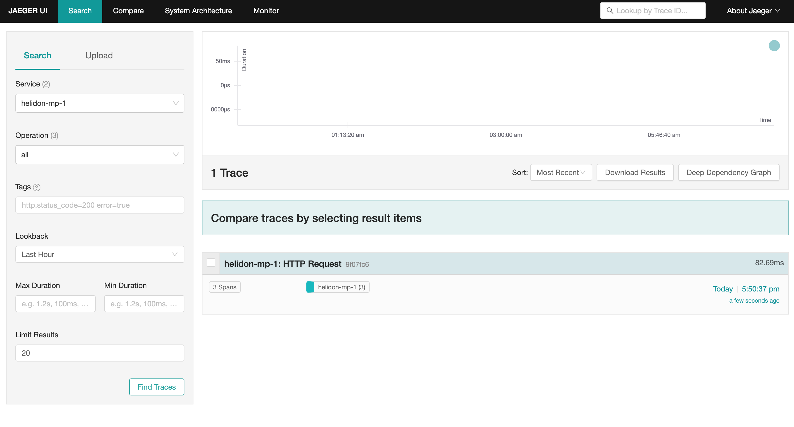
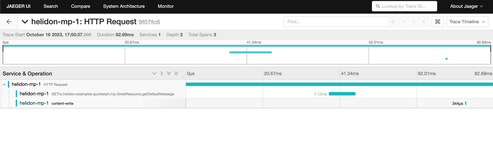

# Helidon MP Tracing Guide

This guide describes how to create a sample MicroProfile (MP) project that can
be used to run some basic examples using tracing with Helidon MP.

## What You Need

For this 30 minute tutorial, you will need the following:

| Requirement                                     | Description                                                                       |
|-------------------------------------------------|-----------------------------------------------------------------------------------|
| [Java 21][java-21] ([Open JDK 21][open-jdk-21]) | Helidon requires Java 21+ (25+ recommended).                                      |
| [Maven 3.8+][maven-3-8]                         | Helidon requires Maven 3.8+.                                                      |
| [Docker 18.09+][docker-18-09]                   | If you want to build and run Docker containers.                                   |
| [Kubectl 1.16.5+][kubectl-1-16-5]               | If you want to deploy to Kubernetes, you need `kubectl` and a Kubernetes cluster. |

Prerequisite product versions for Helidon 4.4.0-SNAPSHOT

Verify Prerequisites:

```shell [Terminal]
java -version
mvn --version
docker --version
kubectl version
```

Setting JAVA_HOME:

```shell [Terminal]
# On Mac
export JAVA_HOME=`/usr/libexec/java_home -v 21`

# On Linux
# Use the appropriate path to your JDK
export JAVA_HOME=/usr/lib/jvm/jdk-21
```

## Introduction

Distributed tracing is a critical feature of microservice based applications,
since it traces workflow both within a service and across multiple services.
This provides insight to sequence and timing data for specific blocks of work,
which helps you identify performance and operational issues. Helidon MP includes
support for distributed tracing through the [OpenTracing
API](https://opentracing.io). Tracing is integrated with WebServer and Security
using either the [Zipkin](https://zipkin.io) or
[Jaeger](https://www.jaegertracing.io) tracers.

### Tracing Concepts

This section explains a few concepts that you need to understand before you get
started with tracing.

- In the context of this document, a *service* is synonymous with an
  application.
- A *span* is the basic unit of work done within a single service, on a single
  host. Every span has a name, starting timestamp, and duration. For example,
  the work done by a REST endpoint is a span. A span is associated to a single
  service, but its descendants can belong to different services and hosts.
- A *trace* contains a collection of spans from one or more services, running on
  one or more hosts. For example, if you trace a service endpoint that calls
  another service, then the trace would contain spans from both services. Within
  a trace, spans are organized as a directed acyclic graph (DAG) and can belong
  to multiple services, running on multiple hosts. The *OpenTracing Data Model*
  describes the details at [The OpenTracing Semantic
  Specification][the-opentracing]. Spans are automatically created by Helidon as
  needed during execution of the REST request.

## Getting Started with Tracing

The examples in this guide demonstrate how to integrate tracing with Helidon,
how to view traces, how to trace across multiple services, and how to integrate
tracing with Kubernetes. All examples use Jaeger and traces will be viewed using
Jaeger UI.

### Create a Sample Helidon MP project

Use the Helidon MP Maven archetype to create a simple project that can be used
for the examples in this guide.

Run the Maven archetype:

```shell [Terminal]
mvn -U archetype:generate -DinteractiveMode=false \
    -DarchetypeGroupId=io.helidon.archetypes \
    -DarchetypeArtifactId=helidon-quickstart-mp \
    -DarchetypeVersion=4.4.0-SNAPSHOT \
    -DgroupId=io.helidon.examples \
    -DartifactId=helidon-quickstart-mp \
    -Dpackage=io.helidon.examples.quickstart.mp
```

The project will be built and run from the helidon-quickstart-mp directory:

```shell [Terminal]
cd helidon-quickstart-mp
```

### Set up Jaeger

First, you need to run the Jaeger tracer. Helidon will communicate with this
tracer at runtime.

Run Jaeger within a docker container, then check the Jaeger server working:

<!--@mdc ::code-callout -->
```shell [Terminal]
docker run -d --name jaeger \                  <1>
  -e COLLECTOR_OTLP_ENABLED=true \
  -p 6831:6831/udp \
  -p 6832:6832/udp \
  -p 5778:5778 \
  -p 16686:16686 \
  -p 4317:4317 \
  -p 4318:4318 \
  -p 14250:14250 \
  -p 14268:14268 \
  -p 14269:14269 \
  -p 9411:9411 \
  jaegertracing/all-in-one:1.50
```
1. Run the Jaeger docker image.
<!--@mdc :: -->

Check the Jaeger server by opening in browser:

```shell [Terminal]
http://localhost:16686/search
```

### Enable Tracing in the Helidon Application

Update the pom.xml file and add the following Jaeger dependency to the
`<dependencies>` section (**not** `<dependencyManagement>`). This will enable
Helidon to use Jaeger at the default host and port, `localhost:14250`.

Add the following dependency to pom.xml:

```xml [pom.xml]
<dependencies>
  <dependency>
    <groupId>io.helidon.microprofile.tracing</groupId>
    <artifactId>helidon-microprofile-tracing</artifactId>
  </dependency>
  <dependency>
    <groupId>io.helidon.tracing.providers</groupId>
    <artifactId>helidon-tracing-providers-jaeger</artifactId>
  </dependency>
</dependencies>
```

All spans sent by Helidon to Jaeger need to be associated with a service.
Specify the service name below.

Add the following line to `META-INF/microprofile-config.properties`:

```properties [microprofile-config.properties]
tracing.service=helidon-mp-1
```

Build the application, skipping unit tests, then run it:

```shell [Terminal]
mvn package -DskipTests=true
java -jar target/helidon-quickstart-mp.jar
```

Run the curl command in a new terminal window and check the response:

```shell [Terminal]
curl http://localhost:8080/greet
```

```json [Response]
{
  "message": "Hello World!"
}
```

### View Tracing Using Jaeger UI

The tracing output data is verbose and can be difficult to interpret using the
REST API, especially since it represents a structure of spans. Jaeger provides a
web-based UI at <http://localhost:16686/search>, where you can see a visual
representation of the same data and the relationship between spans within a
trace. If you see a `Lens UI` button at the top center then click on it, and it
will take you to the specific UI used by this guide.

Click on the UI Find traces button (the search icon) as shown in the image
below.

*Jaeger UI*



The image below shows the trace summary, including start time and duration of
each trace. There are several traces, each one generated in response to a `curl
http://localhost:8080/greet` invocation. The oldest trace will have a much
longer duration since there is one-time initialization that occurs.

*Tracing list view*



Click on a trace, and you will see the trace detail page where the spans are
listed. You can clearly see the root span and the relationship among all the
spans in the trace, along with timing information.

*Trace detail page*



> [!NOTE]
> A parent span might not depend on the result of the child. This is called a
> `FollowsFrom` reference, see [Open Tracing Semantic Spec][open-tracing-sem].
> Note that the last span that writes the response after the root span ends
> falls into this category.

You can examine span details by clicking on the span row. Refer to the image
below, which shows the `security` span details, including timing information.
You can see times for each space relative to the root span. These rows are
annotated with `Server Start` and `Server Finish`, as shown in the third column.

### Enable Tracing on CDI Beans

So far in this tutorial, you have used tracing with JAX-RS without needing to
annotate. You can enable tracing on other CDI beans, either at the class level
or at the method level, as shown by the following examples.

#### Tracing at the Method Level

To trace at the method level, you just annotate a method with @Traced.

Add the @Traced annotation to the getMessage method:

<!--@mdc ::code-callout -->
```java
class GreetingProvider {
    @Traced // <1>
    String getMessage() {
        return message.get();
    }
}
```
1. Enable tracing for getMessage.
<!--@mdc :: -->

Build and run the application, then invoke the endpoints and check the response:

```shell [Terminal]
curl http://localhost:8080/greet
```

Click the back button on your browser, then click on the UI refresh button to
see the new trace. Select the newest trace in the list to see the trace detail
page like the one below. Notice the new span named
`io.helidon.examples.quickstart.mp.greetingprovider.getmessage`.

#### Tracing at the Class Level

To trace at the class level, annotate the class with @Traced. This will enable
tracing for all class methods, except for the constructor and private methods.

Add @Traced to the GreetingProvider class and remove @Traced from the getMessage
method:

<!--@mdc ::code-callout -->
```java
@Traced // <1>
@ApplicationScoped
public class GreetingProvider {

    String getMessage() { // <2>
        return message.get();
    }
}
```
1. This will enable tracing for all class methods, except for the constructor and
   methods that are private.
2. Remove @Traced for the `getMessage` method.
<!--@mdc :: -->

Build and run the application, then invoke the endpoints and check the response:

```shell [Terminal]
curl http://localhost:8080/greet
```

You can refresh the UI view and drill down the trace to see the new spans.

> [!NOTE]
> Methods invoked directly by your code are not enabled for tracing, even if you
> explicitly annotate them with @Traced. Tracing only works for methods invoked
> on CDI beans. See the example below.

Update the GreetingProvider class with the following code:

<!--@mdc ::code-callout -->
```java
@ApplicationScoped
public class GreetingProvider {
    private final AtomicReference<String> message = new AtomicReference<>();

    @Inject
    public GreetingProvider(@ConfigProperty(name = "app.greeting") String message) {
        this.message.set(message);
    }

    @Traced // <1>
    String getMessage() {
        return getMessage2();
    }

    @Traced // <2>
    String getMessage2() {
        return message.get();
    }

    void setMessage(String message) {
        this.message.set(message);
    }
}
```
1. The `getMessage` method will be traced since it is externally invoked by
   `GreetResource`.
2. The `getMessage2` method will not be traced, even with the @Traced annotation,
   since it is called internally by `getMessage`.
<!--@mdc :: -->

Build and run the application, then invoke the endpoints:

```shell [Terminal]
curl http://localhost:8080/greet
```

Then check the response in the Jaeger UI in the browser.

### Trace Across Services

Helidon automatically traces across services as long as the services use the
same tracer, for example, the same instance of Jaeger. This means a single trace
can include spans from multiple services and hosts. OpenTracing uses a
`SpanContext` to propagate tracing information across process boundaries. When
you make client API calls, Helidon will internally call OpenTracing APIs to
propagate the `SpanContext`. There is nothing you need to do in your application
to make this work.

To demonstrate distributed tracing, you will need to create a second project,
where the server listens on port 8081. Create a new root directory to hold this
new project, then do the following steps, similar to what you did at the start
of this guide:

#### Create a second service

Run the Maven archetype:

```shell [Terminal]
mvn -U archetype:generate -DinteractiveMode=false \
    -DarchetypeGroupId=io.helidon.archetypes \
    -DarchetypeArtifactId=helidon-quickstart-mp \
    -DarchetypeVersion=4.4.0-SNAPSHOT \
    -DgroupId=io.helidon.examples \
    -DartifactId=helidon-quickstart-mp-2 \
    -Dpackage=io.helidon.examples.quickstart.mp
```

The project will be built and run from the helidon-quickstart-mp directory:

```shell [Terminal]
cd helidon-quickstart-mp-2
```

Add the following dependency to pom.xml:

```xml [pom.xml]
<dependency>
  <groupId>io.helidon.tracing.providers</groupId>
  <artifactId>helidon-tracing-providers-jaeger</artifactId>
</dependency>
```

Replace `META-INF/microprofile-config.properties` with the following:

```properties [microprofile-config.properties]
app.greeting=Hello From MP-2
tracing.service=helidon-mp-2

# MicroProfile server properties
server.port=8081
server.host=0.0.0.0
```

Build the application, skipping unit tests, then run it:

```shell [Terminal]
mvn package -DskipTests=true
java -jar target/helidon-quickstart-mp-2.jar
```

Run the curl command in a new terminal window and check the response (**notice
the port is 8081**):

```shell [Terminal]
curl http://localhost:8081/greet
```

<!--@mdc ::code-callout -->
```json [Response]
{
  "message": "Hello From MP-2 World!" // <1>
}
```
1. Notice the greeting came from the second service.
<!--@mdc :: -->

#### Modify the first service

Once you have validated that the second service is running correctly, you need
to modify the original application to call it.

Replace the GreetResource class with the following code:

<!--@mdc ::code-callout{collapsed} -->
```java
@Path("/greet")
@RequestScoped
public class GreetResource {

    @Uri("http://localhost:8081/greet")
    private WebTarget target; // <1>

    private static final JsonBuilderFactory JSON = Json.createBuilderFactory(Map.of());
    private final GreetingProvider greetingProvider;

    @Inject
    public GreetResource(GreetingProvider greetingConfig) {
        this.greetingProvider = greetingConfig;
    }

    @GET
    @Produces(MediaType.APPLICATION_JSON)
    public JsonObject getDefaultMessage() {
        return createResponse("World");
    }

    @GET
    @Path("/outbound") // <2>
    public JsonObject outbound() {
        return target.request().accept(MediaType.APPLICATION_JSON_TYPE).get(JsonObject.class);
    }

    private JsonObject createResponse(String who) {
        String msg = String.format("%s %s!", greetingProvider.getMessage(), who);

        return JSON.createObjectBuilder().add("message", msg).build();
    }
}
```
1. This is the `WebTarget` needed to send a request to the second service at port
   `8081`.
2. This is the new endpoint that will call the second service.
<!--@mdc :: -->

<!--@mdc ::code-callout -->
```shell [Terminal]
curl -i http://localhost:8080/greet/outbound # <1>
```
1. The request went to the service on `8080`, which then invoked the service at
   `8081` to get the greeting.
<!--@mdc :: -->

<!--@mdc ::code-callout -->
```json
{
  "message": "Hello From MP-2 World!" // <1>
}
```
1. Notice the greeting came from the second service.
<!--@mdc :: -->

Refresh the Jaeger UI trace listing page and notice that there is a trace across
two services.

*Tracing across multiple services detail view*


In the image above, you can see that the trace includes spans from two services.
You will notice there is a gap before the sixth span, which is a `get`
operation. This is a one-time client initialization delay. Run the `/outbound`
curl command again and look at the new trace to see that the delay no longer
exists.

You can now stop your second service, it is no longer used in this guide.

## Integration with Kubernetes

The following example demonstrate how to use Jaeger from a Helidon application
running in Kubernetes.

Add the following line to `META-INF/microprofile-config.properties`:

```properties [microprofile-config.properties]
tracing.host=jaeger
```

Stop the application and build the docker image for your application:

```shell [Terminal]
docker build -t helidon-tracing-mp .
```

### Deploy Jaeger into Kubernetes

Create the Kubernetes YAML specification, named `jaeger.yaml`, with the
following contents:

```yaml [jaeger.yaml]
apiVersion: v1
kind: Service
metadata:
  name: jaeger
spec:
  ports:
    - port: 16686
      protocol: TCP
  selector:
    app: jaeger
---
kind: Pod
apiVersion: v1
metadata:
  name: jaeger
  labels:
    app: jaeger
spec:
  containers:
    - name: jaeger
      image: jaegertracing/all-in-one
      imagePullPolicy: IfNotPresent
      ports:
        - containerPort: 16686
```

Create the Jaeger pod and ClusterIP service:

```shell [Terminal]
kubectl apply -f ./jaeger.yaml
```

Create a Jaeger external server and expose it on port 9142:

<!--@mdc ::code-callout -->
```shell [Terminal]
kubectl expose pod jaeger --name=jaeger-external --port=16687 --target-port=16686 --type=LoadBalancer # <1>
```
1. Create a service so that you can access the Jaeger UI.
<!--@mdc :: -->

Navigate to <http://localhost:16687/search> to validate that you can access
Jaeger running in Kubernetes. It may take a few seconds before it is ready.

### Deploy Your Helidon Application into Kubernetes

Create the Kubernetes YAML specification, named `tracing.yaml`, with the
following contents:

<!--@mdc ::code-callout{collapsed} -->
```yaml [tracing.yaml]
kind: Service
apiVersion: v1
metadata:
  name: helidon-tracing # <1>
  labels:
    app: helidon-tracing
spec:
  type: NodePort
  selector:
    app: helidon-tracing
  ports:
    - port: 8080
      targetPort: 8080
      name: http
---
kind: Deployment
apiVersion: apps/v1
metadata:
  name: helidon-tracing
spec:
  replicas: 1 # <2>
  selector:
    matchLabels:
      app: helidon-tracing
  template:
    metadata:
      labels:
        app: helidon-tracing
        version: v1
    spec:
      containers:
        - name: helidon-tracing
          image: helidon-tracing-mp
          imagePullPolicy: IfNotPresent
          ports:
            - containerPort: 8080
```
1. A service of type `NodePort` that serves the default routes on port `8080`.
2. A deployment with one replica of a pod.
<!--@mdc :: -->

Create and deploy the application into Kubernetes:

```shell [Terminal]
kubectl apply -f ./tracing.yaml
```

### Access Your Application and the Jaeger Trace

Get the application service information:

```shell [Terminal]
kubectl get service/helidon-tracing
```

<!--@mdc ::code-callout -->
```shell [Terminal]
NAME             TYPE       CLUSTER-IP      EXTERNAL-IP   PORT(S)          AGE
helidon-tracing   NodePort   10.99.159.2   <none>        8080:31143/TCP   8s # <1>
```
1. A service of type `NodePort` that serves the default routes on port `31143`.
<!--@mdc :: -->

Verify the tracing endpoint using port 31143, your port will likely be
different:

```shell [Terminal]
curl http://localhost:31143/greet
```

```json [Response]
{
  "message": "Hello World!"
}
```

Access the Jaeger UI at <http://localhost:16687/search> and click on the refresh
icon to see the trace that was just created.

### Cleanup

You can now delete the Kubernetes resources that were just created during this
example.

Delete the Kubernetes resources:

```shell [Terminal]
kubectl delete -f ./jaeger.yaml
kubectl delete -f ./tracing.yaml
kubectl delete service jaeger-external
docker rm -f jaeger
```

## Responding to Span Lifecycle Events

Applications and libraries can register listeners to be notified at several
moments during the lifecycle of every Helidon span:

- Before a new span starts
- After a new span has started
- After a span ends
- After a span is activated (creating a new scope)
- After a scope is closed

The next sections explain how you can write and add a listener and what it can
do. See the [`SpanListener`][spanlistener] Javadoc for more information.

### Understanding What Listeners Do

A listener cannot affect the lifecycle of a span or scope it is notified about,
but it can add tags and events and update the baggage associated with a span.
Often a listener does additional work that does not change the span or scope
such as logging a message.

When Helidon invokes the listener’s methods it passes proxies for the
`Span.Builder`, `Span`, and `Scope` arguments. These proxies limit the access
the listener has to the span builder, span, or scope, as summarized in the
following table. If a listener method tries to invoke a forbidden operation, the
proxy throws a [`SpanListener.ForbiddenOperationException`][spanlistener-for]
and Helidon then logs a `WARNING` message describing the invalid operation
invocation.

| Tracing type                   | Changes allowed                                   |
|--------------------------------|---------------------------------------------------|
| [`Span.Builder`][span-builder] | Add tags                                          |
| [`Span`][span]                 | Retrieve and update baggage, add events, add tags |
| [`Scope`][scope]               | none                                              |

Summary of Permitted Operations on Proxies Passed to Listeners

The following tables list specifically what operations the proxies permit.

<!--@mdc ::table-collapse -->
| Method                | Purpose                                                     | OK? |
|-----------------------|-------------------------------------------------------------|-----|
| `build()`             | Starts the span.                                            | \-  |
| `end` methods         | Ends the span.                                              | \-  |
| `get()`               | Starts the span.                                            | \-  |
| `kind(Kind)`          | Sets the "kind" of span (server, client, internal, etc.)    | \-  |
| `parent(SpanContext)` | Sets the parent of the span to be created from the builder. | \-  |
| `start()`             | Starts the span.                                            | \-  |
| `start(Instant)`      | Starts the span.                                            | \-  |
| `tag` methods         | Add a tag to the builder before the span is built.          | ✓   |
| `unwrap(Class)`       | Cast the builder to the specified implementation type.      | ✓   |
<!--@mdc :: -->

> [!NOTE]
> Helidon returns the unwrapped object, not a proxy for it.

[`io.helidon.tracing.Span.Builder`][span-builder] Operations

| Method             | Purpose                                                     | OK? |
|--------------------|-------------------------------------------------------------|-----|
| `activate()`       | Makes the span "current", returning a `Scope`.              | \-  |
| `addEvent` methods | Associate a string (and optionally other info) with a span. | ✓   |
| `baggage()`        | Returns the `Baggage` instance associated with the span.    | ✓   |
| `context()`        | Returns the `SpanContext` associated with the span.         | ✓   |
| `status(Status)`   | Sets the status of the span.                                | \-  |
| any `tag` method   | Add a tag to the span.                                      | ✓   |
| `unwrap(Class)`    | Cast the span to the specified implementation type.         | ✓   |

> [!NOTE]
> Helidon returns the unwrapped object, not a proxy to it.

[`io.helidon.tracing.Span`][span] Operations

| Method       | Purpose                              | OK? |
|--------------|--------------------------------------|-----|
| `close()`    | Close the scope.                     | \-  |
| `isClosed()` | Reports whether the scope is closed. | ✓   |

[`io.helidon.tracing.Scope`][scope] Operations

| Method                   | Purpose                                                      | OK? |
|--------------------------|--------------------------------------------------------------|-----|
| `asParent(Span.Builder)` | Sets this context as the parent of a new span builder.       | ✓   |
| `baggage()`              | Returns `Baggage` instance associated with the span context. | ✓   |
| `spanId()`               | Returns the span ID.                                         | ✓   |
| `traceId()`              | Returns the trace ID.                                        | ✓   |

[`io.helidon.tracing.SpanContext`][io-helidon-traci] Operations

### Adding a Listener

#### Explicitly Registering a Listener on a [`Tracer`][tracer]

Create a `SpanListener` instance and invoke the `Tracer#register(SpanListener)`
method to make the listener known to that tracer.

#### Automatically Registering a Listener on all `Tracer` Instances

Helidon also uses Java service loading to locate listeners and register them
automatically on all `Tracer` objects. Follow these steps to add a listener
service provider.

1.  Implement the [`SpanListener`][spanlistener] interface.
2.  Declare your implementation as a service provider:
    1.  Create the file `META-INF/services/io.helidon.tracing.SpanListener`
        containing a line with the fully-qualified name of your class which
        implements `SpanListener`.
    2.  If your service has a `module-info.java` file add the following line to
        it:

        ```java
        provides io.helidon.tracing.SpanListener with <your-implementation-class>;
        ```

The `SpanListener` interface declares default no-op implementations for all the
methods, so your listener can implement only the methods it needs to.

Helidon invokes each listener’s methods in the following order:

| Method                                  | When invoked                                                                                                          |
|-----------------------------------------|-----------------------------------------------------------------------------------------------------------------------|
| `starting(Span.Builder<?> spanBuilder)` | Just before a span is started from its builder.                                                                       |
| `started(Span span)`                    | Just after a span has started.                                                                                        |
| `activated(Span span, Scope scope)`     | After a span has been activated, creating a new scope. A given span might never be activated; it depends on the code. |
| `closed(Span span, Scope scope)`        | After a scope has been closed.                                                                                        |
| `ended(Span span)`                      | After a span has ended successfully.                                                                                  |
| `ended(Span span, Throwable t)`         | After a span has ended unsuccessfully.                                                                                |

Order in which Helidon Invokes Listener Methods

## Summary

This guide has demonstrated how to use the Helidon MP tracing feature with
Jaeger. You have learned to do the following:

- Enable tracing within a service
- Use tracing with JAX-RS and CDI beans
- Use the Jaeger UI
- Use tracing across multiple services
- Integrate tracing with Kubernetes

Refer to the following references for additional information:

- [MicroProfile OpenTracing specification][microprofile-ope]
- [MicroProfile OpenTracing Javadoc][microprofile-ope-2]
- [Helidon Javadoc][helidon-javadoc]

[java-21]: https://www.oracle.com/technetwork/java/javase/downloads
[open-jdk-21]: http://jdk.java.net
[maven-3-8]: https://maven.apache.org/download.cgi
[docker-18-09]: https://docs.docker.com/install/
[kubectl-1-16-5]: https://kubernetes.io/docs/tasks/tools/install-kubectl/
[the-opentracing]: https://opentracing.io/specification
[open-tracing-sem]: https://github.com/opentracing/specification/blob/master/specification.md
[spanlistener]: https://helidon.io/docs/v4/apidocs/io.helidon.tracing/io/helidon/tracing/SpanListener.html
[spanlistener-for]: https://helidon.io/docs/v4/apidocs/io.helidon.tracing/io/helidon/tracing/SpanListener.ForbiddenOperationException.html
[span-builder]: https://helidon.io/docs/v4/apidocs/io.helidon.tracing/io/helidon/tracing/Span.Builder.html
[span]: https://helidon.io/docs/v4/apidocs/io.helidon.tracing/io/helidon/tracing/Span.html
[scope]: https://helidon.io/docs/v4/apidocs/io.helidon.tracing/io/helidon/tracing/Scope.html
[io-helidon-traci]: https://helidon.io/docs/v4/apidocs/io.helidon.tracing/io/helidon/tracing/SpanContext.html
[tracer]: https://helidon.io/docs/v4/apidocs/io.helidon.tracing/io/helidon/tracing/Tracer.html
[microprofile-ope]: https://download.eclipse.org/microprofile/microprofile-opentracing-3.0/microprofile-opentracing-spec-3.0.html
[microprofile-ope-2]: https://download.eclipse.org/microprofile/microprofile-opentracing-3.0/apidocs
[helidon-javadoc]: https://helidon.io/docs/v4/apidocs/index.html?overview-summary.html
