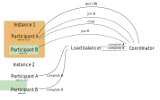

# Long Running Actions (LRA)

## Overview

Distributed transactions for microservices are known as SAGA design patterns and are defined by the [MicroProfile Long Running Actions specification](https://download.eclipse.org/microprofile/microprofile-lra-2.0/microprofile-lra-spec-2.0.html). Unlike well known XA protocol, LRA is asynchronous and therefore much more scalable. Every LRA JAX-RS resource ([participant](#participant)) defines endpoints to be invoked when transaction needs to be *completed* or *compensated*.

## Maven Coordinates

To enable Long Running Actions, add the following dependency to your project’s `pom.xml` (see [Managing Dependencies](../about/managing-dependencies.md)).

``` xml
<dependencies>
    <dependency>
      <groupId>io.helidon.microprofile.lra</groupId>
      <artifactId>helidon-microprofile-lra</artifactId>
    </dependency>
    <!-- Support for Narayana coordinator -->
    <dependency>
      <groupId>io.helidon.lra</groupId>
      <artifactId>helidon-lra-coordinator-narayana-client</artifactId>
    </dependency>
</dependencies>
```

## Usage

The LRA transactions need to be coordinated over REST API by the LRA coordinator. [Coordinator](#coordinator) keeps track of all transactions and calls the `@Compensate` or `@Complete` endpoints for all participants involved in the particular transaction. LRA transaction is first started, then joined by [participant](#participant). The participant reports the successful finish of the transaction by calling it complete. The coordinator then calls the JAX-RS *complete* endpoint that was registered during the join of each [participant](#participant). As the completed or compensated participants don’t have to be on same instance, the whole architecture is highly scalable.

<figure>

</figure>

If an error occurs during the LRA transaction, the participant reports a cancellation of LRA to the coordinator. [Coordinator](#coordinator) calls compensate on all the joined participants.

<figure>

</figure>

When a participant joins the LRA with timeout defined `@LRA(value = LRA.Type.REQUIRES_NEW, timeLimit = 5, timeUnit = ChronoUnit.MINUTES)`, the coordinator compensates if the timeout occurred before the close is reported by the participants.

<figure>

</figure>

## API

### Participant

The Participant, or Compensator, is an LRA resource with at least one of the JAX-RS(or non-JAX-RS) methods annotated with [@Compensate](https://download.eclipse.org/microprofile/microprofile-lra-1.0-RC3/apidocs/org/eclipse/microprofile/lra/annotation/Compensate.html) or [@AfterLRA](https://download.eclipse.org/microprofile/microprofile-lra-1.0-RC3/apidocs/org/eclipse/microprofile/lra/annotation/AfterLRA.html).

### @LRA

[<sub>javadoc</sub>](https://download.eclipse.org/microprofile/microprofile-lra-1.0-RC3/apidocs/org/eclipse/microprofile/lra/annotation/ws/rs/LRA.html)

Marks JAX-RS method which should run in LRA context and needs to be accompanied by at least minimal set of mandatory participant methods([Compensate](#compensate) or [AfterLRA](#afterlra)).

LRA options:

- [value](https://download.eclipse.org/microprofile/microprofile-lra-1.0-RC3/apidocs/org/eclipse/microprofile/lra/annotation/ws/rs/LRA.html#value--)
  - [REQUIRED](https://download.eclipse.org/microprofile/microprofile-lra-1.0-RC3/apidocs/org/eclipse/microprofile/lra/annotation/ws/rs/LRA.Type.html#REQUIRED) join incoming LRA or create and join new
  - [REQUIRES_NEW](https://download.eclipse.org/microprofile/microprofile-lra-1.0-RC3/apidocs/org/eclipse/microprofile/lra/annotation/ws/rs/LRA.Type.html#REQUIRES_NEW) create and join new LRA
  - [MANDATORY](https://download.eclipse.org/microprofile/microprofile-lra-1.0-RC3/apidocs/org/eclipse/microprofile/lra/annotation/ws/rs/LRA.Type.html#MANDATORY) join incoming LRA or fail
  - [SUPPORTS](https://download.eclipse.org/microprofile/microprofile-lra-1.0-RC3/apidocs/org/eclipse/microprofile/lra/annotation/ws/rs/LRA.Type.html#SUPPORTS) join incoming LRA or continue outside LRA context
  - [NOT_SUPPORTED](https://download.eclipse.org/microprofile/microprofile-lra-1.0-RC3/apidocs/org/eclipse/microprofile/lra/annotation/ws/rs/LRA.Type.html#NOT_SUPPORTED) always continue outside LRA context
  - [NEVER](https://download.eclipse.org/microprofile/microprofile-lra-1.0-RC3/apidocs/org/eclipse/microprofile/lra/annotation/ws/rs/LRA.Type.html#NEVER) Fail with 412 if executed in LRA context
  - [NESTED](https://download.eclipse.org/microprofile/microprofile-lra-1.0-RC3/apidocs/org/eclipse/microprofile/lra/annotation/ws/rs/LRA.Type.html#NESTED) create and join new LRA nested in the incoming LRA context
- [timeLimit](https://download.eclipse.org/microprofile/microprofile-lra-1.0-RC3/apidocs/org/eclipse/microprofile/lra/annotation/ws/rs/LRA.html#timeLimit--) max time limit before LRA gets cancelled automatically by [coordinator](#coordinator)
- [timeUnit](https://download.eclipse.org/microprofile/microprofile-lra-1.0-RC3/apidocs/org/eclipse/microprofile/lra/annotation/ws/rs/LRA.html#timeUnit--) time unit if the timeLimit value
- [end](https://download.eclipse.org/microprofile/microprofile-lra-1.0-RC3/apidocs/org/eclipse/microprofile/lra/annotation/ws/rs/LRA.html#end--) when false LRA is not closed after successful method execution
- [cancelOn](https://download.eclipse.org/microprofile/microprofile-lra-1.0-RC3/apidocs/org/eclipse/microprofile/lra/annotation/ws/rs/LRA.html#cancelOn--) which HTTP response codes of the method causes LRA to cancel
- [cancelOnFamily](https://download.eclipse.org/microprofile/microprofile-lra-1.0-RC3/apidocs/org/eclipse/microprofile/lra/annotation/ws/rs/LRA.html#cancelOnFamily--) which family of HTTP response codes causes LRA to cancel

Method parameters:

- Header [LRA_HTTP_CONTEXT_HEADER](https://download.eclipse.org/microprofile/microprofile-lra-1.0-RC3/apidocs/org/eclipse/microprofile/lra/annotation/ws/rs/LRA.html#LRA_HTTP_CONTEXT_HEADER) - ID of the LRA transaction

``` java
@PUT
@LRA(value = LRA.Type.REQUIRES_NEW,
     timeLimit = 500,
     timeUnit = ChronoUnit.MILLIS)
@Path("start-example")
public Response startLra(@HeaderParam(LRA_HTTP_CONTEXT_HEADER) URI lraId,
                         String data) {
    return Response.ok().build();
}
```

### @Compensate

[<sub>javadoc</sub>](https://download.eclipse.org/microprofile/microprofile-lra-1.0-RC3/apidocs/org/eclipse/microprofile/lra/annotation/Compensate.html)

> [!CAUTION]
> Expected to be called by LRA [coordinator](#coordinator) only!

Compensate method is called by a [coordinator](#coordinator) when LRA is cancelled, usually by error during execution of method body of [@LRA annotated method](#lra). If the method responds with 500 or 202, coordinator will eventually try the call again. If participant has [@Status annotated method](#status), [coordinator](#coordinator) retrieves the status to find out if retry should be done.

#### JAX-RS variant with supported LRA context values:

- Header [LRA_HTTP_CONTEXT_HEADER](https://download.eclipse.org/microprofile/microprofile-lra-1.0-RC3/apidocs/org/eclipse/microprofile/lra/annotation/ws/rs/LRA.html#LRA_HTTP_CONTEXT_HEADER) - ID of the LRA transaction
- Header [LRA_HTTP_PARENT_CONTEXT_HEADER](https://download.eclipse.org/microprofile/microprofile-lra-1.0-RC3/apidocs/org/eclipse/microprofile/lra/annotation/ws/rs/LRA.html#LRA_HTTP_PARENT_CONTEXT_HEADER) - parent LRA ID in case of nested LRA

``` java
@PUT
@Path("/compensate")
@Compensate
public Response compensateWork(@HeaderParam(LRA_HTTP_CONTEXT_HEADER) URI lraId,
                               @HeaderParam(LRA_HTTP_PARENT_CONTEXT_HEADER) URI parent) {
    return LRAResponse.compensated();
}
```

#### Non JAX-RS variant with supported LRA context values:

- URI with LRA ID

``` java
@Compensate
public void compensate(URI lraId) {
}
```

### @Complete

[<sub>javadoc</sub>](https://download.eclipse.org/microprofile/microprofile-lra-1.0-RC3/apidocs/org/eclipse/microprofile/lra/annotation/Complete.html)

> [!CAUTION]
> Expected to be called by LRA [coordinator](#coordinator) only!

Complete method is called by [coordinator](#coordinator) when LRA is successfully closed. If the method responds with 500 or 202, coordinator will eventually try the call again. If participant has [@Status annotated method](#status), [coordinator](#coordinator) retrieves the status to find out if retry should be done.

#### JAX-RS variant with supported LRA context values:

- Header [LRA_HTTP_CONTEXT_HEADER](https://download.eclipse.org/microprofile/microprofile-lra-1.0-RC3/apidocs/org/eclipse/microprofile/lra/annotation/ws/rs/LRA.html#LRA_HTTP_CONTEXT_HEADER) - ID of the LRA transaction
- Header [LRA_HTTP_PARENT_CONTEXT_HEADER](https://download.eclipse.org/microprofile/microprofile-lra-1.0-RC3/apidocs/org/eclipse/microprofile/lra/annotation/ws/rs/LRA.html#LRA_HTTP_PARENT_CONTEXT_HEADER) - parent LRA ID in case of nested LRA

``` java
@PUT
@Path("/complete")
@Complete
public Response complete(@HeaderParam(LRA_HTTP_CONTEXT_HEADER) URI lraId,
                         @HeaderParam(LRA_HTTP_PARENT_CONTEXT_HEADER) URI parentLraId) {
    return LRAResponse.completed();
}
```

#### Non JAX-RS variant with supported LRA context values:

- URI with LRA ID

``` java
@Complete
public void complete(URI lraId) {
}
```

### @Forget

[<sub>javadoc</sub>](https://download.eclipse.org/microprofile/microprofile-lra-1.0-RC3/apidocs/org/eclipse/microprofile/lra/annotation/Forget.html)

> [!CAUTION]
> Expected to be called by LRA [coordinator](#coordinator) only!

[Complete](#complete) and [compensate](#compensate) methods can fail(500) or report that compensation/completion is in progress(202). In such case participant needs to be prepared to report its status over [@Status annotated method](#status) to [coordinator](#coordinator). When [coordinator](#coordinator) decides all the participants have finished, method annotated with @Forget is called.

#### JAX-RS variant with supported LRA context values:

- Header [LRA_HTTP_CONTEXT_HEADER](https://download.eclipse.org/microprofile/microprofile-lra-1.0-RC3/apidocs/org/eclipse/microprofile/lra/annotation/ws/rs/LRA.html#LRA_HTTP_CONTEXT_HEADER) - ID of the LRA transaction
- Header [LRA_HTTP_PARENT_CONTEXT_HEADER](https://download.eclipse.org/microprofile/microprofile-lra-1.0-RC3/apidocs/org/eclipse/microprofile/lra/annotation/ws/rs/LRA.html#LRA_HTTP_PARENT_CONTEXT_HEADER) - parent LRA ID in case of nested LRA

``` java
@DELETE
@Path("/forget")
@Forget
public Response forget(@HeaderParam(LRA_HTTP_CONTEXT_HEADER) URI lraId,
                       @HeaderParam(LRA_HTTP_PARENT_CONTEXT_HEADER) URI parent) {
    return Response.noContent().build();
}
```

#### Non JAX-RS variant with supported LRA context values:

- URI with LRA ID

``` java
@Forget
public void forget(URI lraId) {
}
```

### @Leave

[<sub>javadoc</sub>](https://download.eclipse.org/microprofile/microprofile-lra-1.0-RC3/apidocs/org/eclipse/microprofile/lra/annotation/ws/rs/Leave.html)

Method annotated with @Leave called with LRA context(with header [LRA_HTTP_CONTEXT_HEADER](https://download.eclipse.org/microprofile/microprofile-lra-1.0-RC3/apidocs/org/eclipse/microprofile/lra/annotation/ws/rs/LRA.html#LRA_HTTP_CONTEXT_HEADER)) informs [coordinator](#coordinator) that current participant is leaving the LRA. Method body is executed after leave signal is sent. As a result, participant methods complete and compensate won’t be called when the particular LRA ends.

- Header [LRA_HTTP_CONTEXT_HEADER](https://download.eclipse.org/microprofile/microprofile-lra-1.0-RC3/apidocs/org/eclipse/microprofile/lra/annotation/ws/rs/LRA.html#LRA_HTTP_CONTEXT_HEADER) - ID of the LRA transaction

``` java
@PUT
@Path("/leave")
@Leave
public Response leaveLRA(@HeaderParam(LRA_HTTP_CONTEXT_HEADER) URI lraIdtoLeave) {
    return Response.ok().build();
}
```

### @Status

[<sub>javadoc</sub>](https://download.eclipse.org/microprofile/microprofile-lra-1.0-RC3/apidocs/org/eclipse/microprofile/lra/annotation/Status.html)

> [!CAUTION]
> Expected to be called by LRA [coordinator](#coordinator) only!

If the coordinator’s call to the participant’s method fails, then it will retry the call. If the participant is not idempotent, then it may need to report its state to coordinator by declaring method annotated with @Status for reporting if previous call did change participant status. [Coordinator](#coordinator) can call it and decide if compensate or complete retry is needed.

#### JAX-RS variant with supported LRA context values:

- Header [LRA_HTTP_CONTEXT_HEADER](https://download.eclipse.org/microprofile/microprofile-lra-1.0-RC3/apidocs/org/eclipse/microprofile/lra/annotation/ws/rs/LRA.html#LRA_HTTP_CONTEXT_HEADER) - ID of the LRA transaction
- [ParticipantStatus](https://download.eclipse.org/microprofile/microprofile-lra-1.0-RC3/apidocs/org/eclipse/microprofile/lra/annotation/ParticipantStatus.html) - Status of the participant reported to [coordinator](#coordinator)

``` java
@GET
@Path("/status")
@Status
public Response reportStatus(@HeaderParam(LRA_HTTP_CONTEXT_HEADER) URI lraId) {
    return Response.ok(ParticipantStatus.FailedToCompensate).build();
}
```

#### Non JAX-RS variant with supported LRA context values:

- URI with LRA ID
- [ParticipantStatus](https://download.eclipse.org/microprofile/microprofile-lra-1.0-RC3/apidocs/org/eclipse/microprofile/lra/annotation/ParticipantStatus.html) - Status of the participant reported to [coordinator](#coordinator)

``` java
@Status
public Response reportStatus(URI lraId) {
    return Response.ok(ParticipantStatus.FailedToCompensate)
            .build();
}
```

### @AfterLRA

[<sub>javadoc</sub>](https://download.eclipse.org/microprofile/microprofile-lra-1.0-RC3/apidocs/org/eclipse/microprofile/lra/annotation/AfterLRA.html)

> [!CAUTION]
> Expected to be called by LRA [coordinator](#coordinator) only!

Method annotated with [@AfterLRA](https://download.eclipse.org/microprofile/microprofile-lra-1.0-RC3/apidocs/org/eclipse/microprofile/lra/annotation/AfterLRA.html) in the same class as the one with @LRA annotation gets invoked after particular LRA finishes.

#### JAX-RS variant with supported LRA context values:

- Header [LRA_HTTP_ENDED_CONTEXT_HEADER](https://download.eclipse.org/microprofile/microprofile-lra-1.0-RC3/apidocs/org/eclipse/microprofile/lra/annotation/ws/rs/LRA.html#LRA_HTTP_ENDED_CONTEXT_HEADER) - ID of the finished LRA transaction
- Header [LRA_HTTP_PARENT_CONTEXT_HEADER](https://download.eclipse.org/microprofile/microprofile-lra-1.0-RC3/apidocs/org/eclipse/microprofile/lra/annotation/ws/rs/LRA.html#LRA_HTTP_PARENT_CONTEXT_HEADER) - parent LRA ID in case of nested LRA
- [LRAStatus](https://download.eclipse.org/microprofile/microprofile-lra-1.0-RC3/apidocs/org/eclipse/microprofile/lra/annotation/LRAStatus.html) - Final status of the LRA ([Cancelled](https://download.eclipse.org/microprofile/microprofile-lra-1.0-RC3/apidocs/org/eclipse/microprofile/lra/annotation/LRAStatus.html#Cancelled), [Closed](https://download.eclipse.org/microprofile/microprofile-lra-1.0-RC3/apidocs/org/eclipse/microprofile/lra/annotation/LRAStatus.html#Closed), [FailedToCancel](https://download.eclipse.org/microprofile/microprofile-lra-1.0-RC3/apidocs/org/eclipse/microprofile/lra/annotation/LRAStatus.html#FailedToCancel), [FailedToClose](https://download.eclipse.org/microprofile/microprofile-lra-1.0-RC3/apidocs/org/eclipse/microprofile/lra/annotation/LRAStatus.html#FailedToClose))

``` java
@PUT
@Path("/finished")
@AfterLRA
public Response whenLRAFinishes(@HeaderParam(LRA_HTTP_ENDED_CONTEXT_HEADER) URI lraId,
                                @HeaderParam(LRA_HTTP_PARENT_CONTEXT_HEADER) URI parentLraId,
                                LRAStatus status) {
    return Response.ok().build();
}
```

#### Non JAX-RS variant with supported LRA context values:

- URI with finished LRA ID
- [LRAStatus](https://download.eclipse.org/microprofile/microprofile-lra-1.0-RC3/apidocs/org/eclipse/microprofile/lra/annotation/LRAStatus.html) - Final status of the LRA ([Cancelled](https://download.eclipse.org/microprofile/microprofile-lra-1.0-RC3/apidocs/org/eclipse/microprofile/lra/annotation/LRAStatus.html#Cancelled), [Closed](https://download.eclipse.org/microprofile/microprofile-lra-1.0-RC3/apidocs/org/eclipse/microprofile/lra/annotation/LRAStatus.html#Closed), [FailedToCancel](https://download.eclipse.org/microprofile/microprofile-lra-1.0-RC3/apidocs/org/eclipse/microprofile/lra/annotation/LRAStatus.html#FailedToCancel), [FailedToClose](https://download.eclipse.org/microprofile/microprofile-lra-1.0-RC3/apidocs/org/eclipse/microprofile/lra/annotation/LRAStatus.html#FailedToClose))

``` java
public void whenLRAFinishes(URI lraId, LRAStatus status) {
}
```

## Configuration

*Type*

``` text
io.helidon.microprofile.lra
```

| Key | Type | Default value | Description |
|----|----|----|----|
| `mp.lra.coordinator.url` | string | `http://localhost:8070/lra-coordinator` | Url of coordinator. |
| `mp.lra.coordinator.propagation.active` | boolean |   | Propagate LRA headers `LRA_HTTP_CONTEXT_HEADER` and `LRA_HTTP_PARENT_CONTEXT_HEADER` through non-LRA endpoints. |
| `mp.lara.participant.url` | string |   | Url of the LRA enabled service overrides standard base uri, so coordinator can call load-balancer instead of the service. |
| `mp.lra.coordinator.timeout` | string |   | Timeout for synchronous communication with coordinator. |
| `mp.lra.coordinator.timeout-unit` | string |   | Timeout unit for synchronous communication with coordinator. |

Optional configuration options

*Example of LRA configuration*

``` yaml
mp.lra:
  coordinator.url: http://localhost:8070/lra-coordinator 
  propagation.active: true 
  participant.url: https://coordinator.visible.host:443/awesomeapp 
```

- Url of coordinator
- Propagate LRA headers LRA_HTTP_CONTEXT_HEADER and LRA_HTTP_PARENT_CONTEXT_HEADER through non-LRA endpoints
- Url of the LRA enabled service overrides standard base uri, so coordinator can call load-balancer instead of the service

For more information continue to [MicroProfile Long Running Actions specification](https://download.eclipse.org/microprofile/microprofile-lra-2.0/microprofile-lra-spec-2.0.html).

## Examples

The following example shows how a simple LRA participant starts and joins a transaction after calling the '/start-example' resource. When startExample method finishes successfully, close is reported to [coordinator](#coordinator) and `/complete-example` endpoint is called by coordinator to confirm successful closure of the LRA.

If an exception occurs during startExample method execution, coordinator receives cancel call and `/compensate-example` is called by coordinator to compensate for cancelled LRA transaction.

*Example of simple LRA participant*

``` java
@PUT
@LRA(LRA.Type.REQUIRES_NEW) 
@Path("start-example")
public Response startExample(@HeaderParam(LRA_HTTP_CONTEXT_HEADER) URI lraId, 
                             String data) {
    if (data.contains("BOOM")) {
        throw new RuntimeException("BOOM 💥"); 
    }

    LOGGER.info("Data " + data + " processed 🏭");
    return Response.ok().build(); 
}

@PUT
@Complete 
@Path("complete-example")
public Response completeExample(@HeaderParam(LRA_HTTP_CONTEXT_HEADER) URI lraId) {
    LOGGER.log(Level.INFO, "LRA ID: {0} completed 🎉", lraId);
    return LRAResponse.completed();
}

@PUT
@Compensate 
@Path("compensate-example")
public Response compensateExample(@HeaderParam(LRA_HTTP_CONTEXT_HEADER) URI lraId) {
    LOGGER.log(Level.SEVERE, "LRA ID: {0} compensated 🦺", lraId);
    return LRAResponse.compensated();
}
```

- This JAX-RS PUT method will start new LRA transactions and join it before method body gets executed
- LRA ID assigned by coordinator to this LRA transaction
- When method execution finishes exceptionally, cancel signal for this particular LRA is sent to coordinator
- When method execution finishes successfully, complete signal for this particular LRA is sent to coordinator
- Method which will be called by coordinator when LRA is completed
- Method which will be called by coordinator when LRA is canceled

## Testing

Testing of JAX-RS resources with LRA can be challenging as LRA participant running in parallel with the test is needed.

Helidon provides test coordinator which can be started automatically with additional socket on a random port within your own Helidon application. You only need one extra test dependency to enable test coordinator in your [@HelidonTest](testing/testing.md).

*Dependency*

``` xml
<dependency>
    <groupId>io.helidon.microprofile.lra</groupId>
    <artifactId>helidon-microprofile-lra-testing</artifactId>
    <scope>test</scope>
</dependency>
```

Considering that you have LRA enabled JAX-RS resource you want to test.

*Example JAX-RS resource with LRA.*

``` java
@ApplicationScoped
@Path("/test")
public class WithdrawResource {

    private final List<String> completedLras = new CopyOnWriteArrayList<>();
    private final List<String> cancelledLras = new CopyOnWriteArrayList<>();

    @PUT
    @Path("/withdraw")
    @LRA(LRA.Type.REQUIRES_NEW)
    public Response withdraw(@HeaderParam(LRA.LRA_HTTP_CONTEXT_HEADER) Optional<URI> lraId, String content) {
        if ("BOOM".equals(content)) {
            throw new IllegalArgumentException("BOOM");
        }
        return Response.ok().build();
    }

    @Complete
    public void complete(URI lraId) {
        completedLras.add(lraId.toString());
    }

    @Compensate
    public void rollback(URI lraId) {
        cancelledLras.add(lraId.toString());
    }

    public List<String> getCompletedLras() {
        return completedLras;
    }
}
```

Helidon test with enabled CDI discovery can look like this.

*HelidonTest with LRA test support.*

``` java
@HelidonTest
//@AddBean(WithdrawResource.class) 
@AddBean(TestLraCoordinator.class) 
public class LraTest {

    @Inject
    private WithdrawResource withdrawTestResource;

    @Inject
    private TestLraCoordinator coordinator; 

    @Inject
    private WebTarget target;

    @Test
    public void testLraComplete() {
        try (Response res = target
                .path("/test/withdraw")
                .request()
                .put(Entity.entity("test", MediaType.TEXT_PLAIN_TYPE))) {
            assertThat(res.getStatus(), is(200));
            String lraId = res.getHeaderString(LRA.LRA_HTTP_CONTEXT_HEADER);
            Lra lra = coordinator.lra(lraId); 
            assertThat(lra.status(), is(LRAStatus.Closed)); 
            assertThat(withdrawTestResource.getCompletedLras(), contains(lraId));
        }
    }
}
```

- Resource is discovered automatically
- Test coordinator needs to be added manually
- Injecting test coordinator to access state of LRA managed by coordinator mid-test
- Retrieving LRA managed by coordinator by LraId
- Asserting LRA state in coordinator

LRA testing feature has the following default configuration:

- port: `0` - coordinator is started on random port(Helidon LRA participant is capable to discover test coordinator automatically)
- bind-address: `localhost` - bind address of the coordinator
- helidon.lra.coordinator.persistence: `false` - LRAs managed by test coordinator are not persisted
- helidon.lra.participant.use-build-time-index: `false` - Participant annotation inspection ignores Jandex index files created in build time, it helps to avoid issues with additional test resources

Testing LRA coordinator is started on additional named socket `test-lra-coordinator` configured with default index `500`. Default index can be changed with system property `helidon.lra.coordinator.test-socket.index`.

Example: `-Dhelidon.lra.coordinator.test-socket.index=20`.

*HelidonTest override LRA test feature default settings.*

``` java
@HelidonTest
@AddBean(TestLraCoordinator.class)
@AddConfig(key = "server.sockets.500.port", value = "8070") 
@AddConfig(key = "server.sockets.500.host", value = "custom.bind.name") 
@AddConfig(key = "helidon.lra.coordinator.persistence", value = "true") 
@AddConfig(key = "helidon.lra.participant.use-build-time-index", value = "true") 
public class LraCustomConfigTest {
}
```

- Start test LRA coordinator always on the same port 8070(default is random port)
- Test LRA coordinator socket bind address (default is localhost)
- Persist LRA managed by coordinator(default is false)
- Use build time Jandex index(default is false)

When CDI bean auto-discovery is not desired, LRA and Config CDI extensions needs to be added manually.

*HelidonTest setup with disabled discovery.*

``` java
@HelidonTest
@DisableDiscovery
@AddJaxRs
@AddBean(TestLraCoordinator.class)
@AddExtension(LraCdiExtension.class)
@AddExtension(ConfigCdiExtension.class)
@AddBean(WithdrawResource.class)
public class LraNoDiscoveryTest {
}
```

## Additional Information

### Coordinator

Coordinator is a service that tracks all LRA transactions and calls the compensate REST endpoints of the participants when the LRA transaction gets cancelled or completes (in case it gets closed). In addition, participant also keeps track of timeouts, retries participant calls, and assigns LRA ids.

<div>

<div class="title">

Helidon LRA supports following coordinators

</div>

- [MicroTx LRA coordinator](https://docs.oracle.com/en/database/oracle/transaction-manager-for-microservices/index.html)
- Helidon LRA coordinator
- [Narayana coordinator](https://narayana.io/lra).

</div>

### MicroTx LRA Coordinator

Oracle Transaction Manager for Microservices - [MicroTx](https://docs.oracle.com/en/database/oracle/transaction-manager-for-microservices/index.html) is an enterprise grade transaction manager for microservices, among other it manages LRA transactions and is compatible with Narayana LRA clients.

MicroTx LRA coordinator is compatible with Narayana clients when `narayanaLraCompatibilityMode` is on, you need to add another dependency to enable Narayana client:

*Dependency needed for using Helidon LRA with Narayana compatible coordinator*

``` xml
<dependency>
    <groupId>io.helidon.lra</groupId>
    <artifactId>helidon-lra-coordinator-narayana-client</artifactId>
</dependency>
```

*Run MicroTx in Docker*

``` bash
docker container run --name otmm -v "$(pwd)":/app/config \
-w /app/config -p 8080:8080/tcp --env CONFIG_FILE=tcs.yaml \
--add-host host.docker.internal:host-gateway -d tmm:<version>
```

To use MicroTx with Helidon LRA participant, `narayanaLraCompatibilityMode` needs to be enabled.

*Configure MicroTx for development*

``` yaml
tmmAppName: tcs
tmmConfiguration:
  listenAddr: 0.0.0.0:8080
  internalAddr: http://host.docker.internal:8080
  externalUrl: http://lra-coordinator.acme.com:8080
  xaCoordinator:
    enabled: false
  lraCoordinator:
    enabled: true
  tccCoordinator:
    enabled: false
  storage:
    type: memory
  authentication:
    enabled: false
  authorization:
    enabled: false
  serveTLS:
    enabled: false
  narayanaLraCompatibilityMode:
    enabled: true 
```

- Enable Narayana compatibility mode

### Helidon LRA Coordinator

> [!CAUTION]
> Test tool, usage in production is not advised.

*Build and run Helidon LRA coordinator*

``` bash
docker build -t helidon/lra-coordinator https://github.com/oracle/helidon.git#:lra/coordinator/server
docker run --name lra-coordinator --network="host" helidon/lra-coordinator
```

Helidon LRA coordinator is compatible with Narayana clients, you need to add a dependency for Narayana client:

*Dependency needed for using Helidon LRA with Narayana compatible coordinator*

``` xml
<dependency>
    <groupId>io.helidon.lra</groupId>
    <artifactId>helidon-lra-coordinator-narayana-client</artifactId>
</dependency>
```

### Narayana

[Narayana](https://narayana.io) is a transaction manager supporting LRA. To use Narayana LRA coordinator with Helidon LRA client you need to add a dependency for Narayana client:

*Dependency needed for using Helidon LRA with Narayana coordinator*

``` xml
<dependency>
    <groupId>io.helidon.lra</groupId>
    <artifactId>helidon-lra-coordinator-narayana-client</artifactId>
</dependency>
```

The simplest way to run Narayana LRA coordinator locally:

*Downloading and running Narayana LRA coordinator*

``` bash
curl https://repo1.maven.org/maven2/org/jboss/narayana/rts/lra-coordinator-quarkus/5.11.1.Final/lra-coordinator-quarkus-5.11.1.Final-runner.jar \
-o narayana-coordinator.jar
java -Dquarkus.http.port=8070 -jar narayana-coordinator.jar
```

Narayana LRA coordinator is running by default under `lra-coordinator` context, with port `8070` defined in the snippet above you need to configure your Helidon LRA app as follows: `mp.lra.coordinator.url=http://localhost:8070/lra-coordinator`

## Reference

- [MicroProfile LRA GitHub Repository](https://github.com/eclipse/microprofile-lra)
- [MicroProfile Long Running Actions specification](https://download.eclipse.org/microprofile/microprofile-lra-2.0/microprofile-lra-spec-2.0.html)
- [Microprofile LRA JavaDoc](https://download.eclipse.org/microprofile/microprofile-lra-1.0-RC3/apidocs/org/eclipse/microprofile/lra/)
- [Helidon LRA Client JavaDoc](https://helidon.io/docs/v4/apidocs/io.helidon.lra.coordinator.client/module-summary.html)
- [MicroTx - Oracle Transaction Manager for Microservices](https://docs.oracle.com/en/database/oracle/transaction-manager-for-microservices/index.html)
