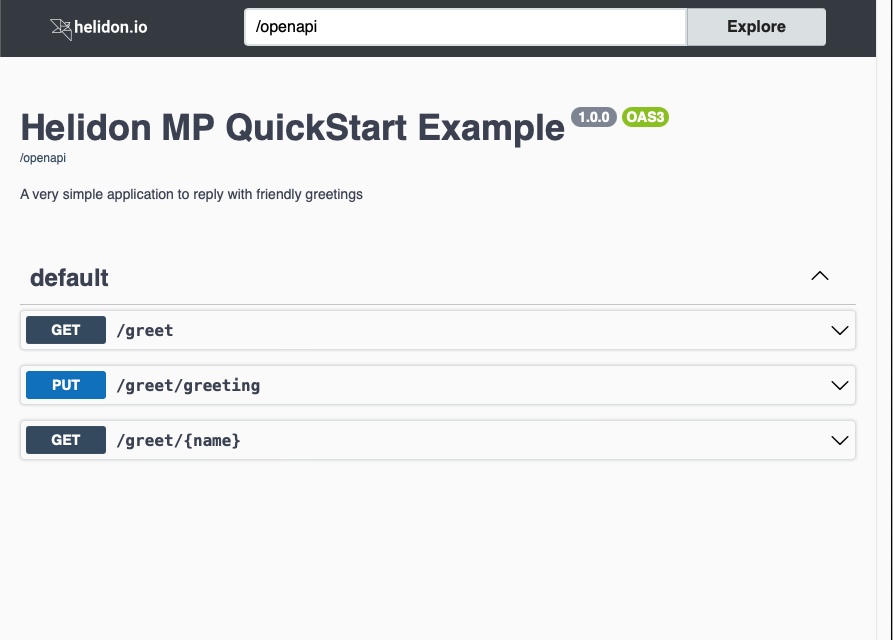
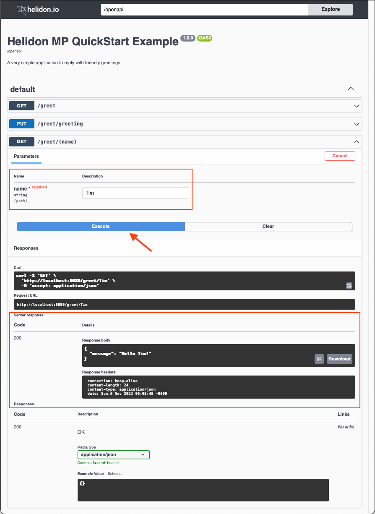

# OpenAPI UI

## Overview

SmallRye offers an [OpenAPI user interface component](https://github.com/smallrye/smallrye-open-api/tree/3.3.4/ui/open-api-ui) which displays a web page based on your application’s OpenAPI document. Through that UI, users can invoke the operations declared in the document.

> [!NOTE]
> The Helidon team discourages including the OpenAPI UI in production applications. The OpenAPI UI *can* be useful for demonstrating and testing your service’s endpoints prior to deployment.

The Helidon OpenAPI component allows you to integrate the SmallRye UI into your application, adding the UI web page to your application very simply.

## Maven Coordinates

To enable Helidon OpenAPI UI support, add the following dependency to your project’s `pom.xml` (see [Managing Dependencies](../../about/managing-dependencies.md)).

``` xml
<dependency>
    <groupId>io.helidon.integrations.openapi-ui</groupId>
    <artifactId>helidon-integrations-openapi-ui</artifactId>
    <scope>runtime</scope>
</dependency>
```

And add a runtime dependency on the SmallRye UI.

``` xml
<dependency>
    <groupId>io.smallrye</groupId>
    <artifactId>smallrye-open-api-ui</artifactId>
    <scope>runtime</scope>
</dependency>
```

Also make sure your project has the following dependency to include OpenAPI support in your Helidon MP application.

``` xml
<dependency>
    <groupId>io.helidon.microprofile.openapi</groupId>
    <artifactId>helidon-microprofile-openapi</artifactId>
    <scope>runtime</scope>
</dependency>
```

## Usage

After you modify, build, and start your Helidon MP service, you can access the OpenAPI UI by default at `http://your-host:your-port/openapi/ui`. Helidon also uses conventional content negotiation at `http://your-host:your-port/openapi` returning the UI to browsers (or any client that accepts HTML) and the OpenAPI document otherwise.

You can customize the path using [configuration](#configuration).

The example below shows the UI for the Helidon MP QuickStart greeting application.

<figure>

<figcaption>Example OpenAPI UI Screen</figcaption>
</figure>

With the OpenAPI UI displayed, follow these steps to access one of your service’s operations.

1.  Find the operation you want to run and click on its row in the list.
2.  The UI expands the operation, showing any input parameters and the possible responses. Click the "Try it out" button in the operation’s row.
3.  The UI now allows you to type into the input parameter field(s) to the right of each parameter name. Enter any required parameter values (first highlighted rectangle) and any non-required values you wish, then click "Execute" (highlighted arrow).
4.  Just below the "Execute" button the UI shows several sections:  
    - the equivalent `curl` command for submitting the request with your inputs,
    - the URL used for the request, and
    - a new "Server response" section (second highlighted rectangle) containing several items from the response:  
      - HTTP status code
      - body
      - headers

The next image shows the screen after you submit the "Returns a personalized greeting" operation.

Note that the UI shows the actual response from invoking the operation in the "Server response" section. The "Responses" section farther below describes the possible responses from the operation as declared in the OpenAPI document for the application.

<figure>

<figcaption>Example OpenAPI UI Screen</figcaption>
</figure>

## API

Your Helidon MP application does not use any API to enable or control Helidon OpenAPI UI support. Adding the dependency as described earlier is sufficient, and you can control the UI behavior using [configuration](#configuration).

## Configuration

To use configuration to control how the Helidon OpenAPI UI service behaves, add `mp.openapi.services.ui` settings to your `META-INF/microprofile-config.properties` file.

### Configuration options

| Key | Kind | Type | Default Value | Description |
|----|----|----|----|----|
| <span id="ad2183-enabled"></span> `enabled` | `VALUE` | `Boolean` | `true` | Sets whether the service should be enabled |
| <span id="aa88b9-options"></span> `options` | `MAP` | `String` |   | Merges implementation-specific UI options |
| <span id="a05812-web-context"></span> `web-context` | `VALUE` | `String` |   | Full web context (not just the suffix) |

The default UI `web-context` value is the web context for your `OpenApiFeature` service with the added suffix `/ui`. If you use the default web context for both `OpenApiFeature` and the UI, the UI responds at `/openapi/ui`.

You can use configuration to affect the UI path in these ways:

- Configure the OpenAPI endpoint path (the `/openapi` part).

  Recall that you can [configure the Helidon OpenAPI component](../../mp/openapi/openapi.md#config) to change where it serves the OpenAPI document.

  ``` properties
  mp.openapi.web-context=/my-openapi
  ```

  In this case, the path for the UI component is your customized OpenAPI path with `/ui` as a suffix. With the example above, the UI responds at `/myopenapi/ui` and Helidon uses standard content negotiation at `/myopenapi` to return either the OpenAPI document or the UI.

- Separately, configure the entire web context path for the UI independently from the web context for OpenAPI.

  *Configuring the OpenAPI UI web context*

``` properties
  mp.openapi.services.ui.web-context=/my-ui
  ```

  > [!NOTE]
  > The `mp.openapi.services.ui.web-context` setting assigns the *entire* web-context for the UI, not the suffix appended to the `OpenApiFeature` endpoint.

  With this configuration, the UI responds at `/my-ui` regardless of the path for OpenAPI itself.

The SmallRye OpenAPI UI component accepts several options, but they are of minimal use to application developers and they must be passed to the SmallRye UI code programmatically. Helidon allows you to specify these values using configuration in the `mp.openapi.services.ui.options` section. Helidon then passes the corresponding options to SmallRye for you. To configure any of these settings, use the enum values—​they are all lower case—​declared in the SmallRye [`Option.java`](https://github.com/smallrye/smallrye-open-api/tree/3.3.4/ui/open-api-ui/src/main/java/io/smallrye/openapi/ui/Option.java) class as the keys in your Helidon configuration.

> [!NOTE]
> Helidon prepares several of the SmallRye options automatically based on other settings. Any options you configure override the values Helidon assigns, possibly interfering with the proper operation of the UI.

# Additional Information

[Helidon OpenAPI MP documentation](../../mp/openapi/openapi.md)

[SmallRye OpenAPI UI GitHub site](https://github.com/smallrye/smallrye-open-api/tree/3.3.4/ui/open-api-ui)
