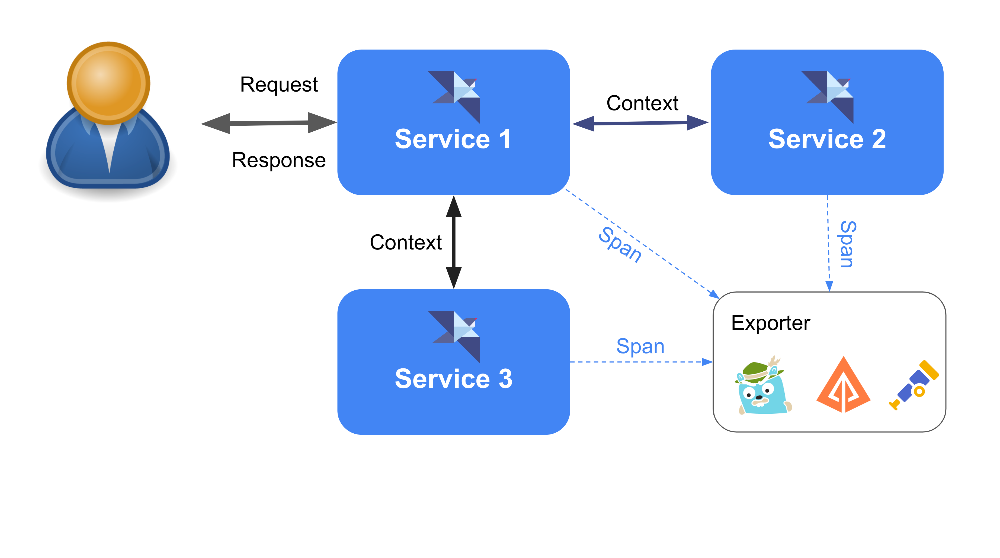
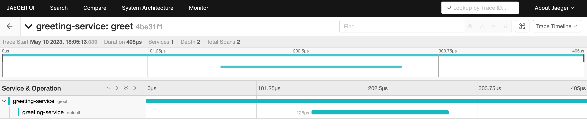
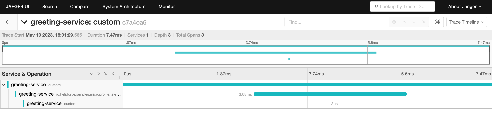
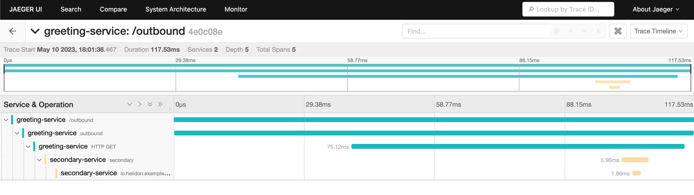

# Telemetry

## Overview

## Maven Coordinates

To enable MicroProfile Telemetry, either add a dependency on the [helidon-microprofile bundle](../mp/introduction/microprofile.md) or add the following dependency to your project’s `pom.xml` (see [Managing Dependencies](../about/managing-dependencies.md)).

``` xml
<dependency>
    <groupId>io.helidon.microprofile.telemetry</groupId>
    <artifactId>helidon-microprofile-telemetry</artifactId>
</dependency>
```

###  OTel Exporter Dependencies

Microprofile Telemetry mandates that implementations such as Helidon use OpenTelemetry, so also add a dependency on an OpenTelemetry exporter.

*Example dependency for the OpenTelemetry OTLP exporter*

``` xml
<dependency>
    <groupId>io.opentelemetry</groupId>
    <artifactId>opentelemetry-exporter-otlp</artifactId>
</dependency>
```

## Usage

[OpenTelemetry](https://opentelemetry.io/) comprises a collection of APIs, SDKs, integration tools, and other software components intended to facilitate the generation and control of telemetry data, including traces, metrics, and logs. In an environment where distributed tracing is enabled via OpenTelemetry (which combines OpenTracing and OpenCensus), this specification establishes the necessary behaviors for MicroProfile applications to participate seamlessly.

MicroProfile Telemetry 1.1 allows for the export of the data it collects to other systems using a variety of exporters such as OTLP mentioned earlier. Typical applications use a single exporter but you can add dependencies on multiple exporters and then use configuration to choose which to use in any given execution. See the [configuration](#configuration) section for more details.

> [!NOTE]
> If possible, assign the following config setting in your application’s `META-INF/microprofile-config.properties` file:
>
> ``` properties
> telemetry.span.name-includes-method = true
> ```
>
> Earlier releases of Helidon 4 implemented MicroProfile Telemetry 1.0 which was based on OpenTelemetry semantic conventions 1.22.0-alpha.
>
> MicroProfile Telemetry 1.1 is based on OpenTelemetry 1.58.0, and in that release the semantic convention for the REST span name now includes the HTTPmethod name, as shown in the format below.
>
>     {http-method-name} {http-request-route}
>
> (see <https://opentelemetry.io/docs/specs/semconv/http/http-spans/#name>)
>
> Although span names are often used only for display in monitoring tools, this is a backward-incompatible change.
>
> Therefore, Helidon 4.4.0-SNAPSHOT by default conforms to the *older* semantic convention to preserve backward compatibility with earlier 4.x releases. Only if you set the property as shown above will Helidon 4.4.0-SNAPSHOT use the new span naming format.
>
> The ability to use the older format is deprecated, and you should plan for its removal in a future major release of Helidon. For that reason Helidon logs a warning message if you use the older REST span naming convention.

In a distributed tracing system, **traces** are used to capture a series of requests and are composed of multiple **spans** that represent individual operations within those requests. Each **span** includes a name, timestamps, and metadata that provide insights into the corresponding operation.

**Context** is included in each span to identify the specific request that it belongs to. This context information is crucial for tracking requests across various components in a distributed system, enabling developers to trace a single request as it traverses through multiple services.

Finally, **exporters** are responsible for transmitting the collected trace data to a backend service for monitoring and visualization. This enables developers to gain a comprehensive understanding of the system’s behavior and detect any issues or bottlenecks that may arise.

<figure>

</figure>

There are two ways to work with Telemetry, using:

- Automatic Instrumentation
- Manual Instrumentation

For Automatic Instrumentation, OpenTelemetry provides a JavaAgent. The Tracing API allows for the automatic participation in distributed tracing of Jakarta RESTful Web Services (both server and client) as well as MicroProfile REST Clients, without requiring any modifications to the code. This is achieved through automatic instrumentation.

For Manual Instrumentation, there is a set of annotations and access to OpenTelemetry API.

`@WithSpan` - By adding this annotation to a method in any Jakarta CDI aware bean, a new span will be created and any necessary connections to the current Trace context will be established. Additionally, the `SpanAttribute` annotation can be used to mark method parameters that should be included in the Trace.

Helidon provides full access to OpenTelemetry Tracing API:

- `io.opentelemetry.api.OpenTelemetry`
- `io.opentelemetry.api.trace.Tracer`
- `io.opentelemetry.api.trace.Span`
- `io.opentelemetry.api.baggage.Baggage`

Accessing and using these objects can be done as follows. For span:

*Span sample*

``` java
@ApplicationScoped
class HelidonBean {

    @WithSpan 
    void doSomethingWithinSpan() {
        // do something here
    }

    @WithSpan("name") 
    void complexSpan(@SpanAttribute(value = "arg") String arg) {
        // do something here
    }
}
```

- Simple `@WithSpan` annotation usage.
- Additional attributes can be set on a method.

### Working With Tracers

You can inject OpenTelemetry `Tracer` using the regular `@Inject` annotation and use `SpanBuilder` to manually create, star and stop spans.

*SpanBuilder usage*

``` java
@Path("/")
public class HelidonEndpoint {

    @Inject
    Tracer tracer; 

    @GET
    @Path("/span")
    public Response span() {
        Span span = tracer.spanBuilder("new") 
                .setSpanKind(SpanKind.CLIENT)
                .setAttribute("someAttribute", "someValue")
                .startSpan();

        span.end();

        return Response.ok().build();
    }
}
```

- Inject `Tracer`.
- Use `Tracer.spanBuilder` to create and start new `Span`.

Helidon Microprofile Telemetry is integrated with [Helidon Tracing API](tracing.md). This means that both APIs can be mixed, and all parent hierarchies will be kept. In the case below, `@WithSpan` annotated method is mixed with manually created `io.helidon.tracing.Span`:

*Inject Helidon Tracer*

``` java
private io.helidon.tracing.Tracer helidonTracerInjected;

@Inject
GreetResource(io.helidon.tracing.Tracer helidonTracerInjected) {
    this.helidonTracerInjected = helidonTracerInjected; 
}

@GET
@Path("mixed_injected")
@Produces(MediaType.APPLICATION_JSON)
@WithSpan("mixed_parent_injected")
public GreetingMessage mixedSpanInjected() {
    io.helidon.tracing.Span mixedSpan = helidonTracerInjected.spanBuilder("mixed_injected") 
            .kind(io.helidon.tracing.Span.Kind.SERVER)
            .tag("attribute", "value")
            .start();
    mixedSpan.end();

    return new GreetingMessage("Mixed Span Injected" + mixedSpan);
}
```

- Inject `io.helidon.tracing.Tracer`.
- Use the injected tracer to create `io.helidon.tracing.Span` using the `spanBuilder()` method.

The span is then started and ended manually. Span parent relations will be preserved. This means that span named "mixed_injected" with have parent span named "mixed_parent_injected", which will have parent span named "mixed_injected".

Another option is to use the Global Tracer:

*Obtain the Global tracer*

``` java
@GET
@Path("mixed")
@Produces(MediaType.APPLICATION_JSON)
@WithSpan("mixed_parent")
public GreetingMessage mixedSpan() {
    io.helidon.tracing.Tracer helidonTracer = io.helidon.tracing.Tracer.global(); 
    io.helidon.tracing.Span mixedSpan = helidonTracer.spanBuilder("mixed") 
            .kind(io.helidon.tracing.Span.Kind.SERVER)
            .tag("attribute", "value")
            .start();
    mixedSpan.end();

    return new GreetingMessage("Mixed Span" + mixedSpan);
}
```

- Obtain tracer using the `io.helidon.tracing.Tracer.global()` method;
- Use the created tracer to create a span.

The span is then started and ended manually. Span parent relations will be preserved.

### Working With Spans

To obtain the current span, it can be injected by CDI. The current span can also be obtained using the static method `Span.current()`.

*Inject the current span*

``` java
@Path("/")
public class HelidonEndpoint {
    @Inject
    Span span; 

    @GET
    @Path("/current")
    public Response currentSpan() {
        return Response.ok(span).build(); 
    }

    @GET
    @Path("/current/static")
    public Response currentSpanStatic() {
        return Response.ok(Span.current()).build(); 
    }
}
```

- Inject the current span.
- Use the injected span.
- Use `Span.current()` to access the current span.

### Working With Baggage

The same functionality is available for the `Baggage` API:

*Inject the current baggage*

``` java
@Path("/")
public class HelidonEndpoint {
    @Inject
    Baggage baggage; 

    @GET
    @Path("/current")
    public Response currentBaggage() {
        return Response.ok(baggage.getEntryValue("baggageKey")).build(); 
    }

    @GET
    @Path("/current/static")
    public Response currentBaggageStatic() {
        return Response.ok(Baggage.current().getEntryValue("baggageKey")).build(); 
    }
}
```

- Inject the current baggage.
- Use the injected baggage.
- Use `Baggage.current()` to access the current baggage.

### Responding to Span Lifecycle Events

Applications and libraries can register listeners to be notified at several moments during the lifecycle of every Helidon span:

- Before a new span starts
- After a new span has started
- After a span ends
- After a span is activated (creating a new scope)
- After a scope is closed

See the [Helidon SE documentation on span lifecycle support](../se/tracing.md#Tracing-callbacks) for more detail on the Helidon SE API which supports this feature. You can use those features from a Helidon MP application as well, in particular receiving notification of life cycle changes of *OpenTelemetry* spans.

Helidon MP applications which inject an OpenTelemetry `Tracer` or `Span` can easily request such notification by adding the Helidon [`@CallbackEnabled`](/apidocs/io.helidon.microprofile.telemetry/io/helidon/microprofile/telemetry/CallbackEnabled.html) annotation to injection points as shown in the following example.

*Using `@CallbackEnabled`*

``` java
@Inject
@CallbackEnabled
private Tracer otelTracer;
```

Note that although the injected object implements the corresponding OpenTelemetry interface it *is not* the native OpenTelemetry object. Be sure to read and understand the Helidon SE documentation at the earlier link regarding the behavior of callback-enabled objects.

### Controlling Automatic Span Creation

By default, Helidon MP Telemetry creates a new child span for each incoming REST request and for each outgoing REST client request. You can selectively control if Helidon creates these automatic spans on a request-by-request basis by adding a very small amount of code to your project.

#### Controlling Automatic Spans for Incoming REST Requests

To selectively suppress child span creation for incoming REST requests implement the [HelidonTelemetryContainerFilterHelper interface](/apidocs/io.helidon.microprofile.telemetry/io/helidon/microprofile/telemetry/spi/HelidonTelemetryContainerFilterHelper.html).

When Helidon receives an incoming REST request it invokes the `shouldStartSpan` method on each such implementation, passing the [Jakarta REST container request context](https://jakarta.ee/specifications/restful-ws/3.1/apidocs/jakarta.ws.rs/jakarta/ws/rs/container/containerrequestcontext) for the request. If at least one implementation returns `false` then Helidon suppresses the automatic child span. If all implementations return `true` then Helidon creates the automatic child span.

The following example shows how to allow automatic spans in the Helidon greet example app for requests for the default greeting but not for the personalized greeting or the `PUT` request to change the greeting message (because the update path ends with `greeting` not `greet`).

Your implementation of `HelidonTelemetryContainerFilterHelper` must have a CDI bean-defining annotation. The example shows `@ApplicationScoped`.

*Example container helper for the Helidon MP Greeting app*

``` java
@ApplicationScoped
public class CustomRestRequestFilterHelper implements HelidonTelemetryContainerFilterHelper {

    @Override
    public boolean shouldStartSpan(ContainerRequestContext containerRequestContext) {

        // Allows automatic spans for incoming requests for the default greeting but not for
        // personalized greetings or the PUT request to update the greeting message.
        return containerRequestContext.getUriInfo().getPath().endsWith("greet");
    }
}
```

#### Controlling Automatic Spans for Outgoing REST Client Requests

To selectively suppress child span creation for outgoing REST client requests implement the [HelidonTelemetryClientFilterHelper interface](/apidocs/io.helidon.microprofile.telemetry/io/helidon/microprofile/telemetry/spi/HelidonTelemetryClientFilterHelper.html).

When your application sends an outgoing REST client request Helidon invokes the `shouldStartSpan` method on each such implementation, passing the [Jakarta REST client request context](https://jakarta.ee/specifications/restful-ws/3.1/apidocs/jakarta.ws.rs/jakarta/ws/rs/client/clientrequestcontext) for the request. If at least one implementation returns `false` then Helidon suppresses the automatic child span. If all implementations return `true` then Helidon creates the automatic child span.

The following example shows how to allow automatic spans in an app that invokes the Helidon greet example app. The example permits automatic child spans for outgoing requests for the default greeting but not for the personalized greeting or the `PUT` request to change the greeting message (because the update path ends with `greeting` not `greet`).

Your implementation of `HelidonTelemetryClientFilterHelper` must have a CDI bean-defining annotation. The example shows `@ApplicationScoped`.

*Example Client Helper for the Helidon MP Greeting App*

``` java
@ApplicationScoped
public class CustomRestClientRequestFilterHelper implements HelidonTelemetryClientFilterHelper {

    @Override
    public boolean shouldStartSpan(ClientRequestContext clientRequestContext) {

        // Allows automatic spans for outgoing requests for the default greeting but not for
        // personalized greetings or the PUT request to update the greeting message.
        return clientRequestContext.getUri().getPath().endsWith("greet");
    }
}
```

## Configuration

> [!IMPORTANT]
> MicroProfile Telemetry is not activated by default. To activate this feature, you need to specify the configuration `otel.sdk.disabled=false` in one of the MicroProfile Config or other config sources.

To configure OpenTelemetry, MicroProfile Config must be used, and the configuration properties outlined in the following sections must be followed:

- [OpenTelemetry SDK Autoconfigure](https://github.com/open-telemetry/opentelemetry-java/tree/v1.19.0/sdk-extensions/autoconfigure) (excluding properties related to Metrics and Logging)
- [Manual Instrumentation](https://opentelemetry.io/docs/instrumentation/java/manual/)

Please consult with the links above for all configurations' properties usage.

For your application to report trace information be sure you add a dependency on an OpenTelemetry exporter as [described earlier](#otel-exporter-dependencies) and, as needed, configure its use. By default OpenTelemetry attempts to use the OTLP exporter so you do not need to add configuration to specify that choice. To use a different exporter set `otel.traces.exporter` in your configuration to the appropriate value: `zipkin`, `prometheus`, etc. See the [examples](#examples) section below.

### OpenTelemetry Java Agent

The OpenTelemetry Java Agent may influence the work of MicroProfile Telemetry, on how the objects are created and configured. Helidon will do "best effort" to detect the use of the agent. But if there is a decision to run the Helidon app with the agent, a configuration property should be set:

`otel.agent.present=true`

This way, Helidon will explicitly get all the configuration and objects from the Agent, thus allowing correct span hierarchy settings.

## Examples

This guide demonstrates how to incorporate MicroProfile Telemetry into Helidon and provides illustrations of how to view traces. The Jaeger backend is employed in all the examples, and the Jaeger UI is used to view the traces.

### Set Up Jaeger Backend

For example, the Jaeger backend gathers the tracing information.

*Run the Jaeger backend in a docker container*

``` bash
docker run -d --name jaeger \
  -e COLLECTOR_ZIPKIN_HOST_PORT=:9411 \
  -e COLLECTOR_OTLP_ENABLED=true \
  -p 6831:6831/udp \
  -p 6832:6832/udp \
  -p 5778:5778 \
  -p 16686:16686 \
  -p 4317:4317 \
  -p 4318:4318 \
  -p 14250:14250 \
  -p 14268:14268 \
  -p 14269:14269 \
  -p 9411:9411 \
  jaegertracing/all-in-one:1.50
```

All the tracing information gathered from the examples runs is accessible from the browser in the Jaeger UI under <http://localhost:16686/>

### Enable MicroProfile Telemetry in Helidon Application

Together with Helidon Telemetry dependency, an OpenTelemetry Exporter dependency should be added to project’s pom.xml file.

``` xml
<dependencies>
    <dependency>
        <groupId>io.helidon.microprofile.telemetry</groupId>
        <artifactId>helidon-microprofile-telemetry</artifactId> 
    </dependency>
    <dependency>
        <groupId>io.opentelemetry</groupId>
        <artifactId>opentelemetry-exporter-jaeger</artifactId>  
    </dependency>
</dependencies>
```

- Helidon Telemetry dependency.
- OpenTelemetry Jaeger exporter.

Add these lines to `META-INF/microprofile-config.properties`:

*MicroProfile Telemetry properties*

``` properties
otel.sdk.disabled=false     
otel.traces.exporter=jaeger 
otel.service.name=greeting-service 
```

- Enable MicroProfile Telemetry.
- Set exporter to Jaeger.
- Name of our service.

Here we enable MicroProfile Telemetry, set tracer to "jaeger" and give a name, which will be used to identify our service in the tracer.

> [!NOTE]
> For this example, you will use Jaeger to manage data tracing. If you prefer to use Zipkin, please set `otel.traces.exporter` property to "zipkin". For more information using about Zipkin, see <https://zipkin.io/>. Also, a corresponding Maven dependency for the exporter should be added:
>
>     <dependency>
>         <groupId>io.opentelemetry</groupId>
>         <artifactId>opentelemetry-exporter-zipkin</artifactId>
>     </dependency>

### Tracing at Method Level

To create simple services, use `@WithSpan` and `Tracer` to create span and let MicroProfile OpenTelemetry handle them.

``` java
@Path("/greet")
public class GreetResource {

    @GET
    @WithSpan("default") 
    public String getDefaultMessage() {
        return "Hello World";
    }
}
```

- Use of `@WithSpan` with name "default".

Now let’s call the Greeting endpoint:

``` bash
curl localhost:8080/greet
Hello World
```

Next, launch the Jaeger UI at <http://localhost:16686/>. The expected output is:

<figure>

</figure>

*Custom method*

``` java
@Inject
private Tracer tracer; 

@GET
@Path("custom")
@Produces(MediaType.APPLICATION_JSON)
@WithSpan 
public JsonObject useCustomSpan() {
    Span span = tracer.spanBuilder("custom") 
            .setSpanKind(SpanKind.INTERNAL)
            .setAttribute("attribute", "value")
            .startSpan();
    span.end(); 

    return Json.createObjectBuilder()
            .add("Custom Span", span.toString())
            .build();
}
```

- Inject OpenTelemetry `Tracer`.
- Create a span around the method `useCustomSpan()`.
- Create a custom `INTERNAL` span and start it.
- End the custom span.

Let us call the custom endpoint:

``` bash
curl localhost:8080/greeting/custom
```

Again you can launch the Jaeger UI at <http://localhost:16686/>. The expected output is:

<figure>

</figure>

Now let us use multiple services calls. In the example below our main service will call the `secondary` services. Each method in each service will be annotated with `@WithSpan` annotation.

*Outbound method*

``` java
@Uri("http://localhost:8081/secondary")
private WebTarget target; 

@GET
@Path("/outbound")
@WithSpan("outbound") 
public String outbound() {
    return target.request().accept(MediaType.TEXT_PLAIN).get(String.class); 
}
```

- Inject `WebTarget` pointing to Secondary service.
- Wrap method using `WithSpan`.
- Call the secondary service.

The secondary service is basic; it has only one method, which is also annotated with `@WithSpan`.

*Secondary service*

``` java
@GET
@WithSpan 
public String getSecondaryMessage() {
    return "Secondary"; 
}
```

- Wrap method in a span.
- Return a string.

Let us call the *Outbound* endpoint:

``` bash
curl localhost:8080/greet/outbound
Secondary
```

The `greeting-service` call `secondary-service`. Each service will create spans with corresponding names, and a service class hierarchy will be created.

Launch the Jaeger UI at <http://localhost:16686/> to see the expected output (shown below).

<figure>

</figure>

This example is available at the [Helidon official GitHub repository](https://github.com/helidon-io/helidon-examples/tree/helidon-4.x/examples/microprofile/telemetry).

## Reference

- [MicroProfile Telemetry Specification](https://download.eclipse.org/microprofile/microprofile-telemetry-1.1/tracing/microprofile-telemetry-tracing-spec-1.1.pdf)
- [OpenTelemetry Documentation](https://opentelemetry.io/docs/)
