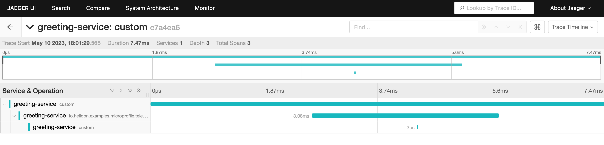

<!--@frontmatter
description: "MicroProfile Telemetry"
navigation:
  icon: i-lucide-chart-line
-->
# Telemetry

## Maven Coordinates

To enable MicroProfile Telemetry, either add a dependency on the
[helidon-microprofile bundle](introduction.md) or add the following dependency
to your project’s `pom.xml` (see [Managing
Dependencies](../dependency-management.md)).

```xml [pom.xml]
<dependency>
  <groupId>io.helidon.microprofile.telemetry</groupId>
  <artifactId>helidon-microprofile-telemetry</artifactId>
</dependency>
```

###  Exporter Dependencies

MicroProfile Telemetry mandates that implementations such as Helidon use
OpenTelemetry, so also add a dependency on an OpenTelemetry exporter.

Example dependency for the OpenTelemetry OTLP exporter:

```xml [pom.xml]
<dependency>
  <groupId>io.opentelemetry</groupId>
  <artifactId>opentelemetry-exporter-otlp</artifactId>
</dependency>
```

## Compatibility

> [!NOTE]
> Helidon v4 is backward compatible with MicroProfile telemetry 1.0

Earlier releases of Helidon 4 implemented MicroProfile Telemetry 1.0 which was
based on OpenTelemetry semantic conventions 1.22.0-alpha.

MicroProfile Telemetry 1.1 is supported, however it is based on OpenTelemetry
1.58.0 which changed the REST span name conventions, which is not backward
compatible. See [OpenTelemetry HTTP span name][opentelemetry-http] for more
details.

Use the following configuration to use the new conventions:

```properties [microprofile-config.properties]
telemetry.span.name-includes-method = true
```

The ability to use the older format is deprecated, and you should plan for its
removal in a future major release of Helidon. For that reason Helidon logs a
warning message if you use the older REST span naming convention. See
[Helidon automatic span compatibility](#helidon-automatic-span-compatibility)
for details about this setting and the response-writing compatibility setting.

## Usage

[OpenTelemetry](https://opentelemetry.io/) comprises a collection of APIs, SDKs,
integration tools, and other software components intended to facilitate the
generation and control of telemetry data, including traces, metrics, and logs.
In an environment where distributed tracing is enabled via OpenTelemetry (which
combines OpenTracing and OpenCensus), this specification establishes the
necessary behaviors for MicroProfile applications to participate seamlessly.

MicroProfile Telemetry 1.1 allows for the export of the data it collects to
other systems using a variety of exporters such as OTLP mentioned earlier.
Typical applications use a single exporter, but you can add dependencies on
multiple exporters and then use configuration to choose which to use in any
given execution. See the [configuration](#configuration) section for more
details.

In a distributed tracing system, **traces** are used to capture a series of
requests and are composed of multiple **spans** that represent individual
operations within those requests. Each **span** includes a name, timestamps, and
metadata that provide insights into the corresponding operation.

**Context** is included in each span to identify the specific request that it
belongs to. This context information is crucial for tracking requests across
various components in a distributed system, enabling developers to trace a
single request as it traverses through multiple services.

Finally, **exporters** are responsible for transmitting the collected trace data
to a backend service for monitoring and visualization. This enables developers
to gain a comprehensive understanding of the system’s behavior and detect any
issues or bottlenecks that may arise.


There are two ways to work with Telemetry, using:

- Automatic Instrumentation
- Manual Instrumentation

For Automatic Instrumentation, OpenTelemetry provides a JavaAgent. The Tracing
API allows for the automatic participation in distributed tracing of Jakarta
RESTful Web Services (both server and client) as well as MicroProfile REST
Clients, without requiring any modifications to the code. This is achieved
through automatic instrumentation.

For Manual Instrumentation, there is a set of annotations and access to
OpenTelemetry API.

`@WithSpan` - By adding this annotation to a method in any Jakarta CDI aware
bean, a new span will be created and any necessary connections to the current
Trace context will be established. Additionally, the `SpanAttribute` annotation
can be used to mark method parameters that should be included in the Trace.

Helidon provides full access to OpenTelemetry Tracing API:

- `io.opentelemetry.api.OpenTelemetry`
- `io.opentelemetry.api.trace.Tracer`
- `io.opentelemetry.api.trace.Span`
- `io.opentelemetry.api.baggage.Baggage`

Accessing and using these objects can be done as follows. For span:

Span sample:

<!--@mdc ::code-callout -->
```java
@ApplicationScoped
class HelidonBean {

    @WithSpan // <1>
    void doSomethingWithinSpan() {
        // do something here
    }

    @WithSpan("name") // <2>
    void complexSpan(@SpanAttribute(value = "arg") String arg) {
        // do something here
    }
}
```
1. Simple `@WithSpan` annotation usage.
2. Additional attributes can be set on a method.
<!--@mdc :: -->

### Working With Tracers

You can inject OpenTelemetry `Tracer` using the regular `@Inject` annotation and
use `SpanBuilder` to manually create, star and stop spans.

SpanBuilder usage:

<!--@mdc ::code-callout -->
```java
@Path("/")
public class HelidonEndpoint {

    @Inject
    Tracer tracer; // <1>

    @GET
    @Path("/span")
    public Response span() {
        Span span = tracer.spanBuilder("new") // <2>
                .setSpanKind(SpanKind.CLIENT)
                .setAttribute("someAttribute", "someValue")
                .startSpan();

        span.end();

        return Response.ok().build();
    }
}
```
1. Inject `Tracer`.
2. Use `Tracer.spanBuilder` to create and start new `Span`.
<!--@mdc :: -->

Helidon MicroProfile Telemetry is integrated with [Helidon Tracing
API](tracing.md). This means that both APIs can be mixed, and all parent
hierarchies will be kept. In the case below, `@WithSpan` annotated method is
mixed with manually created `io.helidon.tracing.Span`:

Inject Helidon Tracer:

<!--@mdc ::code-callout -->
```java
private io.helidon.tracing.Tracer helidonTracerInjected;

@Inject
GreetResource(io.helidon.tracing.Tracer helidonTracerInjected) {
    this.helidonTracerInjected = helidonTracerInjected; // <1>
}

@GET
@Path("mixed_injected")
@Produces(MediaType.APPLICATION_JSON)
@WithSpan("mixed_parent_injected")
public GreetingMessage mixedSpanInjected() {
    io.helidon.tracing.Span mixedSpan = helidonTracerInjected.spanBuilder("mixed_injected") // <2>
            .kind(io.helidon.tracing.Span.Kind.SERVER)
            .tag("attribute", "value")
            .start();
    mixedSpan.end();

    return new GreetingMessage("Mixed Span Injected" + mixedSpan);
}
```
1. Inject `io.helidon.tracing.Tracer`.
2. Use the injected tracer to create `io.helidon.tracing.Span` using the
   `spanBuilder()` method.
<!--@mdc :: -->

The span is then started and ended manually. Span parent relations will be
preserved. This means that span named "mixed_injected" with have parent span
named "mixed_parent_injected", which will have parent span named
"mixed_injected".

Another option is to use the Global Tracer:

Obtain the Global tracer:

<!--@mdc ::code-callout -->
```java
@GET
@Path("mixed")
@Produces(MediaType.APPLICATION_JSON)
@WithSpan("mixed_parent")
public GreetingMessage mixedSpan() {
    io.helidon.tracing.Tracer helidonTracer = io.helidon.tracing.Tracer.global(); // <1>
    io.helidon.tracing.Span mixedSpan = helidonTracer.spanBuilder("mixed") // <2>
            .kind(io.helidon.tracing.Span.Kind.SERVER)
            .tag("attribute", "value")
            .start();
    mixedSpan.end();

    return new GreetingMessage("Mixed Span" + mixedSpan);
}
```
1. Obtain tracer using the `io.helidon.tracing.Tracer.global()` method;
2. Use the created tracer to create a span.
<!--@mdc :: -->

The span is then started and ended manually. Span parent relations will be
preserved.

### Working With Spans

To obtain the current span, it can be injected by CDI. The current span can also
be obtained using the static method `Span.current()`.

Inject the current span:

<!--@mdc ::code-callout -->
```java
@Path("/")
public class HelidonEndpoint {
    @Inject
    Span span; // <1>

    @GET
    @Path("/current")
    public Response currentSpan() {
        return Response.ok(span).build(); // <2>
    }

    @GET
    @Path("/current/static")
    public Response currentSpanStatic() {
        return Response.ok(Span.current()).build(); // <3>
    }
}
```
1. Inject the current span.
2. Use the injected span.
3. Use `Span.current()` to access the current span.
<!--@mdc :: -->

### Working With Baggage

The same functionality is available for the `Baggage` API:

Inject the current baggage:

<!--@mdc ::code-callout -->
```java
@Path("/")
public class HelidonEndpoint {
    @Inject
    Baggage baggage; // <1>

    @GET
    @Path("/current")
    public Response currentBaggage() {
        return Response.ok(baggage.getEntryValue("baggageKey")).build(); // <2>
    }

    @GET
    @Path("/current/static")
    public Response currentBaggageStatic() {
        return Response.ok(Baggage.current().getEntryValue("baggageKey")).build(); // <3>
    }
}
```
1. Inject the current baggage.
2. Use the injected baggage.
3. Use `Baggage.current()` to access the current baggage.
<!--@mdc :: -->

### Responding to Span Lifecycle Events

Applications and libraries can register listeners to be notified at several
moments during the lifecycle of every Helidon span:

- Before a new span starts
- After a new span has started
- After a span ends
- After a span is activated (creating a new scope)
- After a scope is closed

See the [Helidon SE documentation on span lifecycle support][helidon-se-docum]
for more detail on the Helidon SE API which supports this feature. You can use
those features from a Helidon MP application as well, in particular receiving
notification of life cycle changes of *OpenTelemetry* spans.

Helidon MP applications which inject an OpenTelemetry `Tracer` or `Span` can
easily request such notification by adding the Helidon
[`@CallbackEnabled`][callbackenabled] annotation to injection points as shown in
the following example.

Using @CallbackEnabled:

```java
@Inject
@CallbackEnabled
private Tracer otelTracer;
```

Note that although the injected object implements the corresponding
OpenTelemetry interface it *is not* the native OpenTelemetry object. Be sure to
read and understand the Helidon SE documentation at the earlier link regarding
the behavior of callback-enabled objects.

### Controlling Automatic Span Creation

By default, Helidon MP Telemetry creates a new child span for each incoming REST
request and for each outgoing REST client request. You can selectively control
if Helidon creates these automatic spans on a request-by-request basis by adding
a very small amount of code to your project.

#### Controlling Automatic Spans for Incoming REST Requests

To selectively suppress child span creation for incoming REST requests implement
the [HelidonTelemetryContainerFilterHelper interface][helidontelemetry].

When Helidon receives an incoming REST request it invokes the `shouldStartSpan`
method on each such implementation, passing the [Jakarta REST container request
context][jakarta-rest-con] for the request. If at least one implementation
returns `false` then Helidon suppresses the automatic child span. If all
implementations return `true` then Helidon creates the automatic child span.

The following example shows how to allow automatic spans in the Helidon greet
example app for requests for the default greeting but not for the personalized
greeting or the `PUT` request to change the greeting message (because the update
path ends with `greeting` not `greet`).

Your implementation of `HelidonTelemetryContainerFilterHelper` must have a CDI
bean-defining annotation. The example shows `@ApplicationScoped`.

Example container helper for the Helidon MP Greeting app:

```java
@ApplicationScoped
public class CustomRestRequestFilterHelper implements HelidonTelemetryContainerFilterHelper {

    @Override
    public boolean shouldStartSpan(ContainerRequestContext containerRequestContext) {

        // Allows automatic spans for incoming requests for the default greeting but not for
        // personalized greetings or the PUT request to update the greeting message.
        return containerRequestContext.getUriInfo().getPath().endsWith("greet");
    }
}
```

#### Controlling Automatic Spans for Outgoing REST Client Requests

To selectively suppress child span creation for outgoing REST client requests
implement the [HelidonTelemetryClientFilterHelper
interface][helidontelemetry-2].

When your application sends an outgoing REST client request Helidon invokes the
`shouldStartSpan` method on each such implementation, passing the [Jakarta REST
client request context][jakarta-rest-cli] for the request. If at least one
implementation returns `false` then Helidon suppresses the automatic child span.
If all implementations return `true` then Helidon creates the automatic child
span.

The following example shows how to allow automatic spans in an app that invokes
the Helidon greet example app. The example permits automatic child spans for
outgoing requests for the default greeting but not for the personalized greeting
or the `PUT` request to change the greeting message (because the update path
ends with `greeting` not `greet`).

Your implementation of `HelidonTelemetryClientFilterHelper` must have a CDI
bean-defining annotation. The example shows `@ApplicationScoped`.

Example Client Helper for the Helidon MP Greeting App:

```java
@ApplicationScoped
public class CustomRestClientRequestFilterHelper implements HelidonTelemetryClientFilterHelper {

    @Override
    public boolean shouldStartSpan(ClientRequestContext clientRequestContext) {

        // Allows automatic spans for outgoing requests for the default greeting but not for
        // personalized greetings or the PUT request to update the greeting message.
        return clientRequestContext.getUri().getPath().endsWith("greet");
    }
}
```

## Configuration

> [!IMPORTANT]
> MicroProfile Telemetry is not activated by default. To activate this feature,
> you need to specify the configuration `otel.sdk.disabled=false` in one of the
> MicroProfile Config or other config sources.

To configure OpenTelemetry, MicroProfile Config must be used, and the
configuration properties outlined in the following sections must be followed:

- [OpenTelemetry SDK Autoconfigure][opentelemetry-sd] (excluding properties
  related to Metrics and Logging)
- [Manual Instrumentation][manual-instrumen]

Please consult with the links above for all configurations' properties usage.

For your application to report trace information be sure you add a dependency on
an OpenTelemetry exporter as [described earlier](#otel-exporter-dependencies)
and, as needed, configure its use. By default OpenTelemetry attempts to use the
OTLP exporter so you do not need to add configuration to specify that choice. To
use a different exporter set `otel.traces.exporter` in your configuration to the
appropriate value. The `zipkin` value is deprecated because OpenTelemetry
stopped publishing its Zipkin exporter in 1.65.0; use `otlp` for traces. See
the [examples](#examples) section below.

### Helidon Automatic Span Compatibility

Helidon supports the following deprecated vendor-specific compatibility
settings for automatic incoming REST request spans:

| Property | Type | Default | Description |
|----------|------|---------|-------------|
| `telemetry.span.full.url` | `Boolean` | `false` | **Deprecated.** Whether the span name uses the absolute request path instead of the matched JAX-RS route. |
| `telemetry.span.name-includes-method` | `Boolean` | `false` | **Deprecated.** Whether the span name includes the HTTP request method. |
| `telemetry.span.includes-response-write` | `Boolean` | `false` | **Deprecated.** Whether the span includes preparing and writing the response entity. |

By default, Helidon uses the matched, low-cardinality JAX-RS route in the span
name, such as `/greet/{name}`. Setting `telemetry.span.full.url` to `true`
uses the resolved absolute request path instead, such as
`http://localhost:8080/greet/Joe`. The absolute path does not include the query
string. Because resolved paths can contain user-supplied path values and
therefore create high-cardinality span names, leave this setting `false` unless
compatibility with an application that expects the older full-URL naming format
requires it. The setting is deprecated because a future major release will use
low-cardinality route-based span names unconditionally.

The `telemetry.span.full.url` and `telemetry.span.name-includes-method` settings
are independent. For example, setting both to `true` produces a span name such
as `GET http://localhost:8080/greet/Joe`.

Earlier Helidon 4 releases used OpenTelemetry semantic conventions which did
not include the HTTP method in automatic incoming REST span names. Setting
`telemetry.span.name-includes-method` to `true` selects the current convention,
which includes the method. Leaving it unset or setting it to `false` preserves
the older span names for compatibility and causes Helidon to log a warning. The
setting is deprecated because a future major release will use the current span
naming convention unconditionally.

When `telemetry.span.includes-response-write` is `false`, Helidon ends the
span before serializing the response entity, preserving the behavior of earlier
Helidon 4 releases. When it is `true`, Helidon keeps the span open until response
serialization and encoding have populated Helidon's response stream and Jersey
has finished processing the response. If an asynchronous resource method is
still executing at that point, the span ends when the resource method returns.
The span remains open during response
filtering, but Helidon makes it current only during discrete, thread-owned
phases: request filtering, resource-method execution, exception mapping, and
entity materialization. This includes asynchronous JAX-RS responses. Spans
started by exception mappers, writer interceptors, message-body writers, or
streaming output are therefore children of the automatic span, without leaving
its scope attached to a thread between phases. Helidon does not force the
automatic span to be current across arbitrary response filters because a
request filter can establish a nested scope which its paired response filter
must close in nesting order. The automatic span still remains open during that
work. If response processing or writing fails, Helidon records the available
failure and ends the automatic span after Jersey finishes processing the failed
request and any still-running asynchronous resource method returns. An
application exception which Jersey successfully maps to a response
is not itself treated as a response-writing failure; the resulting HTTP status
determines the automatic span status.

This setting controls only automatic spans created by Helidon. When the
OpenTelemetry Java Agent is present, the agent owns the automatic server span,
so `telemetry.span.includes-response-write` has no effect.

This setting is deprecated for removal in a future major release. After its
removal, automatic incoming REST spans will always include response preparation
through the end of Jersey response processing.

For `telemetry.span.includes-response-write`, `true` measures the
server-side work of preparing the response. It does not measure the later
WebServer socket commit, network delivery, or wait for the client to receive or
acknowledge the response. A downstream transport failure after JAX-RS processing
has finished might therefore not be recorded on the span, but it cannot leave
the span unfinished. For long-lived `ChunkedOutput` and server-sent event
responses, the span covers initial JAX-RS response processing but not the later
serialization and transmission of individual chunks or events.

### OpenTelemetry Java Agent

The OpenTelemetry Java Agent may influence the work of MicroProfile Telemetry,
on how the objects are created and configured. Helidon will do "best effort" to
detect the use of the agent. But if there is a decision to run the Helidon app
with the agent, a configuration property should be set:

`otel.agent.present=true`

This way, Helidon will explicitly get all the configuration and objects from the
Agent, thus allowing correct span hierarchy settings.

## Examples

This guide demonstrates how to incorporate MicroProfile Telemetry into Helidon
and provides illustrations of how to view traces. The Jaeger backend is employed
in all the examples, and the Jaeger UI is used to view the traces.

### Set Up Jaeger Backend

For example, the Jaeger backend gathers the tracing information.

Run the Jaeger backend in a docker container:

```shell [Terminal]
docker run -d --name jaeger \
  -e COLLECTOR_ZIPKIN_HOST_PORT=:9411 \
  -e COLLECTOR_OTLP_ENABLED=true \
  -p 6831:6831/udp \
  -p 6832:6832/udp \
  -p 5778:5778 \
  -p 16686:16686 \
  -p 4317:4317 \
  -p 4318:4318 \
  -p 14250:14250 \
  -p 14268:14268 \
  -p 14269:14269 \
  -p 9411:9411 \
  jaegertracing/all-in-one:1.50
```

All the tracing information gathered from the examples runs is accessible from
the browser in the Jaeger UI under <http://localhost:16686/>

### Enable MicroProfile Telemetry in Helidon Application

Together with Helidon Telemetry dependency, an OpenTelemetry Exporter dependency
should be added to project’s pom.xml file.

<!--@mdc ::code-callout -->
```xml [pom.xml]
<dependencies>
    <dependency>
        <groupId>io.helidon.microprofile.telemetry</groupId>
        <artifactId>helidon-microprofile-telemetry</artifactId> <!-- (1) -->
    </dependency>
    <dependency>
        <groupId>io.opentelemetry</groupId>
        <artifactId>opentelemetry-exporter-otlp</artifactId>  <!-- (2) -->
    </dependency>
</dependencies>
```
1. Helidon Telemetry dependency.
2. OpenTelemetry OTLP exporter.
<!--@mdc :: -->

Add these lines to `META-INF/microprofile-config.properties`:

MicroProfile Telemetry properties:

<!--@mdc ::code-callout -->
```properties
otel.sdk.disabled=false     <1>
otel.traces.exporter=otlp <2>
otel.service.name=greeting-service <3>
```
1. Enable MicroProfile Telemetry.
2. Set exporter to OTLP.
3. Name of our service.
<!--@mdc :: -->

Here we enable MicroProfile Telemetry, set tracer to "otlp" and give a name,
which will be used to identify our service in the tracer.

> [!WARNING]
> The OpenTelemetry Zipkin exporter is deprecated. OpenTelemetry stopped
> publishing it in 1.65.0, and Helidon 27 removes support for it. Existing
> Helidon 4 applications can continue using `otel.traces.exporter=zipkin` with
> the corresponding dependency shown below, but should migrate to the OTLP
> exporter:
>
>     <dependency>
>         <groupId>io.opentelemetry</groupId>
>         <artifactId>opentelemetry-exporter-zipkin</artifactId>
>     </dependency>

### Tracing at Method Level

To create simple services, use `@WithSpan` and `Tracer` to create span and let
MicroProfile OpenTelemetry handle them.

<!--@mdc ::code-callout -->
```java
@Path("/greet")
public class GreetResource {

    @GET
    @WithSpan("default") // <1>
    public String getDefaultMessage() {
        return "Hello World";
    }
}
```
1. Use of `@WithSpan` with name "default".
<!--@mdc :: -->

Now let’s call the Greeting endpoint:

```shell [Terminal]
curl localhost:8080/greet
Hello World
```

Next, launch the Jaeger UI at <http://localhost:16686/>. The expected output is:


Custom method:

<!--@mdc ::code-callout -->
```java
@Inject
private Tracer tracer; // <1>

@GET
@Path("custom")
@Produces(MediaType.APPLICATION_JSON)
@WithSpan // <2>
public JsonObject useCustomSpan() {
    Span span = tracer.spanBuilder("custom") // <3>
            .setSpanKind(SpanKind.INTERNAL)
            .setAttribute("attribute", "value")
            .startSpan();
    span.end(); // <4>

    return Json.createObjectBuilder()
            .add("Custom Span", span.toString())
            .build();
}
```
1. Inject OpenTelemetry `Tracer`.
2. Create a span around the method `useCustomSpan()`.
3. Create a custom `INTERNAL` span and start it.
4. End the custom span.
<!--@mdc :: -->

Let us call the custom endpoint:

```shell [Terminal]
curl localhost:8080/greeting/custom
```

Again you can launch the Jaeger UI at <http://localhost:16686/>. The expected
output is:



Now let us use multiple services calls. In the example below our main service
will call the `secondary` services. Each method in each service will be
annotated with `@WithSpan` annotation.

Outbound method:

<!--@mdc ::code-callout -->
```java
@Uri("http://localhost:8081/secondary")
private WebTarget target; // <1>

@GET
@Path("/outbound")
@WithSpan("outbound") // <2>
public String outbound() {
    return target.request().accept(MediaType.TEXT_PLAIN).get(String.class); // <3>
}
```
1. Inject `WebTarget` pointing to Secondary service.
2. Wrap method using `WithSpan`.
3. Call the secondary service.
<!--@mdc :: -->

The secondary service is basic; it has only one method, which is also annotated
with `@WithSpan`.

Secondary service:

<!--@mdc ::code-callout -->
```java
@GET
@WithSpan // <1>
public String getSecondaryMessage() {
    return "Secondary"; // <2>
}
```
1. Wrap method in a span.
2. Return a string.
<!--@mdc :: -->

Let us call the *Outbound* endpoint:

```shell [Terminal]
curl localhost:8080/greet/outbound
Secondary
```

The `greeting-service` call `secondary-service`. Each service will create spans
with corresponding names, and a service class hierarchy will be created.

Launch the Jaeger UI at <http://localhost:16686/> to see the expected output
(shown below).


This example is available at the [Helidon official GitHub
repository][helidon-official].

## Reference

- [MicroProfile Telemetry Specification][microprofile-tel]
- [OpenTelemetry Documentation](https://opentelemetry.io/docs/)

[helidon-se-docum]: ../se/tracing.md#span-lifecycle
[callbackenabled]: https://helidon.io/docs/v4/apidocs/io.helidon.microprofile.telemetry/io/helidon/microprofile/telemetry/CallbackEnabled.html
[helidontelemetry]: https://helidon.io/docs/v4/apidocs/io.helidon.microprofile.telemetry/io/helidon/microprofile/telemetry/spi/HelidonTelemetryContainerFilterHelper.html
[jakarta-rest-con]: https://jakarta.ee/specifications/restful-ws/3.1/apidocs/jakarta.ws.rs/jakarta/ws/rs/container/containerrequestcontext
[helidontelemetry-2]: https://helidon.io/docs/v4/apidocs/io.helidon.microprofile.telemetry/io/helidon/microprofile/telemetry/spi/HelidonTelemetryClientFilterHelper.html
[jakarta-rest-cli]: https://jakarta.ee/specifications/restful-ws/3.1/apidocs/jakarta.ws.rs/jakarta/ws/rs/client/clientrequestcontext
[opentelemetry-sd]: https://github.com/open-telemetry/opentelemetry-java/tree/v1.19.0/sdk-extensions/autoconfigure
[manual-instrumen]: https://opentelemetry.io/docs/instrumentation/java/manual/
[helidon-official]: https://github.com/helidon-io/helidon-examples/tree/helidon-4.x/examples/microprofile/telemetry
[microprofile-tel]: https://download.eclipse.org/microprofile/microprofile-telemetry-1.1/tracing/microprofile-telemetry-tracing-spec-1.1.pdf
[opentelemetry-http]: https://opentelemetry.io/docs/specs/semconv/http/http-spans/#name
