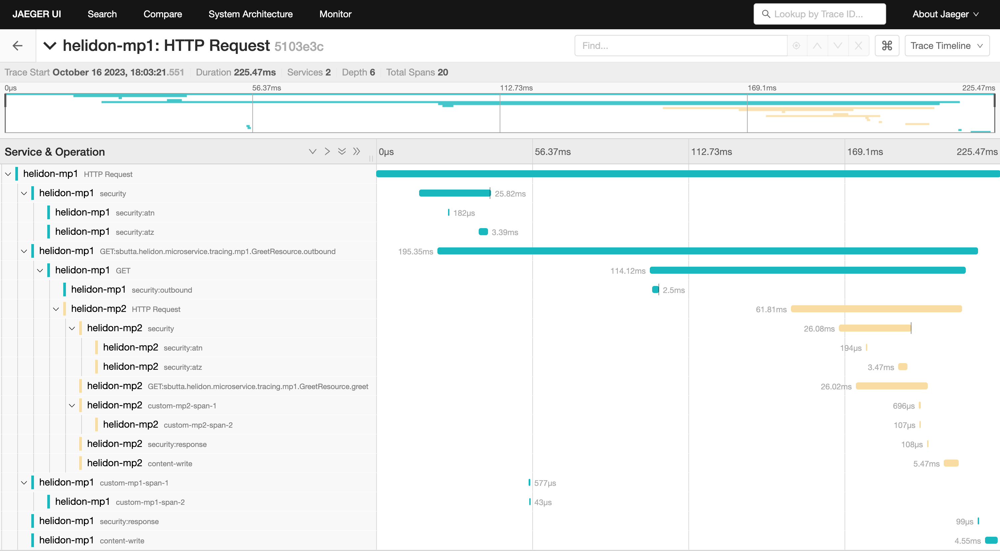

# Tracing

> [!WARNING]
> This feature is marked as `@Deprecated` in Helidon. Please use the
> [Telemetry](../mp/telemetry.md) feature instead. The OpenTracing Specification
> that MP OpenTracing is based on is no longer maintained. The MP OpenTracing
> specification is no longer required by MicroProfile. The specification is
> superseded by the [MicroProfile Telemetry specification][microprofile-tel].

## Overview

Distributed tracing is a critical feature of microservice based applications,
since it traces workflow both within a service and across multiple services.
This provides insight to sequence and timing data for specific blocks of work,
which helps you identify performance and operational issues. Helidon MP includes
support for distributed tracing through the [OpenTracing
API](https://opentracing.io). Tracing is integrated with WebServer and Security.

## Maven Coordinates

To enable MicroProfile Tracing, either add a dependency on the
[helidon-microprofile bundle](introduction.md) or add the following dependency
to your project’s `pom.xml` (see [Managing
Dependencies](../dependency-management.md)).

```xml [pom.xml]
<dependency>
  <groupId>io.helidon.microprofile.tracing</groupId>
  <artifactId>helidon-microprofile-tracing</artifactId>
</dependency>
```

## Usage

This section explains a few concepts that you need to understand before you get
started with tracing.

- In the context of this document, a *service* is synonymous with an
  application.
- A *span* is the basic unit of work done within a single service, on a single
  host. Every span has a name, starting timestamp, and duration. For example,
  the work done by a REST endpoint is a span. A span is associated to a single
  service, but its descendants can belong to different services and hosts.
- A *trace* contains a collection of spans from one or more services, running on
  one or more hosts. For example, if you trace a service endpoint that calls
  another service, then the trace would contain spans from both services. Within
  a trace, spans are organized as a directed acyclic graph (DAG) and can belong
  to multiple services, running on multiple hosts. The *OpenTracing Data Model*
  describes the details at [The OpenTracing Semantic
  Specification][the-opentracing]. Spans are automatically created by Helidon as
  needed during execution of the REST request. Additional spans can be added
  through MP annotation `@Traced` or through OpenTracing APIs.

## Traced spans

The following table lists all spans traced by Helidon components:

<!--@mdc ::table-collapse -->
| component    | span name            | description                                                                                                                                                               |
|--------------|----------------------|---------------------------------------------------------------------------------------------------------------------------------------------------------------------------|
| `web-server` | `HTTP Request`       | The overall span of the Web Server from request initiation until response Note that in `Zipkin` the name is replaced with `jax-rs` span name if `jax-rs` tracing is used. |
| `web-server` | `content-read`       | Span for reading the request entity                                                                                                                                       |
| `web-server` | `content-write`      | Span for writing the response entity                                                                                                                                      |
| `security`   | `security`           | Processing of request security                                                                                                                                            |
| `security`   | `security:atn`       | Span for request authentication                                                                                                                                           |
| `security`   | `security:atz`       | Span for request authorization                                                                                                                                            |
| `security`   | `security:response`  | Processing of response security                                                                                                                                           |
| `security`   | `security:outbound`  | Processing of outbound security                                                                                                                                           |
| `jax-rs`     | A generated name     | Span for the resource method invocation, name is generated from class and method name                                                                                     |
| `jax-rs`     | `jersey-client-call` | Span for outbound client call                                                                                                                                             |
<!--@mdc :: -->

Some of these spans `log` to the span. These log events can be (in most cases)
configured:

| span name           | log name           | configurable | enabled by default | description                                              |
|---------------------|--------------------|--------------|--------------------|----------------------------------------------------------|
| `HTTP Request`      | `handler.class`    | YES          | YES                | Each handler has its class and event logged              |
| `security`          | `status`           | YES          | YES                | Logs either "status: PROCEED" or "status: DENY"          |
| `security:atn`      | `security.user`    | YES          | NO                 | The username of the user if logged in                    |
| `security:atn`      | `security.service` | YES          | NO                 | The name of the service if logged in                     |
| `security:atn`      | `status`           | YES          | YES                | Logs the status of security response (such as `SUCCESS`) |
| `security:atz`      | `status`           | YES          | YES                | Logs the status of security response (such as `SUCCESS`) |
| `security:outbound` | `status`           | YES          | YES                | Logs the status of security response (such as `SUCCESS`) |

There are also tags that are set by Helidon components. These are not
configurable.

<!--@mdc ::table-collapse -->
| span name            | tag name           | description                                                                                       |
|----------------------|--------------------|---------------------------------------------------------------------------------------------------|
| `HTTP Request`       | `component`        | name of the component - `helidon-webserver`, or `jaxrs` when using MP                             |
| `HTTP Request`       | `http.method`      | HTTP method of the request, such as `GET`, `POST`                                                 |
| `HTTP Request`       | `http.status_code` | HTTP status code of the response                                                                  |
| `HTTP Request`       | `http.url`         | The path of the request (for SE without protocol, host and port)                                  |
| `HTTP Request`       | `error`            | If the request ends in error, this tag is set to `true`, usually accompanied by logs with details |
| `security`           | `security.id`      | ID of the security context created for this request (if security is used)                         |
| `jersey-client-call` | `http.method`      | HTTP method of the client request                                                                 |
| `jersey-client-call` | `http.status_code` | HTTP status code of client response                                                               |
| `jersey-client-call` | `http.url`         | Full URL of the request (such as `http://localhost:8080/greet`)                                   |
<!--@mdc :: -->

## Configuration

### Enabling and Disabling Tracing

You can configure a custom service name using the `tracing.service`
configuration property. If this property is undefined, name is created from
JAX-RS Application name, or `Helidon MP` is used if no application is defined.

### Configuration options

<!--@include ../config/io.helidon.tracing.Tracer.md#configuration-options delim=--- offset=2 collapseTables=10 -->
See [Configuration options][io-helidon-traci].
<!--/include-->


To disable Helidon tracing for web server and security:

```properties [microprofile-config.properties]
tracing.components.web-server.enabled=false
tracing.components.security.enabled=false
```

To disables MP Tracing as by specification:

```properties [microprofile-config.properties]
mp.opentracing.server.skip-pattern=.*
```

Tracing configuration can be defined in `application.yaml` file.

```yaml [application.yaml]
tracing:
  paths:
    - path: "/favicon.ico"
      enabled: false
    - path: "/metrics"
      enabled: false
    - path: "/health"
      enabled: false
  components:
    web-server:
      spans:
        - name: "HTTP Request"
          logs:
            - name: "content-write"
              enabled: false
```

### Controlling Tracing Output

For Web Server we have a path based support for configuring tracing, in addition
to the configuration described above.

Configuration of path can use any path string supported by the Web Server. The
configuration itself has the same possibilities as traced configuration
described above. The path specific configuration will be merged with global
configuration (path is the "newer" configuration, global is the "older")

#### Renaming top level span using request properties

To have a nicer overview in search pane of a tracer, you can customize the
top-level span name using configuration.

Example:

Configuration properties:

```properties [microprofile-config.properties]
tracing.components.web-server.spans.0.name="HTTP Request"
tracing.components.web-server.spans.0.new-name: "HTTP %1$s %2$s"
```

This is supported ONLY for the span named "HTTP Request" on component
"web-server".

Parameters provided:

1.  Method - HTTP method
2.  Path - path of the request (such as '/greet')
3.  Query - query of the request (may be null)

## Examples

The examples in this guide demonstrate how to integrate tracing with Helidon,
how to view traces, how to trace across multiple services, and how to integrate
tracing with Kubernetes. All examples use Jaeger and traces will be viewed using
both the Jaeger UI.

### Set up Jaeger

First, you need to run the Jaeger tracer. Helidon will communicate with this
tracer at runtime.

Run Jaeger within a docker container, then check the Jaeger server working:

<!--@mdc ::code-callout -->
```shell [Terminal]
docker run -d --name jaeger \                  <1>
  -e COLLECTOR_OTLP_ENABLED=true \
  -p 6831:6831/udp \
  -p 6832:6832/udp \
  -p 5778:5778 \
  -p 16686:16686 \
  -p 4317:4317 \
  -p 4318:4318 \
  -p 14250:14250 \
  -p 14268:14268 \
  -p 14269:14269 \
  -p 9411:9411 \
  jaegertracing/all-in-one:1.50
```
1. Run the Jaeger docker image.
<!--@mdc :: -->

Check the Jaeger server by opening http://localhost:16686/search in a browser.

### Trace Across Services

Helidon automatically traces across services as long as the services use the
same tracer, for example, the same instance of Jaeger. This means a single trace
can include spans from multiple services and hosts. OpenTracing uses a
`SpanContext` to propagate tracing information across process boundaries. When
you make client API calls, Helidon will internally call OpenTracing APIs to
propagate the `SpanContext`. There is nothing you need to do in your application
to make this work.

To demonstrate distributed tracing, you will need to create a second project,
where the server listens on port 8081. Create a new root directory to hold this
new project, then do the following steps, similar to what you did at the start
of this guide:

#### Create a second service

Run the Maven archetype:

```shell [Terminal]
mvn -U archetype:generate -DinteractiveMode=false \
    -DarchetypeGroupId=io.helidon.archetypes \
    -DarchetypeArtifactId=helidon-quickstart-mp \
    -DarchetypeVersion=4.4.0-SNAPSHOT \
    -DgroupId=io.helidon.examples \
    -DartifactId=helidon-quickstart-mp-2 \
    -Dpackage=io.helidon.examples.quickstart.mp
```

The project will be built and run from the helidon-quickstart-mp directory:

```shell [Terminal]
cd helidon-quickstart-mp-2
```

Add the following dependency to pom.xml:

```xml [pom.xml]
<dependency>
  <groupId>io.helidon.tracing.providers</groupId>
  <artifactId>helidon-tracing-providers-jaeger</artifactId>
</dependency>
```

Replace `META-INF/microprofile-config.properties` with the following:

```properties [microprofile-config.properties]
app.greeting=Hello From MP-2
tracing.service=helidon-mp-2

# MicroProfile server properties
server.port=8081
```

Build the application, skipping unit tests, then run it:

```shell [Terminal]
mvn package -DskipTests=true
java -jar target/helidon-quickstart-mp-2.jar
```

Run the curl command in a new terminal window and check the response (**notice
the port is 8081**):

```shell [Terminal]
curl http://localhost:8081/greet
```

Response body:

<!--@mdc ::code-callout -->
```json
{
  "message": "Hello From MP-2 World!" // <1>
}
```
1. Notice the greeting came from the second service.
<!--@mdc :: -->

#### Modify the first service

Once you have validated that the second service is running correctly, you need
to modify the original application to call it.

Replace the GreetResource class with the following code:

<!--@mdc ::code-callout{collapsed} -->
```java
@Path("/greet")
@RequestScoped
public class GreetResource {

    @Uri("http://localhost:8081/greet")
    private WebTarget target; // <1>

    private static final JsonBuilderFactory JSON = Json.createBuilderFactory(Map.of());
    private final GreetingProvider greetingProvider;

    @Inject
    public GreetResource(GreetingProvider greetingConfig) {
        this.greetingProvider = greetingConfig;
    }

    @GET
    @Produces(MediaType.APPLICATION_JSON)
    public JsonObject getDefaultMessage() {
        return createResponse("World");
    }

    @GET
    @Path("/outbound") // <2>
    public JsonObject outbound() {
        return target.request().accept(MediaType.APPLICATION_JSON_TYPE).get(JsonObject.class);
    }

    private JsonObject createResponse(String who) {
        String msg = String.format("%s %s!", greetingProvider.getMessage(), who);

        return JSON.createObjectBuilder().add("message", msg).build();
    }
}
```
1. This is the `WebTarget` needed to send a request to the second service at port
   `8081`.
2. This is the new endpoint that will call the second service.
<!--@mdc :: -->

<!--@mdc ::code-callout -->
```shell [Terminal]
curl -i http://localhost:8080/greet/outbound # <1>
```
1. The request went to the service on `8080`, which then invoked the service at
   `8081` to get the greeting.
<!--@mdc :: -->

Response body:

<!--@mdc ::code-callout -->
```json [Response]
{
  "message": "Hello From MP-2 World!" // <1>
}
```
1. Notice the greeting came from the second service.
<!--@mdc :: -->

Refresh the Jaeger UI trace listing page and notice that there is a trace across
two services.

*Tracing across multiple services detail view*



In the image above, you can see that the trace includes spans from two services.
You will notice there is a gap before the sixth span, which is a `get`
operation. This is a one-time client initialization delay. Run the `/outbound`
curl command again and look at the new trace to see that the delay no longer
exists.

You can now stop your second service, it is no longer used in this guide.

## Kubernetes Integration

The following example demonstrates how to use Jaeger from a Helidon application
running in Kubernetes.

Update application.yaml:

```yaml [application.yaml]
tracing:
  host: "jaeger"
```

Stop the application and build the docker image for your application:

```shell [Terminal]
docker build -t helidon-tracing-mp .
```

### Deploy Jaeger into Kubernetes

Create the Kubernetes YAML specification, named `jaeger.yaml`, with the
following contents:

```yaml [jaeger.yaml]
apiVersion: v1
kind: Service
metadata:
  name: jaeger
spec:
  ports:
    - port: 16686
      protocol: TCP
  selector:
    app: jaeger
---
kind: Pod
apiVersion: v1
metadata:
  name: jaeger
  labels:
    app: jaeger
spec:
  containers:
    - name: jaeger
      image: jaegertracing/all-in-one
      imagePullPolicy: IfNotPresent
      ports:
        - containerPort: 16686
```

Create the Jaeger pod and ClusterIP service:

```shell [Terminal]
kubectl apply -f ./jaeger.yaml
```

Create a Jaeger external server and expose it on port 9142:

<!--@mdc ::code-callout -->
```shell [Terminal]
kubectl expose pod jaeger --name=jaeger-external --port=16687 --target-port=16686 --type=LoadBalancer # <1>
```
1. Create a service so that you can access the Jaeger UI.
<!--@mdc :: -->

Navigate to http://localhost:16687/search to validate that you can access Jaeger
running in Kubernetes. It may take a few seconds before it is ready.

### Deploy Your Helidon Application into Kubernetes

Create the Kubernetes YAML specification, named `tracing.yaml`, with the
following contents:

<!--@mdc ::code-callout{collapsed} -->
```yaml [tracing.yaml]
kind: Service
apiVersion: v1
metadata:
  name: helidon-tracing # <1>
  labels:
    app: helidon-tracing
spec:
  type: NodePort
  selector:
    app: helidon-tracing
  ports:
    - port: 8080
      targetPort: 8080
      name: http
---
kind: Deployment
apiVersion: apps/v1
metadata:
  name: helidon-tracing
spec:
  replicas: 1 # <2>
  selector:
    matchLabels:
      app: helidon-tracing
  template:
    metadata:
      labels:
        app: helidon-tracing
        version: v1
    spec:
      containers:
        - name: helidon-tracing
          image: helidon-tracing-mp
          imagePullPolicy: IfNotPresent
          ports:
            - containerPort: 8080
```
1. A service of type `NodePort` that serves the default routes on port `8080`.
2. A deployment with one replica of a pod.
<!--@mdc :: -->

Create and deploy the application into Kubernetes:

```shell [Terminal]
kubectl apply -f ./tracing.yaml
```

### Access Your Application and the Jaeger Trace

Get the application service information:

```shell [Terminal]
kubectl get service/helidon-tracing
```

<!--@mdc ::code-callout -->
```log [Output]
NAME             TYPE       CLUSTER-IP      EXTERNAL-IP   PORT(S)          AGE
helidon-tracing   NodePort   10.99.159.2   <none>        8080:31143/TCP   8s # <1>
```
1. A service of type `NodePort` that serves the default routes on port `31143`.
<!--@mdc :: -->

Verify the tracing endpoint using port 31143, your port will likely be
different:

```shell [Terminal]
curl http://localhost:31143/greet
```

```json [Response]
{
  "message": "Hello World!"
}
```

Access the Jaeger UI at http://localhost:16687/search and click on the refresh
icon to see the trace that was just created.

### Cleanup

You can now delete the Kubernetes resources that were just created during this
example.

Delete the Kubernetes resources:

```shell [Terminal]
kubectl delete -f ./jaeger.yaml
kubectl delete -f ./tracing.yaml
kubectl delete service jaeger-external
docker rm -f jaeger
```

## Creating custom spans

Helidon MP fully supports MicroProfile OpenTracing. You can add custom spans
using `@Traced` annotation on methods of CDI beans.

**Note for invoking methods on same class:** *If you invoke a method on the same
class, `@Traced` annotation would be ignored, as it is not invoked through a CDI
proxy and as such cannot be intercepted. To make sure `@Traced` is honored, use
it on JAX-RS resource methods and on CDI bean methods used from other beans.*

## Trace propagation across services

Automated trace propagation is supported currently only with Jersey client.

Tracing propagation works automatically as long as you run within the scope of
Helidon MP and use Helidon components to invoke external services.

### Manual handling of traces in Jersey Client

There is an option to provide `SpanContext` programmatically (such as when
writing a command line application that starts the span manually).

You can either configure the span context as the active span, or explicitly
define it as client property.

Tracing propagation with Jersey client:

```java
Response response = client.target(serviceEndpoint)
        .request()
        // tracer should be provided unless available as GlobalTracer
        .property(TRACER_PROPERTY_NAME, tracer)
        .property(CURRENT_SPAN_CONTEXT_PROPERTY_NAME, spanContext)
        .get();
```

## Jaeger Tracing

```xml [pom.xml]
<dependency>
  <groupId>io.helidon.tracing</groupId>
  <artifactId>helidon-tracing-providers-jaeger</artifactId>
</dependency>
```

### Configuration options

<!--@include ../config/io.helidon.tracing.providers.jaeger.JaegerTracerBuilder.md#configuration-options delim=--- offset=1 collapseTables=10 -->
See [Configuration options][io-helidon-traci-2].
<!--/include-->

### Configuration Example

The following is an example of a Jaeger configuration, specified in the YAML
format.

```yaml [application.yaml]
tracing:
    service: "helidon-full-http"
    protocol: "https"
    host: "jaeger"
    port: 14240
```

### Jaeger Tracing Metrics

As the [Jaeger Tracing](#jaeger-tracing) section describes, you can use Jaeger
tracing in your Helidon application.

## Zipkin Tracing

```xml [pom.xml]
<dependency>
  <groupId>io.helidon.tracing.providers</groupId>
  <artifactId>helidon-tracing-providers-zipkin</artifactId>
</dependency>
```

### Configuration options

<!--@include ../config/io.helidon.tracing.providers.zipkin.ZipkinTracerBuilder.md#configuration-options delim=--- offset=1 collapseTables=10 -->
See [Configuration options][io-helidon-traci-3].
<!--/include-->

### Configuration Example

The following is an example of a Zipkin configuration, specified in the YAML
format.

```yaml [application.yaml]
tracing:
  zipkin:
    service: "helidon-service"
    protocol: "https"
    host: "zipkin"
    port: 9987
    api-version: 1
    # this is the default path for API version 2
    path: "/api/v2/spans"
    tags:
      tag1: "tag1-value"
      tag2: "tag2-value"
    boolean-tags:
      tag3: true
      tag4: false
    int-tags:
      tag5: 145
      tag6: 741
```

Example of Zipkin trace:


## OpenTelemetry Tracing

Helidon supports configuration of OpenTelemetry and OpenTelemetry tracing in two
primary ways: using tracing or using telemetry. The [Helidon MP Telemetry doc
page](../mp/telemetry.md) describes how to use Helidon’s support for
MicroProfile Telemetry to control OpenTelemetry.

Avoid using both the OpenTelemetry tracing support described here and support
for MicroProfile Telemetry as the results are unpredictable.

> [!NOTE]
> If you provide settings under both `telemetry` and `tracing`, Helidon uses the
> `telemetry` settings. Specifying both does not confuse Helidon but it might
> confuse users.

Dependency for OpenTelemetry support using tracing:

```xml [pom.xml]
<dependency>
  <groupId>io.helidon.tracing.providers</groupId>
  <artifactId>helidon-tracing-providers-opentelemetry</artifactId>
</dependency>
```

### Configuration options

<!--@include ../config/io.helidon.tracing.providers.opentelemetry.OpenTelemetryTracer.md#configuration-options delim=--- offset=1 collapseTables=10 -->
See [Configuration options][io-helidon-traci-4].
<!--/include-->

### Configuration Example

<!--@mdc ::code-callout -->
```properties [microprofile-config.properties]
tracing.service=helidon-otel-tracing-example # <1>
tracing.global=false                         # <2>
tracing.int-tags.0.example=1                 # <3>
tracing.tags.0.direction=north               # <4>
```
1. Specifies the OpenTelemetry service name.
2. Indicates the configured tracer *should not* be made the global tracer
   (defaults to `true`).
3. Assigns an integer-valued tag `example` the value `1`.
4. Assigns a string-valued tag `direction` the value `north`.
<!--@mdc :: -->

By default, Helidon tracing support for OpenTelemetry uses OpenTelemetry’s OTLP
gRPC exporter. Alternatively, you can choose to use OpenTelemetry’s HTTP
exporter using protobuf by setting `exporter-type` to `http/proto`. To use other
exporters OpenTelemetry offers, use the Helidon `telemetry` configuration
instead of `tracing`.

## Span Lifecycle

<!--@include ../includes/tracing/common-callbacks.md#span-lifecycle offset=2 -->
See [Span Lifecycle Callbacks][span-lifecycle-c].
<!--/include-->

## Reference

- [MicroProfile OpenTracing Specification][microprofile-ope]
- [OpenTracing Project](https://opentracing.io/)

[microprofile-tel]: https://github.com/eclipse/microprofile-telemetry
[the-opentracing]: https://opentracing.io/specification
[microprofile-ope]: https://download.eclipse.org/microprofile/microprofile-opentracing-3.0/microprofile-opentracing-spec-3.0.html
[io-helidon-traci]: ../config/io.helidon.tracing.Tracer.md#configuration-options
[io-helidon-traci-2]: ../config/io.helidon.tracing.providers.jaeger.JaegerTracerBuilder.md#configuration-options
[io-helidon-traci-3]: ../config/io.helidon.tracing.providers.zipkin.ZipkinTracerBuilder.md#configuration-options
[io-helidon-traci-4]: ../config/io.helidon.tracing.providers.opentelemetry.OpenTelemetryTracer.md#configuration-options
[span-lifecycle-c]: ../includes/tracing/common-callbacks.md#span-lifecycle
