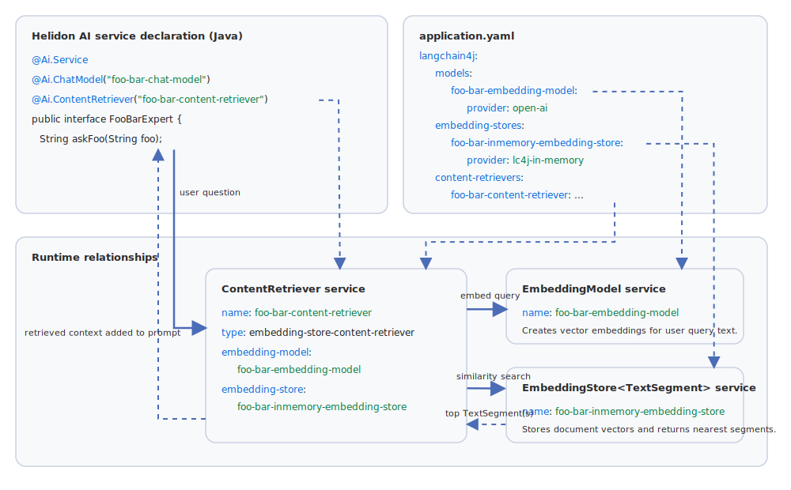

# RAG

## Maven Coordinates

No additional dependencies are required beyond the [LangChain4j integration core dependencies](langchain4j.md#maven-coordinates).

## Retrieval-Augmented Generation

To use RAG with LangChai4j in Helidon, we are going to work with several components.

- **ChatModel** – LLM model for which are going to augment the prompts
- **EmbeddingModel** – Special model trained to create embeddings and execute similarity search with the original prompt
- **EmbeddingStore** – A storage for embeddings we are going to search embeddings similar to the original prompt
- **ContentRetriever** - LangChain4j utility actually using embedding model for content retrieval from the embedding store

RAG-capable AI Service or Agent needs to have content retriever configured, `@Ai.ContentRetriever` annotation can be used for that like in the following example:

```java
@Ai.Service
@Ai.ChatModel("foo-bar-chat-model")
@Ai.ContentRetriever("foo-bar-content-retriever")
public interface FooBarExpert {
    String askFoo(String foo);
}
```

To use the `foo-bar-content-retriever` content retriever from the preceding example, you must provide configuration that specifies the embedding model and embedding store to use.

See the complete configuration example below, which uses OpenAI models and the in-memory embedding store:

```yaml
langchain4j:

  providers:
    open-ai:
      api-key: "${OPENAI_API_KEY}"

  models:
    foo-bar-chat-model:
      provider: open-ai
      model-name: "gpt-4o-mini"

    foo-bar-embedding-model:
      provider: open-ai
      model-name: "text-embedding-3-small"

  embedding-stores:
    # Built-in in-memory embedding store
    foo-bar-inmemory-embedding-store:
      provider: lc4j-in-memory

  content-retrievers:
    foo-bar-content-retriever:
      provider: lc4j-content-retriever
      # Type is optional 'embedding-store-content-retriever' is the default
      type: embedding-store-content-retriever
      max-results: 10
      min-score: 0.6
      embedding-model: foo-bar-embedding-model
      embedding-store: foo-bar-inmemory-embedding-store
```

<figure>

</figure>

Full list of configuration properties:

| Key | Type | Description |
|----|----|----|
| `display-name` | string | Display name. |
| `enabled` | boolean | If set to `false`, embedding store content retriever will be disabled even if configured. |
| `max-results` | int | Maximum number of results. |
| `min-score` | double | Minimum score threshold. |
| `embedding-model` | string | Name of the service in the service registry that implements `dev.langchain4j.model.embedding.EmbeddingModel`. |
| `embedding-store` | string | Name of the service in the service registry that implements `dev.langchain4j.model.embedding.EmbeddingStore<TextSegment>`. |

## Additional Information

- [LangChain4j Integration](langchain4j.md)
