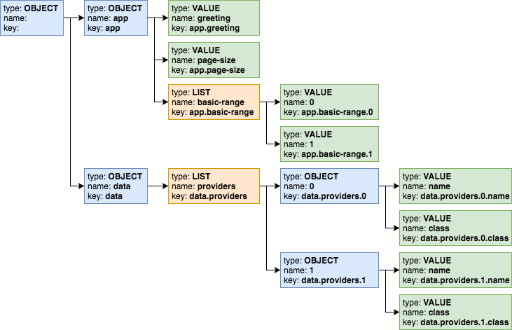

# Hierarchical Features

## Overview

The config system represents configuration as a tree in memory. Many developers
will choose to work directly with config values — values from the leaves in the
tree — accessing them by their keys. You can also navigate explicitly among the
nodes of the tree without using keys. This section describes what the tree looks
like and how you can traverse it.

## Configuration Node Types

The config system represents configuration in memory using three types of nodes,
each a different interface defined within the [`ConfigNode`][confignode]
interface.

`ConfigNode` Types:

| Type   | Java Interface          | Usage                                                                         |
|--------|-------------------------|-------------------------------------------------------------------------------|
| object | `ConfigNode.ObjectNode` | Represents complex structure (a subtree). Its child nodes can be of any type. |
| list   | `ConfigNode.ListNode`   | Represents a list of nodes. Its components can be of any type.                |
| value  | `ConfigNode.ValueNode`  | Represents a leaf node.                                                       |

A node of any type can have a `String` value.

Each config tree in memory will have an object node as its root with child nodes
as dictated by the source config data from which the config system built the
tree.

> [!NOTE]
> If your application attempts to access a non-existent node, for example using
>
> ```java
> config.get("key.does.not.exist")
> ```
>
> the config system returns a `Config` node object with type `MISSING`. The
> in-memory config tree contains nodes only of types `OBJECT`, `LIST`, and
> `VALUE`.

## Configuration Key

Each config node (except the root) has a non-null key. Here is the formal
definition of what keys can be:

The ABNF syntax of config key:

```bnf
config-key = *1( key-token *( "." key-token ) )
key-token = *( unescaped / escaped )
unescaped = %x00-2D / %x2F-7D / %x7F-10FFFF
       ; %x2E ('.') and %x7E ('~') are excluded from 'unescaped'
escaped = "~" ( "0" / "1" )
       ; representing '~' and '.', respectively
```

> [!IMPORTANT]
> To emphasize, the dot character (“.”) has special meaning as a name separator
> in keys. To include a dot as a character in a key escape it as “~1”. To
> include a tilde escape it as “~0”.

## In-memory Representation of Configuration

The following example is in [HOCON][hocon] (human-optimized config object
notation) format. The config system supports HOCON as an [extension
module](supported-formats.md#hoconjson).

HOCON `application.conf` file:

```text [application.conf]
app {
    greeting = "Hello"
    page-size = 20
    basic-range = [ -20, 20 ]
}
data {
    providers: [
        {
            name = "Provider1"
            class = "this.is.my.Provider1"
        },
        {
            name = "Provider2"
            class = "this.is.my.Provider2"
        }
    ]
}
```

The diagram below illustrates the in-memory tree for that configuration.

*Config Nodes structure of `application.conf` file*



1.  Each non-root node has a name which distinguishes it from other nodes with
    the same parent. The interpretation of the name depends on the node type.

    <table>
    <thead>
    <tr>
    <th>Node Type</th>
    <th>Name</th>
    </tr>
    </thead>
    <tbody>
    <tr>
    <td><p>object</td>
    <td rowspan="2" style="vertical-align: middle">member name of the node within its parent</td>
    </tr>
    <td>value</td>
    <tr>
    <td>list</td>
    <td>element index of the node within the containing list</td>
    </tr>
    </tbody>
    </table>

2.  Each node’s key is the fully-qualified path using dotted names from the root
    to that node.
3.  The root has an empty key, empty name, and no value.

The `Config` object exposes methods to return the [`name`][name], [`key`][key],
and [`type`][type] of the node.

## Access by Key

For many applications, accessing configuration values by key will be the
simplest approach. If you write the code with a specific configuration structure
in mind, your code can retrieve the value from a specific configuration node
very easily.

Your application can specify the entire navigation path as the key to a single
`get` invocation, using dotted notation to separate the names of the nodes along
the path. The code can navigate one level at a time using chained `get`
invocations, each specifying one level of the path to the expected node. Or, you
can mix the two styles.

All the following lines retrieve the same `Config` node.

Equivalent Config Retrievals:

<!--@mdc ::code-callout -->
```java
assert config.get("") == config;
Config provName1 = config.get("data.providers.0.name"); // <1>
Config provName2 = config.get("data.providers.0").get("name"); // <2>
Config provName3 = config.get("data.providers").get("0.name");
Config provName4 = config.get("data").get("providers.0").get("name");
Config provName5 = config.get("data").get("providers").get("0").get("name"); // <3>
```
1. using a single key
2. mixed style (composite key and single key)
3. navigating one level with each `get` invocation
<!--@mdc :: -->

The `Config.get(key)` method always returns a `Config` object without throwing
an exception. If the specified key does not exist the method returns a `Config`
node of type `MISSING`. There are several ways your application can tell whether
a given config value exists.

| Method     | Usage                                                                                                                                                      |
|------------|------------------------------------------------------------------------------------------------------------------------------------------------------------|
| `exists`   | Returns `true` or `false`                                                                                                                                  |
| `ifExists` | Execute functional operations for present nodes                                                                                                            |
| `type`     | Returns enum value for the `Config.Type`; `Config.Type.MISSING` if the node represents a config value that *does not* exist                                |
| `as`       | Returns the `ConfigValue` with the correct type that has all methods of `Optional` and a few additional ones - see [`ConfigValue`][configvalue] interface. |

The config system throws a `MissingValueException` if the application tries to
access the value of a missing node by invoking the `ConfigValue.get()` method.

## Access by General Navigation

Some applications might need to work with configuration without knowing its
structure or key names ahead of time, and such applications can use various
methods on the `Config` class to do this.

General Config Node Methods:

<table>
<thead>
<tr>
<th>Method</th>
<th>Usage</th>
</tr>
</thead>
<tbody>
<tr>
<td><code>asNodeList()</code></td>
<td>Returns a <code>ConfigValue&lt;List&lt;Config&gt;&gt;</code>. For nodes of type <code>OBJECT</code> contains child nodes as a <code>List</code></td>
</tr>
<tr>
<td><code>hasValue()</code></td>
<td>For any node reports if the node has a value. This can be true for any node type except <code>MISSING</code></td>
</tr>
<tr>
<td><code>isLeaf()</code></td>
<td>Reports whether the node has no child nodes. Leaf nodes have no children and has a single value</td>
</tr>
<tr>
<td><code>key()</code></td>
<td><p>Returns the fully-qualified path of the node using dotted notation</td>
</tr>
<tr>
<td><code>name()</code></td>
<td><p>Returns the name of the node (the last part of the key)</td>
</tr>
<tr>
<td><code>asNode()</code></td>
<td><p>Returns a <code>ConfigValue&lt;Config&gt;</code> wrapped around the node</td>
</tr>
<tr>
<td><code>traverse()</code></td>
<td rowspan="2" style="vertical-align: middle">Returns a <code>Stream&lt;Config&gt;</code> as an iterative deepening depth-first traversal of the subtree</td>
</tr>
<tr>
<td><code>traverse(Predicate&lt;Config&gt;)</code></td>
</tr>
<tr>
<td><code>type()</code></td>
<td><p>Returns the <code>Type</code> enum value for the node: <code>OBJECT</code>, <code>LIST</code>, <code>VALUE</code>, or <code>MISSING</code></td>
</tr>
</tbody>
</table>

List names of child nodes of an *object* node:

<!--@mdc ::code-callout -->
```java
List<String> appNodeNames = config.get("app")
        .asNodeList() // <1>
        .map(nodes -> { // <2>
            return nodes
                    .stream()
                    .map(Config::name)
                    .sorted()
                    .toList();
        })
        .orElse(List.of()); // <3>

assert appNodeNames.get(0).equals("basic-range"); // <4>
assert appNodeNames.get(1).equals("greeting"); // <4>
assert appNodeNames.get(2).equals("page-size"); // <4>
```
1. Get the ConfigValue with child `Config` instances.
2. Map the node list to names using the Java Stream API (if present)
3. Use an empty list if the "app" node does not exist
4. Check that the list contains the expected child names: `basic-range`,
   `greeting` and `page-size`.
<!--@mdc :: -->

List child nodes of a *list* node:

<!--@mdc ::code-callout -->
```java
List<Config> providers = config.get("data.providers")
        .asNodeList().orElse(List.of()); // <1>

assert providers.get(0).key().toString().equals("data.providers.0"); // <2>
assert providers.get(1).key().toString().equals("data.providers.1"); // <2>
```
1. Get child nodes of the `data.providers` *list* node as a `List` of `Config`
   instances.
2. Check that the list contains the expected child nodes with keys
   `data.providers.0` and `data.providers.1`.
<!--@mdc :: -->

The `traverse()` method returns a stream of the nodes in the subtree that is
rooted at the current configuration node. Depending on the structure of the
loaded configuration the stream contains a mix of object, list or leaf value
nodes.

Traverse subtree below a *list* node:

<!--@mdc ::code-callout -->
```java
config.get("data.providers")
        .traverse() // <1>
        .forEach(node -> System.out.println(node.type() + " \t" + node.key())); // <2>
```
1. Visit the subtree rooted at the `data.providers` *list* node.
2. Prints out following list of nodes (type and key):
<!--@mdc :: -->

```text
OBJECT   data.providers.0
VALUE   data.providers.0.name
VALUE   data.providers.0.class
OBJECT  data.providers.1
VALUE   data.providers.1.name
VALUE   data.providers.1.class
```

The optional `Predicate<Config>` argument to the `traverse` methods allows the
application to prune the traversal of a subtree at any point.

Traverse *root* (*object*) node, skipping the entire data subtree:

<!--@mdc ::code-callout -->
```java
config.traverse(node -> !node.name().equals("data")) // <1>
        .forEach(node -> System.out.println(node.type() + " \t" + node.key())); // <2>
```
1. Visit all *root* sub-nodes, excluding whole `data` tree structure but
   including others.
2. Prints out following list of nodes (type and key):
<!--@mdc :: -->

```text
OBJECT    app
VALUE   app.page-size
VALUE   app.greeting
LIST    app.basic-range
VALUE   app.basic-range.0
VALUE   app.basic-range.1
```

## Detaching a Config Subtree

Sometimes it can be convenient to write part of your application to deal with
configuration without it knowing if or where the relevant configuration is
plugged into a larger config tree.

For example, the [`application.properties`][application-prop] from the
introduction section contains several settings prefixed with `web` such as
`web.page-size`. Perhaps in another config source the same information might be
stored as `server.web.page-size`:

Alternate Structure for Web Config:

```java
server.web.page-size: 40
server.web.debug = true
server.web.ratio = 1.4
```

You might want to write the web portion of your app to work with a config
subtree with keys that are independent of the subtree’s position in a larger
tree. This would allow you to reuse the web portion of your application without
change, regardless of which structure a config source used.

One easy way to do this is to *detach* a subtree from a larger config tree. When
your application invokes the [`Config.detach`][config-detach] method it gets
back a *copy* of the config node but with no parent. The copy and the original
node both point to the same objects for their child nodes (if any). The original
node is unchanged.

Detaching a Subtree:

<!--@mdc ::code-callout -->
```java
// originalRoot is from the original example .conf file
// alternateRoot is from the alternate structure above

Config detachedFromOriginal = originalRoot.get("web").detach();
Config detachedFromAlternate = alternateRoot.get("server.web").detach();

assert originalRoot.get("web.debug").equals("true"); // <1>
assert alternateRoot.get("server.web.debug").equals("true"); // <1>

assert detachedFromOriginal.get("debug").equals("true"); // <2>
assert detachedFromAlternate.get("debug").equals("true"); // <2>
```
1. Navigation depends on knowing the full structure of the config and so is
   different for the two cases.
2. Detaching so the `web` node is the root can use the same key regardless of
   where the config subtree came from.
<!--@mdc :: -->

[confignode]: https://helidon.io/docs/v4/apidocs/io.helidon.config/io/helidon/config/spi/ConfigNode.html
[hocon]: https://github.com/lightbend/config/blob/master/HOCON.md
[name]: https://helidon.io/docs/v4/apidocs/io.helidon.config/io/helidon/config/Config.html#name--
[key]: https://helidon.io/docs/v4/apidocs/io.helidon.config/io/helidon/config/Config.html#key--
[type]: https://helidon.io/docs/v4/apidocs/io.helidon.config/io/helidon/config/Config.html#type--
[configvalue]: https://helidon.io/docs/v4/apidocs/io.helidon.config/io/helidon/config/ConfigValue.html
[application-prop]: introduction.md#accessing-config-values
[config-detach]: https://helidon.io/docs/v4/apidocs/io.helidon.config/io/helidon/config/Config.html#detach--
