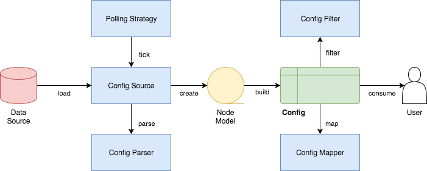

# The Configuration Component

## Contents

- [Overview](#overview)
- [Maven Coordinates](#maven-coordinates)
- [Usage](#usage)
- [Configuration](#configuration)
- [Reference](#reference)
- [Additional Information](#additional-information)

## Overview

Helidon provides a very flexible and comprehensive configuration system, offering you many application configuration choices. The Config component provides a Java API to load and process configuration data from various sources into a `Config` object which the application can then use.

## Maven Coordinates

To enable Config, add the following dependency to your project’s `pom.xml` (see [Managing Dependencies](../../about/managing-dependencies.md)).

``` xml
<dependencies>
    <dependency>
        <groupId>io.helidon.config</groupId>
        <artifactId>helidon-config</artifactId>
    </dependency>
</dependencies>
```

## Usage

A brief overview of the config system helps clarify its different parts and how they work together. Most applications will typically deal with more than one of these parts.

<figure>

</figure>

These are the main parts of the configuration system:

- `Config` system - allows you to read configuration data in an application
- A config source - a location containing configuration data (File, Map, Properties etc.)
- A config parser - a component capable of transforming bytes into configuration data (such as JSON content, YAML etc.)

### Config Sources

Configuration can be loaded from different types of locations and expressed in different formats. The config system includes support for several types of config sources, for example:

1.  Environment variables - the property is a name/value pair.
2.  Java system properties - the property is a name/value pair.
3.  Resources in the classpath - the contents of the resource is parsed according to its inferred format.
4.  File - the contents of the file is parsed according to its inferred format.
5.  Directory - each non-directory file in the directory becomes a config entry: the file name is the key. and the contents of that file are used as the corresponding config String value.
6.  A URL resource - contents is parsed according to its inferred format.
7.  A variety of in-memory data structures (`String`, `Map`, `Properties`)

See the JavaDoc for the [`ConfigSources`](/apidocs/io.helidon.config/io/helidon/config/ConfigSources.html) class for a complete list of the built-in config source types and how to use them.

See the [advanced topics'](advanced-configuration.md#_advanced_config_sources) page for further information on some more involved aspects of config sources.

### Config Parsers

When it reads configuration text from sources, the config system uses config parsers to translate that text into the in-memory data structures representing that configuration.

The config system includes several built-in parsers, such as for the Java properties, YAML, JSON, and HOCON formats. See [this section](#built-in-support-for-config-formats) for how to change your `pom.xml` to make parsers for those formats available to your application. Then your application can invoke the [config builder’s `addParser`](/apidocs/io.helidon.config/io/helidon/config/Config.Builder.html#addParser-io.helidon.config.spi.ConfigParser-) method so that builder will use the parsers you choose.

You can extend the system with custom parsers of your own. Implement the [`ConfigParser`](/apidocs/io.helidon.config/io/helidon/config/spi/ConfigParser.html) interface, then construct a `Config.Builder` using the `addParser` method, passing an instance of your customer parser. Invoke one of the `sources` methods to include a source that uses the custom format and then build the `Config` object.

See the [advanced topics'](advanced-configuration.md#_advanced_config_parsers) page for further information on some more involved aspects of config parsers.

## Configuration

### Global Configuration

Global configuration is a singleton instance of `Config` that is implicitly used by some components of Helidon, plus it provides a convenient mechanism for your application to retrieve configuration from anywhere in your code. By default, global configuration is initialized to the default `Config` object (as returned by `Config.create()`) and it is registered in the Helidon Service Registry.

To retrieve the global configuration, you fetch it directly from the service registry:

``` java
Config config = Services.get(Config.class);
```

Or you can use the global configuration convenience method to retrieve it:

``` java
Config config = Config.global();
```

If your application builds a custom configuration (from custom config sources for example) and you would like this configuration to be discovered and used by Helidon components then you should set this custom configuration instance as the global configuration. You do this by setting the configuration instance directly into the service registry (the old way of doing this via `Config.global(config)` is deprecated).

``` java
Services.set(Config.class, config);
```

Note that if you want to explicitly set the global configuration then you **must** do it before any code in your application (or any Helidon component) retrieves global configuration. That means it should be done early in your application initialization before you create any other Helidon component.

### Custom Config Sources

Although the default configuration is very simple to use, your application can take full control of all configuration sources and precedence. You can do so by creating and invoking methods on a `Config.Builder` object to construct a `Config` instance.

When your application prepares a `Config.Builder` it sets what `ConfigSource`s and `ConfigParser`s the builder should use in constructing the resulting `Config` object. The JavaDoc explains how to use the [`Config.Builder`](/apidocs/io.helidon.config/io/helidon/config/Config.Builder.html).

See the [Custom Configuration Sources](../../se/guides/config.md#_custom_configuration_sources) and [advanced config sources](advanced-configuration.md#_advanced_config_sources) sections for detailed examples and further information.

### Accessing Config Values

You have used Helidon to customize configuration behavior from your code using the `Config` and `Config.Builder` classes. As discussed previously, `Config` system reads configuration from a config source, which uses a config parser to translate the source into an in-memory tree which represents the configuration’s structure and values.

This approach allows us to take any source data, be it a flat properties file or an object structure such as JSON, and transform it into a single tree that allows for overriding of values using heterogeneous config sources.

We are using the `.` as a separator of tree structure.

Example of two config sources that can be used by `Config` with the same data tree in different formats:

A Properties source:

``` properties
web.page-size=25
```

A YAML source:

``` yaml
web:
  page-size: 25
```

The configuration has the same internal representation in `Config`. Once created, the `Config` object provides many methods the application can use to retrieve config data as various Java types. See the [`Config`](/apidocs/io.helidon.config/io/helidon/config/Config.html) JavaDoc for complete details.

``` java
int pageSize = config.get("web.page-size")
        .asInt()
        .orElse(20);
```

Or using the tree node approach:

``` java
int pageSize = config
        .get("web")
        .get("page-size")
        .asInt()
        .orElse(20);
```

For this first example we can see the basic features of `Config`:

- Configuration is a tree of `Config` nodes
- You can use `.` as a tree separator when requesting node values
- Each config value can be retrieved as a typed object, with shortcut methods for the most commonly used types, such as `int`, `String`, `long` and other
- You can immediately provide a default value for the cases the configuration option is not defined in any source

### Overriding Values

The `Config` system treats config sources as a hierarchy, where the first source that has a specific configuration key "wins" and its value is used, other sources are not even queried for it.

In order to properly configure your application using configuration sources, you need to understand the precedence rules that Helidon uses to merge your configuration data. If any of the Helidon required properties are not specified in one of these source, then Helidon will use a default value.

For example the default configuration when you use `Config.create()` uses the following config sources in precedence order:

1.  System properties config source
2.  Environment variables config source
3.  A classpath config source called `application.?` where the `?` depends on supported media types currently on the classpath.By default, it is `properties`, but if you have YAML support on classpath, it would be `application.yaml` (a `ConfigParser` may add additional supported suffixes for default file)

Let’s consider the following keys:

1.  System property `answer=42`
2.  Environment variable `ANSWER=38`
3.  A key in a configuration file `answer=36`

When you request `` config.get(`answer ``).asInt().orElse(25)`` , you would get `42 ``

This allows you to configure environment specific configuration values through system properties, environment variables, or through files available on each environment (be it a physical machine, a Kubernetes pod, or a docker image) without changing your source code.

### Config Filters

Config system applies configured *config filters* on each value when it is requested for the first time.

There is a built-in filter called `ValueResolvingFilter` (enabled by default, can be disabled through API) that resolves references to other keys in values in configuration.

Example: Let’s consider the following example properties file

``` properties
host=localhost
first-service.host=${host}/firstservice
second-service.host=${host}/secondservice
```

The filter resolves the `${host}` reference to the `localhost` value.

This makes it easier to override values in testing and production, as you can just override the `host` key and leave the URIs same.

See [Filter, Overrides, and Token Substitution](advanced-configuration.md#filters-and-overrides) section for further information on some more involved aspects.

### Typed config values

The `Config` object lets your application retrieve config data as a typed ConfigValue.

You can retrieve a `ConfigValue<T>` using the following `as` methods in `Config`:

- `asString()` - to get a string config value
- `asBoolean()` and other accessors for primitive types
- `as(Class)` - to get a value for a type that has a mapper configured
- `as(Generic)` - to get a value for a type supporting generics (such as `Set<String>`)
- `asMap()` - to get a map of key to value pairs
- `asList(Class)` - to get a list of typed values
- `as(Function<Config,T>)` - to get a typed value providing a mapper function

ConfigValue\<T\> can be used to obtain:

- an `Optional<T>` value *from a single node*,
- the `T` value *from a single node* interpreted as a basic Java type (primitive or simple object) already known to the config system (such as a `boolean` or a `Double`), or
- a complex Java type *from a subtree* of the config tree.

  The config system automatically knows how to return `List` and `Map` complex types, and you can provide *config mappers* to convert a config subtree to whatever Java types your application needs.

See [Property Mapping](property-mapping.md) page for details on how to use the built-in mappings and your own custom ones to convert to simple and complex types.

### Dealing with Loading Errors: Retry Policies

Config sources, especially those that depend on fallible mechanisms such as the network or a shared file system, might fail to load during momentary outages. The config system allows you to build resiliency into your application’s use of configuration that relies on such technologies.

When your application builds a `ConfigSource` it can specify a *retry policy*. When the config system needs to load data from that source it delegates the load operation to that retry policy. That policy is responsible not only for loading the data but also for detecting errors during loading and implementing the algorithm for deciding when and how many times to retry a failed load before reporting a failure back to your application.

The config system includes two predefined retry policies:

| Policy | Summary |
|----|----|
| "just call" (default) | asks the config source to load the data with no retry |
| "repeat" | performs a settable number of time-based retries, reporting failure only after all available retries have failed |

Predefined Retry Policies

See the [`RetryPolicies`](/apidocs/io.helidon.config/io/helidon/config/RetryPolicies.html) JavaDoc for complete details on these built-in retry policies.

You can devise your own policy. Implement the [`RetryPolicy`](/apidocs/io.helidon.config/io/helidon/config/spi/RetryPolicy.html) interface. Then pass an instance of your policy implementation to the config source builder’s `retryPolicy` method.

### Change Support

Each `Config` object which the config system returns to your application is immutable; even if the information in one of the underlying config sources changes, an in-memory data structure built from the earlier content remains unchanged.

Nevertheless, we know that configuration sometimes changes, and we may want to react to such changes. So the config system allows your application to learn when such underlying changes in the data occur and respond accordingly.

In `Config` system, you can do this through change support provided by these components:

1.  `Config.onChange()` API - you can use to add your listener, to be notified of configuration changes
2.  `PollingStrategy` - a component providing regular events to check if a source has changed. This requires support in config sources themselves (see `PollableSource`)
3.  `ChangeWatcher` - a component watching the underlying source for changes. This requires support in config sources themselves (see `WatchableSource`)
4.  `EventConfigSource` - an event source that is capable of notifying about changes itself

If you want to receive `onChange` events, you must configure your Config with at least one source that is capable of providing changes (having a `PollingStrategy` or `ChangeWatcher` configured, or implementing `EventConfigSource`)

The [mutability](mutability-support.md) documentation explains this in detail, and the [`PollingStrategies`](/apidocs/io.helidon.config/io/helidon/config/PollingStrategies.html) JavaDoc describes the built-in implementations.

You can, of course, write your own by implementing the [`PollingStrategy`](/apidocs/io.helidon.config/io/helidon/config/spi/PollingStrategy.html) interface. On a config source builder invoke `pollingStrategy` with an instance of your custom strategy and then invoke `build` to create the `ConfigSource`.

### Built-in Support for Config Formats

If you add additional Helidon config maven artifacts to your dependencies, then the config system can read formats other than Java properties format and the default configuration will search for other `application` file types in the following order. Note that the default configuration *stops* once it finds one of the files below; it *does not* merge all such files it can find.

| Source | Helidon maven artifact ID (group ID: `io.helidon.config`) | Notes |
|----|----|----|
| `application.yaml` | `helidon-config-yaml` | YAML format <http://yaml.org> |
| `application.conf` | `helidon-config-hocon` | HOCON format <https://github.com/lightbend/config#using-hocon-the-json-superset> |
| `application.json` | `helidon-config-hocon` | JSON format <https://json.org/> |
| `application.properties` | `helidon-config` | Java properties format |

Default Config Files (most to the least important)

You can also extend the config system to handle other types of sources by implementing the [`ConfigSource`](/apidocs/io.helidon.config/io/helidon/config/spi/ConfigSource.html) interface. See the [extensions'](extensions.md) documentation for complete information.

## Reference

| Name | Description |
| --- | --- |
| [SE Config Guide](../guides/config.md) | Step-by-step guide about using Config in your Helidon SE application. |

## Additional Information

The links in the following tables lead you to more information about various other config topics.

| Topic | Documentation |
|----|----|
| Where config comes from | [Config sources](#config-sources),[Config Profiles](config-profiles.md) |
| What format config data is expressed in | [Config parsers](#config-parsers), [supported formats](supported-formats.md) |
| How to filter, override, and dereference values | [Filters and overrides](advanced-configuration.md#filters-and-overrides) |
| What happens when config data changes | [Mutability Support](mutability-support.md) |
| How to deal with loading errors | [Config retry policies](#dealing-with-loading-errors-retry-policies) |

Controlling How Config is Loaded

| Topic | Documentation |
|----|----|
| How config data is translated into Java types | [Config mappers](property-mapping.md) |
| How to navigate config trees | [Navigation](hierarchical-features.md) |

Accessing Configuration Data

| Topic              | Documentation                |
|--------------------|------------------------------|
| Writing extensions | [Extensions](extensions.md) |

Extending and Fine-tuning the Config System
