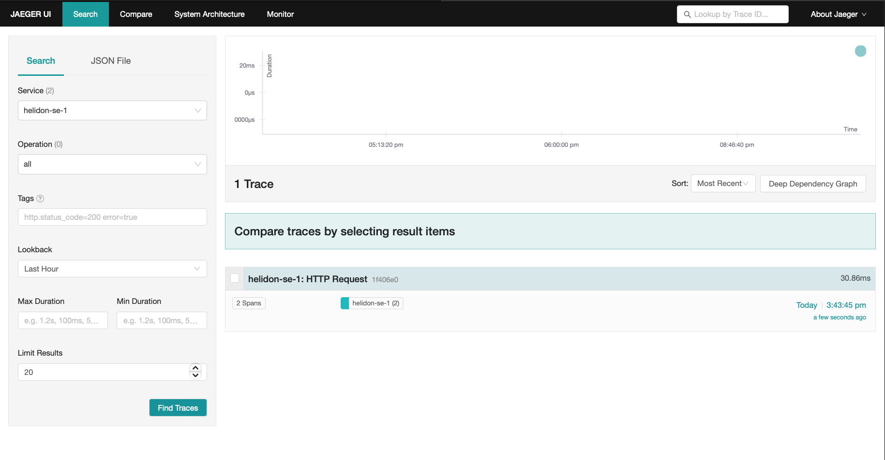
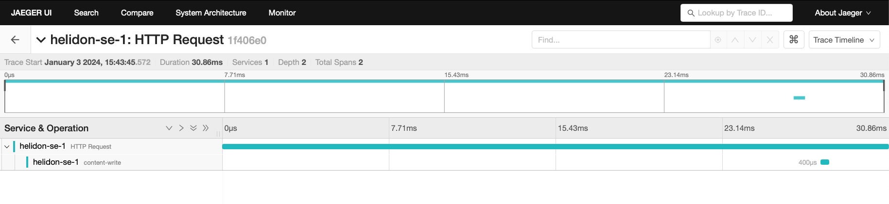
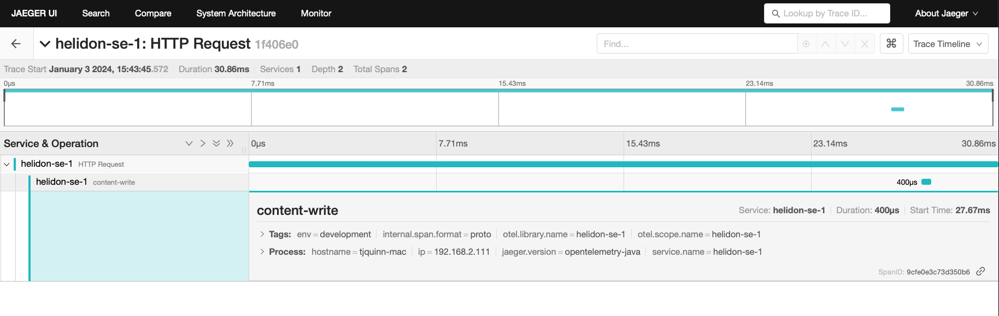
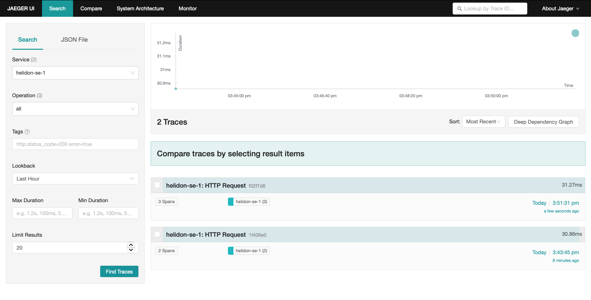
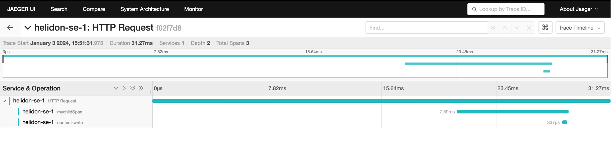
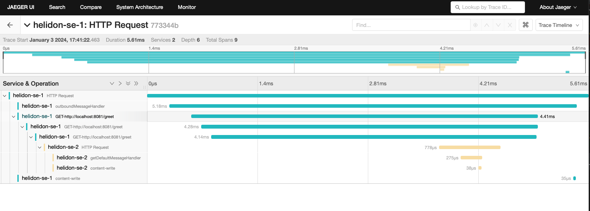

# Helidon SE Tracing Guide

This guide describes how to create a sample Helidon SE project that can be used to run some basic examples using tracing with a Helidon SE application.

## What You Need

For this 30 minute tutorial, you will need the following:

|  |  |
|----|----|
| [Java SE 21](https://www.oracle.com/technetwork/java/javase/downloads) ([Open JDK 21](http://jdk.java.net)) | Helidon requires Java 21+ (25+ recommended). |
| [Maven 3.8+](https://maven.apache.org/download.cgi) | Helidon requires Maven 3.8+. |
| [Docker 18.09+](https://docs.docker.com/install/) | If you want to build and run Docker containers. |
| [Kubectl 1.16.5+](https://kubernetes.io/docs/tasks/tools/install-kubectl/) | If you want to deploy to Kubernetes, you need `kubectl` and a Kubernetes cluster (you can [install one on your desktop](../../about/kubernetes.md)). |

Prerequisite product versions for Helidon 4.4.0-SNAPSHOT

*Verify Prerequisites*

```bash
java -version
mvn --version
docker --version
kubectl version
```

*Setting JAVA_HOME*

```bash
# On Mac
export JAVA_HOME=`/usr/libexec/java_home -v 21`

# On Linux
# Use the appropriate path to your JDK
export JAVA_HOME=/usr/lib/jvm/jdk-21
```

## Introduction

Distributed tracing is a critical feature of microservice-based applications, since it traces workflow both within a service and across multiple services. This provides insight to sequence and timing data for specific blocks of work, which helps you identify performance and operational issues. Helidon includes support for distributed tracing through its own API, backed by either through the [OpenTelemetry API](https://opentelemetry.io/docs/instrumentation/js/api/tracing/), or by [OpenTracing API](https://opentracing.io).

### Tracing Concepts

This section explains a few concepts that you need to understand before you get started with tracing. In the context of this document, a service is synonymous with an application. A *span* is the basic unit of work done within a single service, on a single host. Every span has a name, starting timestamp, and duration. For example, the work done by a REST endpoint is a span. A span is associated to a single service, but its descendants can belong to different services and hosts. A *trace* contains a collection of spans from one or more services, running on one or more hosts. For example, if you trace a service endpoint that calls another service, then the trace would contain spans from both services. Within a trace, spans are organized as a directed acyclic graph (DAG) and can belong to multiple services, running on multiple hosts. Spans are automatically created by Helidon as needed during execution of the REST request.

## Getting Started with Tracing

The examples in this guide demonstrate how to integrate tracing with Helidon, how to view traces, how to trace across multiple services, and how to integrate tracing with Kubernetes. All examples use the Jaeger backend and traces will be viewed using the Jaeger UI.

### Create a Sample Helidon SE Project

Use the Helidon SE Maven archetype to create a simple project that can be used for the examples in this guide.

*Run the Maven archetype:*

```bash
mvn -U archetype:generate -DinteractiveMode=false \
    -DarchetypeGroupId=io.helidon.archetypes \
    -DarchetypeArtifactId=helidon-quickstart-se \
    -DarchetypeVersion=4.4.0-SNAPSHOT \
    -DgroupId=io.helidon.examples \
    -DartifactId=helidon-quickstart-se \
    -Dpackage=io.helidon.examples.quickstart.se
```

*The project will be built and run from the `helidon-quickstart-se` directory:*

```bash
cd helidon-quickstart-se
```

### Set up Jaeger

First, run the Jaeger backend. Helidon communicates with this backend at runtime.

*Run Jaeger within a docker container*

```bash
docker run -d --name jaeger \ 
  -e COLLECTOR_OTLP_ENABLED=true \
  -p 6831:6831/udp \
  -p 6832:6832/udp \
  -p 5778:5778 \
  -p 16686:16686 \
  -p 4317:4317 \
  -p 4318:4318 \
  -p 14250:14250 \
  -p 14268:14268 \
  -p 14269:14269 \
  -p 9411:9411 \
  jaegertracing/all-in-one:1.50
```

- Run the Jaeger docker image.

### Enable Tracing in the Helidon Application

Update the `pom.xml` file and add the following OpenTelemetry dependency to the `<dependencies>` section (**not** `<dependencyManagement>`). This will enable Helidon to use OpenTelemetry at the default host and port, `localhost:4317`.

*Add the following dependencies to `pom.xml`:*

```xml
<dependencies>
     <dependency>
         <groupId>io.helidon.tracing</groupId>
         <artifactId>helidon-tracing</artifactId>   
     </dependency>
     <dependency>
         <groupId>io.helidon.webserver.observe</groupId>
         <artifactId>helidon-webserver-observe-tracing</artifactId> 
         <scope>runtime</scope>
     </dependency>
     <dependency>
         <groupId>io.helidon.tracing.providers</groupId>
         <artifactId>helidon-tracing-providers-opentelemetry</artifactId>  
         <scope>runtime</scope>
     </dependency>
</dependencies>
```

- Helidon Tracing dependencies.
- Observability features for tracing.
- OpenTelemetry tracing provider.

Helidon offers several tracing providers: OpenTelemetry, Zipkin, and Jaeger (deprecated). All spans sent by Helidon to the backend need to be associated with a service, assigned by the `tracing.service` setting in the example below.

*Add the following lines to `src/main/resources/application.yaml`:*

```bash
tracing:
  service: helidon-se-1
  tags:
    env: development
  enabled: true
  sampler-type: "const"
  sampler-param: 1
  log-spans: true
  propagation: b3
```

### View Automatic Tracing of REST Endpoints

Tracing is part of Helidon’s observability support. By default, Helidon discovers any observability feature on the classpath and activates it automatically. In particular for tracing, Helidon adds a trace each time a client accesses a service endpoint. You can see these traces using the Jaeger UI once you build, run, and access your application without changing your application’s Java code.

#### Build and Access QuickStart

*Build and run the application*

```bash
mvn clean package
java -jar target/helidon-quickstart-se.jar
```

*Access the application*

```bash
curl http://localhost:8080/greet
```

### Viewing Traces Using the Jaeger UI

The Jaeger backend provides a web-based UI at <http://localhost:16686> where you can see a visual representation of the traces and spans within them.

1.  From the `Service` drop list select `helidon-se-1`. This name corresponds to the `tracing.service` setting you assigned in the `application.yaml` config file.
2.  Click on the UI Find Traces button. Notice that you can change the look-back time to restrict the trace list. You will see a trace for each `curl` command you ran to access the application.

<figure>

<figcaption>List of traces</figcaption>
</figure>

Click on a trace to see the trace detail page (shown below) which shows the spans within the trace. You can clearly see the root span (`HTTP Request`) and the single child span (`content-write`) along with the time over which each span was active.

<figure>

<figcaption>Trace detail page</figcaption>
</figure>

You can examine span details by clicking on the span row. Refer to the image below which shows the span details including timing information. You can see times for each space relative to the root span.

<figure>

<figcaption>Span detail page</figcaption>
</figure>

### Adding a Custom Span

Your application can use the Helidon tracing API to create custom spans. The following code replaces the generated `getDefaultMessageHandler` method to add a custom span around the code which prepares the default greeting response. The new custom span’s parent span is set to the one which Helidon automatically creates for the REST endpoint.

*Update the `GreetService` class, replacing the `getDefaultMessageHandler` method:*

```java
private void getDefaultMessageHandler(ServerRequest request,
                                      ServerResponse response) {
    var spanBuilder = Tracer.global().spanBuilder("secondchildSpan"); 
    request.context().get(SpanContext.class).ifPresent(sc -> sc.asParent(spanBuilder)); 
    var span = spanBuilder.start(); 

    try (Scope scope = span.activate()) { 
        sendResponse(response, "World");
        span.end(); 
    } catch (Throwable t) {
        span.end(t);    
    }
}
```

- Create a new `Span` using the global tracer.
- Set the parent of the new span to the span from the `Request` if available.
- Start the span.
- Make the new span the current span, returning a `Scope` which is auto-closed.
- End the span normally after the response is sent.
- End the span with an exception if one was thrown.

*Build the application and run it:*

```bash
mvn package
java -jar target/helidon-quickstart-se.jar
```

*Run the `curl` command in a new terminal window and check the response:*

```bash
curl http://localhost:8080/greet
```

*JSON response:*

```json
{
  "message": "Hello World!"
}
```

Return to the main Jaeger UI screen and click Find Traces again. The new display contains an additional trace, displayed first, for the most recent `curl` you ran.

<figure>

<figcaption aria-hidden="true">Expanded trace list</figcaption>
</figure>

Notice that the top trace has three spans, not two as with the earlier trace. Click on the trace to see the trace details.

<figure>

<figcaption aria-hidden="true">Trace details with custom span</figcaption>
</figure>

Note the row for `mychildSpan`--the custom span created by the added code.

### Using Tracing Across Services

Helidon automatically traces across services if the services propagate span information. This means a single trace can include spans from multiple services and hosts. Helidon uses a `SpanContext` to propagate tracing information across process boundaries. When you make client API calls, Helidon will internally call OpenTelemetry APIs or OpenTracing APIs to propagate the `SpanContext`. There is nothing you need to do in your application to make this work.

To demonstrate distributed tracing, create a second project where the server listens to on port 8081. Create a new directory to hold this new project, then do the following steps, similar to what you did at the start of this guide:

### Create the Second Service

*Run the Maven archetype:*

```bash
mvn -U archetype:generate -DinteractiveMode=false \
    -DarchetypeGroupId=io.helidon.archetypes \
    -DarchetypeArtifactId=helidon-quickstart-se \
    -DarchetypeVersion=4.4.0-SNAPSHOT \
    -DgroupId=io.helidon.examples \
    -DartifactId=helidon-quickstart-se-2 \
    -Dpackage=io.helidon.examples.quickstart.se
```

*The project is in the `helidon-quickstart-se-2` directory:*

```bash
cd helidon-quickstart-se-2
```

*Add the following dependencies to `pom.xml`:*

```xml
<dependencies>
     <dependency>
         <groupId>io.helidon.tracing</groupId>
         <artifactId>helidon-tracing</artifactId>   
     </dependency>
     <dependency>
         <groupId>io.helidon.webserver.observe</groupId>
         <artifactId>helidon-webserver-observe-tracing</artifactId> 
         <scope>runtime</scope>
     </dependency>
     <dependency>
         <groupId>io.helidon.tracing.providers</groupId>
         <artifactId>helidon-tracing-providers-opentelemetry</artifactId>  
         <scope>runtime</scope>
     </dependency>
</dependencies>
```

- Helidon Tracing API.
- Observability features for tracing.
- OpenTelemetry tracing provider.

*Replace `src/main/resources/application.yaml` with the following:*

```bash
app:
  greeting: "Hello From SE-2"

tracing:
  service: helidon-se-2
  tags:
    env: development
  enabled: true
  sampler-type: "const"
  sampler-param: 1
  log-spans: true
  propagation: b3

server:
  port: 8081
  host: 0.0.0.0
```

> [!NOTE]
> The settings above are for development and experimental purposes only. For production environment, please see the [Tracing documentation](../../se/tracing.md).

*Update the `GreetService` class. Replace the `getDefaultMessageHandler` method:*

```java
private void getDefaultMessageHandler(ServerRequest request,
                                      ServerResponse response) {

    var spanBuilder = Tracer.global().spanBuilder("getDefaultMessageHandler");
    request.context().get(SpanContext.class).ifPresent(spanBuilder::parent);
    Span span = spanBuilder.start();

    try (Scope scope = span.activate()) {
        sendResponse(response, "World");
        span.end();
    } catch (Throwable t) {
        span.end(t);
    }
}
```

Build the application, skipping unit tests; the unit tests check for the default greeting response which is now different in the updated config. Then run the application.

*Build and run:*

```bash
mvn package -DskipTests=true
java -jar target/helidon-quickstart-se-2.jar
```

*Run the curl command in a new terminal window (**notice the port is 8081**) :*

```bash
curl http://localhost:8081/greet
```

*JSON response:*

```json
{
  "message": "Hello From SE-2 World!"
}
```

### Modify the First Service

Once you have validated that the second service is running correctly, you need to modify the original application to call it.

*Add the following dependencies to `pom.xml`:*

```xml
<dependencies>
    <dependency>
        <groupId>io.helidon.webclient</groupId>
        <artifactId>helidon-webclient</artifactId>
    </dependency>
    <dependency>
        <groupId>io.helidon.webclient</groupId>
        <artifactId>helidon-webclient-api</artifactId>
    </dependency>
    <dependency>
        <groupId>io.helidon.webclient</groupId>
        <artifactId>helidon-webclient-tracing</artifactId>
    </dependency>
    <dependency>
        <groupId>io.helidon.webclient</groupId>
        <artifactId>helidon-webclient-http1</artifactId>
        <scope>runtime</scope>
    </dependency>
</dependencies>
```

Make the following changes to the `GreetFeature` class.

1.  Add a `WebClient` field.

    *Add a private instance field (before the constructors)*

```java
    private WebClient webClient;
    ```

2.  Add code to initialize the `WebClient` field.

    *Add the following code to the `GreetService(Config)` constructor*

```java
    webClient = WebClient.builder()
            .baseUri("http://localhost:8081")
            .addService(WebClientTracing.create())
            .build();
    ```

3.  Add a routing rule for the new endpoint `/outbound`.

    *Add the following line in the `routing` method as the first `.get` invocation in the method*

```java
    .get("/outbound", this::outboundMessageHandler);
    ```

4.  Add a method to handle requests to `/outbound`.

    *Add the following method*

```java
    private void outboundMessageHandler(ServerRequest request,
                                        ServerResponse response) {
        var spanBuilder = Tracer.global().spanBuilder("outboundMessageHandler");
        request.context().get(SpanContext.class).ifPresent(spanBuilder::parent);
        var span = spanBuilder.start();

        try (Scope scope = span.activate()) {
            ClientResponseTyped<JsonObject> remoteResult = webClient.get()
                    .path("/greet")
                    .accept(MediaTypes.APPLICATION_JSON)
                    .request(JsonObject.class);

            response.status(remoteResult.status()).send(remoteResult.entity());
            span.end();
        } catch (Exception e) {
            response.status(Status.INTERNAL_SERVER_ERROR_500).send();
            span.end(e);
        }
    }
    ```

Stop the application if it is still running, rebuild and run it, then invoke the endpoint and check the response.

*Build, run, and access the application*

```bash
mvn clean package
java -jar target/helidon-quickstart-se.jar
curl -i http://localhost:8080/greet/outbound 
```

- The request goes to the service on `8080`, which then invokes the service at `8081` to get the greeting.

*JSON response:*

```json
{
  "message": "Hello From SE-2 World!" 
}
```

- Notice the greeting came from the second service.

Refresh the Jaeger UI trace listing page and notice that there is a trace across two services. Click on that trace to see its details.

<figure>

<figcaption>Tracing across multiple services detail view</figcaption>
</figure>

Note several things about the display:

1.  The top-level span `helidon-se-1 HTTP Request` includes all the work across *both* services.
2.  `helidon-se-1 outboundMessageHandler` is the custom span you added to the first service `/outbound` endpoint code.
3.  `helidon-se-1 GET-http://localhost:8080/greet` captures the work the `WebClient` is doing in sending a request to the second service. Helidon adds these spans automatically to each outbound `WebClient` request.
4.  `helidon-se-2 HTTP Request` represents the arrival of the request sent by the first service’s `WebClient` at the second service’s `/greet` endpoint.
5.  `helidon-se-2 getDefaultMessageHandler` is the custom span you added to the second service `/greet` endpoint code.

You can now stop your second service, it is no longer used in this guide.

## Integration with Kubernetes

The following example demonstrates how to use Jaeger from a Helidon application running in Kubernetes.

*Replace the tracing configuration in `resources/application.yaml` with the following:*

```yaml
tracing: 
  service: helidon-se-1
  host: jaeger
```

- Helidon service `helidon-se-1` will connect to the Jaeger server at host name `jaeger`.

*Stop the application and build the docker image for your application:*

```bash
docker build -t helidon-tracing-se .
```

### Deploy Jaeger into Kubernetes

*Create the Kubernetes YAML specification, named `jaeger.yaml`, with the following contents:*

```yaml
apiVersion: v1
kind: Service
metadata:
  name: jaeger
spec:
  ports:
    - port: 16686
      protocol: TCP
  selector:
    app: jaeger
---
kind: Pod
apiVersion: v1
metadata:
  name: jaeger
  labels:
    app: jaeger
spec:
  containers:
    - name: jaeger
      image: jaegertracing/all-in-one
      imagePullPolicy: IfNotPresent
      ports:
        - containerPort: 16686
```

*Create the Jaeger pod and ClusterIP service:*

```bash
kubectl apply -f ./jaeger.yaml
```

*Create a Jaeger external server to view the UI and expose it on port 9142:*

```bash
kubectl expose pod  jaeger --name=jaeger-external --port=16687 --target-port=16686 --type=LoadBalancer
```

Navigate to <http://localhost:16687/jaeger> to validate that you can access Jaeger running in Kubernetes. It may take a few seconds before it is ready.

### Deploy Your Helidon Application into Kubernetes

*Create the Kubernetes YAML specification, named `tracing.yaml`, with the following contents:*

```yaml
kind: Service
apiVersion: v1
metadata:
  name: helidon-tracing 
  labels:
    app: helidon-tracing
spec:
  type: NodePort
  selector:
    app: helidon-tracing
  ports:
    - port: 8080
      targetPort: 8080
      name: http
---
kind: Deployment
apiVersion: apps/v1
metadata:
  name: helidon-tracing
spec:
  replicas: 1 
  selector:
    matchLabels:
      app: helidon-tracing
  template:
    metadata:
      labels:
        app: helidon-tracing
        version: v1
    spec:
      containers:
        - name: helidon-tracing
          image: helidon-tracing-se
          imagePullPolicy: IfNotPresent
          ports:
            - containerPort: 8080
```

- A service of type `NodePort` that serves the default routes on port `8080`.
- A deployment with one replica of a pod.

*Create and deploy the application into Kubernetes:*

```bash
kubectl apply -f ./tracing.yaml
```

### Access Your Application and the Jaeger Trace

*Get the application service information:*

```bash
kubectl get service/helidon-tracing
```

```bash
NAME             TYPE       CLUSTER-IP      EXTERNAL-IP   PORT(S)          AGE
helidon-tracing   NodePort   10.99.159.2   <none>        8080:31143/TCP   8s 
```

- A service of type `NodePort` that serves the default routes on port `31143`.

*Verify the tracing endpoint using port `31143`, your port will likely be different:*

```bash
curl http://localhost:31143/greet
```

*JSON response:*

```json
{
  "message": "Hello World!"
}
```

Access the Jaeger UI at <http://localhost:9412/jaeger> and click on the refresh icon to see the trace that was just created.

### Cleanup

You can now delete the Kubernetes resources just created during this example.

*Delete the Kubernetes resources:*

```bash
kubectl delete -f ./jaeger.yaml
kubectl delete -f ./tracing.yaml
kubectl delete service jaeger-external
docker rm -f jaeger
```

## Responding to Span Lifecycle Events

Applications and libraries can register listeners to be notified at several moments during the lifecycle of every Helidon span:

- Before a new span starts
- After a new span has started
- After a span ends
- After a span is activated (creating a new scope)
- After a scope is closed

The next sections explain how you can write and add a listener and what it can do. See the [`SpanListener`](/apidocs/io.helidon.tracing/io/helidon/tracing/SpanListener.html) Javadoc for more information.

### Understanding What Listeners Do

A listener cannot affect the lifecycle of a span or scope it is notified about, but it can add tags and events and update the baggage associated with a span. Often a listener does additional work that does not change the span or scope such as logging a message.

When Helidon invokes the listener’s methods it passes proxies for the `Span.Builder`, `Span`, and `Scope` arguments. These proxies limit the access the listener has to the span builder, span, or scope, as summarized in the following table. If a listener method tries to invoke a forbidden operation, the proxy throws a [`SpanListener.ForbiddenOperationException`](/apidocs/io.helidon.tracing/io/helidon/tracing/SpanListener.ForbiddenOperationException.html) and Helidon then logs a `WARNING` message describing the invalid operation invocation.

| Tracing type | Changes allowed |
|----|----|
| [`Span.Builder`](/apidocs/io.helidon.tracing/io/helidon/tracing/Span.Builder.html) | Add tags |
| [`Span`](/apidocs/io.helidon.tracing/io/helidon/tracing/Span.html) | Retrieve and update baggage, add events, add tags |
| [`Scope`](/apidocs/io.helidon.tracing/io/helidon/tracing/Scope.html) | none |

Summary of Permitted Operations on Proxies Passed to Listeners

The following tables list specifically what operations the proxies permit.

| Method | Purpose | OK? |
|----|----|----|
| `build()` | Starts the span. | \- |
| `end` methods | Ends the span. | \- |
| `get()` | Starts the span. | \- |
| `kind(Kind)` | Sets the "kind" of span (server, client, internal, etc.) | \- |
| `parent(SpanContext)` | Sets the parent of the span to be created from the builder. | \- |
| `start()` | Starts the span. | \- |
| `start(Instant)` | Starts the span. | \- |
| `tag` methods | Add a tag to the builder before the span is built. | ✓ |
| `unwrap(Class)` | Cast the builder to the specified implementation type. † | ✓ |

[`io.helidon.tracing.Span.Builder`](/apidocs/io.helidon.tracing/io/helidon/tracing/Span.Builder.html) Operations

† Helidon returns the unwrapped object, not a proxy for it.

| Method | Purpose | OK? |
|----|----|----|
| `activate()` | Makes the span "current", returning a `Scope`. | \- |
| `addEvent` methods | Associate a string (and optionally other info) with a span. | ✓ |
| `baggage()` | Returns the `Baggage` instance associated with the span. | ✓ |
| `context()` | Returns the `SpanContext` associated with the span. | ✓ |
| `status(Status)` | Sets the status of the span. | \- |
| any `tag` method | Add a tag to the span. | ✓ |
| `unwrap(Class)` | Cast the span to the specified implementation type. † | ✓ |

[`io.helidon.tracing.Span`](/apidocs/io.helidon.tracing/io/helidon/tracing/Span.html) Operations

† Helidon returns the unwrapped object, not a proxy to it.

| Method       | Purpose                              | OK? |
|--------------|--------------------------------------|-----|
| `close()`    | Close the scope.                     | \-  |
| `isClosed()` | Reports whether the scope is closed. | ✓   |

[`io.helidon.tracing.Scope`](/apidocs/io.helidon.tracing/io/helidon/tracing/Scope.html) Operations

| Method | Purpose | OK? |
|----|----|----|
| `asParent(Span.Builder)` | Sets this context as the parent of a new span builder. | ✓ |
| `baggage()` | Returns `Baggage` instance associated with the span context. | ✓ |
| `spanId()` | Returns the span ID. | ✓ |
| `traceId()` | Returns the trace ID. | ✓ |

[`io.helidon.tracing.SpanContext`](/apidocs/io.helidon.tracing/io/helidon/tracing/SpanContext.html) Operations

### Adding a Listener

#### Explicitly Registering a Listener on a [`Tracer`](/apidocs/io.helidon.tracing/io/helidon/tracing/Tracer.html)

Create a `SpanListener` instance and invoke the `Tracer#register(SpanListener)` method to make the listener known to that tracer.

#### Automatically Registering a Listener on all `Tracer` Instances

Helidon also uses Java service loading to locate listeners and register them automatically on all `Tracer` objects. Follow these steps to add a listener service provider.

1.  Implement the [`SpanListener`](/apidocs/io.helidon.tracing/io/helidon/tracing/SpanListener.html) interface.
2.  Declare your implementation as a service provider:
    1.  Create the file `META-INF/services/io.helidon.tracing.SpanListener` containing a line with the fully-qualified name of your class which implements `SpanListener`.
    2.  If your service has a `module-info.java` file add the following line to it:

        ``` java
        provides io.helidon.tracing.SpanListener with <your-implementation-class>;
        ```

The `SpanListener` interface declares default no-op implementations for all the methods, so your listener can implement only the methods it needs to.

Helidon invokes each listener’s methods in the following order:

| Method | When invoked |
|----|----|
| `starting(Span.Builder<?> spanBuilder)` | Just before a span is started from its builder. |
| `started(Span span)` | Just after a span has started. |
| `activated(Span span, Scope scope)` | After a span has been activated, creating a new scope. A given span might never be activated; it depends on the code. |
| `closed(Span span, Scope scope)` | After a scope has been closed. |
| `ended(Span span)` | After a span has ended successfully. |
| `ended(Span span, Throwable t)` | After a span has ended unsuccessfully. |

Order in which Helidon Invokes Listener Methods

## Summary

This guide has demonstrated how to use the Helidon SE tracing feature with Jaeger. You have learned to do the following:

- Enable tracing within a service
- Use tracing with JAX-RS
- Use the Jaeger REST API and UI
- Use tracing across multiple services
- Integrate tracing with Kubernetes

Refer to the following references for additional information:

- [MicroProfile OpenTracing specification](https://download.eclipse.org/microprofile/microprofile-opentracing-3.0/microprofile-opentracing-spec-3.0.html)
- [MicroProfile OpenTracing Javadoc](https://download.eclipse.org/microprofile/microprofile-opentracing-3.0/apidocs)
  - [OpenTelemetry API](https://opentelemetry.io/docs/instrumentation/js/api/tracing/)
- [Helidon Javadoc](/apidocs/index.html?overview-summary.html)
