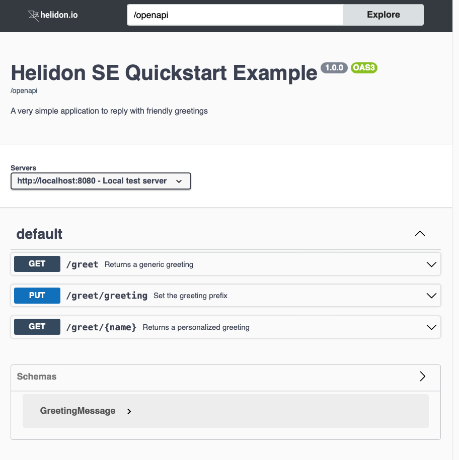
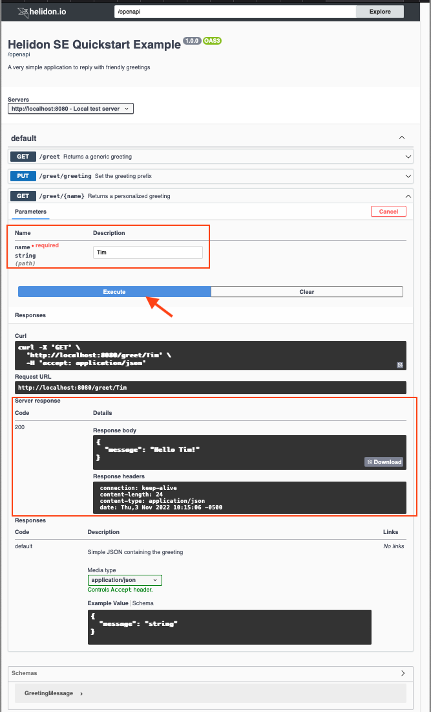

# OpenAPI UI

## Overview

SmallRye offers an [OpenAPI user interface component][openapi-user-int] which
displays a web page based on your application’s OpenAPI document. Through that
UI, users can invoke the operations declared in the document.

> [!NOTE]
> The Helidon team discourages including the OpenAPI UI in production
> applications. The OpenAPI UI *can* be useful for demonstrating and testing
> your service’s endpoints prior to deployment.

The Helidon OpenAPI component allows you to integrate the SmallRye UI into your
application, adding the UI web page to your application very simply.

## Maven Coordinates

To enable Helidon OpenAPI UI support, add the following dependency to your
project’s `pom.xml` (see [Managing
Dependencies](../../dependency-management.md)).

```xml [pom.xml]
<dependency>
  <groupId>io.helidon.integrations.openapi-ui</groupId>
  <artifactId>helidon-integrations-openapi-ui</artifactId>
</dependency>
```

And add a runtime dependency on the SmallRye UI.

```xml [pom.xml]
<dependency>
  <groupId>io.smallrye</groupId>
  <artifactId>smallrye-open-api-ui</artifactId>
  <scope>runtime</scope>
</dependency>
```

Also, make sure your project has the following dependency.

```xml [pom.xml]
<dependency>
  <groupId>io.helidon.openapi</groupId>
  <artifactId>helidon-openapi</artifactId>
</dependency>
```

This dependency allows your application to create, configure, and register the
`OpenApiFeature` service.

## Usage

Make sure your application incorporates Helidon OpenAPI support as described in
detail in [the Helidon OpenAPI documentation](../../se/openapi/openapi.md).
Helidon automatically prepares the OpenAPI UI with default settings if you also
declare a dependency on the Helidon OpenAPI UI integration component as
explained above. The [API](#api) section below illustrates adding OpenAPI to
your application and customizing the UI behavior.

After you modify, build, and start your Helidon SE service, you can access the
OpenAPI UI by default at `http://your-host:your-port/openapi/ui`. Helidon also
uses conventional content negotiation at `http://your-host:your-port/openapi`
returning the UI to browsers (or any client that accepts HTML) and the OpenAPI
document otherwise.

You can customize the path using either the API or
[configuration](#configuration).

The example below shows the UI if you modify the Helidon SE QuickStart greeting
application to contain a static OpenAPI file which describes the service
endpoints.

Example OpenAPI UI Screen:


With the OpenAPI UI displayed, follow these steps to access one of your
service’s operations.

1.  Find the operation you want to run and click on its row in the list.
2.  The UI expands the operation, showing any input parameters and the possible
    responses. Click the "Try it out" button in the operation’s row.
3.  The UI now allows you to type into the input parameter field(s) to the right
    of each parameter name. Enter any required parameter values (first
    highlighted rectangle) and any non-required values you wish, then click
    "Execute" (highlighted arrow).
4.  Just below the "Execute" button the UI shows several sections:
    - the equivalent `curl` command for submitting the request with your inputs,
    - the URL used for the request, and
    - a new "Server response" section (second highlighted rectangle) containing
      several items from the response:
      - HTTP status code
      - body
      - headers

The next image shows the screen after you submit the "Returns a personalized
greeting" operation.

Note that the UI shows the actual response from invoking the operation in the
"Server response" section. The "Responses" section farther below describes the
possible responses from the operation as declared in the OpenAPI document for
the application.

Example OpenAPI UI Screen:


## API

With the Helidon OpenAPI UI dependency in your `pom.xml` file, the OpenAPI
support automatically includes the default UI behavior, possibly modified by any
UI settings you have in your configuration. You do not have to do anything else
to enable the UI.

### Creating `OpenApiFeature` with Automatic UI Behavior

Some applications explicitly create the `OpenApiFeature` object to tailor its
behavior before registering it with the server. If your `pom.xml` includes a
dependency on the OpenAPI UI component, then any `OpenApiFeature` object your
application builds prepares the default OpenAPI UI behavior, possibly modified
as above by any UI settings you have in your configuration.

Create OpenApiFeature with automatic UI:

<!--@mdc ::code-callout -->
```java
WebServer server = WebServer.builder()
        .config(config.get("server"))
        .addFeature(OpenApiFeature.create(config.get("openapi"))) // <1>
        .routing(Main::routing)
        .build()
        .start();
```
1. Add the OpenAPI feature to the server, configured using the `openapi` section
   of the configuration.
<!--@mdc :: -->

If your code invokes the `OpenApiFeature.Builder` `config` method, Helidon
automatically applies the `ui` section of the `openapi` configuration to the UI.

### Customizing the UI Behavior

You can control some of the behavior of the UI programmatically in two steps:

1.  Create an [`OpenApiUiConfig.Builder`][openapiuiconfig] and invoke methods on
    it to set the UI behavior, then invoke the builder’s `build` method to
    create the `OpenApiUi` object.
2.  Invoke the `addService` method on
    [`OpenApiFeature.Builder`][openapifeature-b], passing the `OpenApiUi` object
    you prepared above.

The following example illustrates these steps, combining configuration with
explicit programmatic settings.

Create OpenApiUi and OpenAPISupport instances:

<!--@mdc ::code-callout -->
```java
Config openApiConfig = config.get("openapi"); // <1>
WebServer server = WebServer.builder()
        .config(config.get("server"))
        .addFeature(OpenApiFeature.builder() // <2>
                            .addService(OpenApiUi.builder() // <3>
                                                .webContext("my-ui") // <4>
                                                .config(openApiConfig.get("ui")) // <5>
                                                .build())
                            .config(openApiConfig)
                            .build())
        .routing(Main::routing)
        .build()
        .start();
```
1. Extract the `openapi` config.
2. Begin setting up the `OpenApiFeature` builder.
3. Create the UI builder.
4. Set UI behavior programmatically.
5. Set additional UI behavior based on UI configuration.
<!--@mdc :: -->

The order in which your code invokes the methods on `OpenApiUi.Builder` and
`OpenApiFeature.Builder` determines the outcome. For instance, the example above
adds the UI service to the `OpenApiFeature.Builder` *before* applying
configuration to the `OpenApiFeature.Builder`. If the configuration contains a
setting for the UI `web-context` value, then the UI uses the configured value
and not the programmatic value because your code applies the configuration
later. Your code should typically apply configuration *after* setting any values
programmatically. Doing so allows users or deployers of your service to set the
behavior using configuration according to their particular needs which your code
might not be able to anticipate.

> [!NOTE]
> The `webContext(String)` method on `OpenApiUi.Builder` sets the web context
> where the UI should respond instead of the default `/openapi/ui`. Helidon uses
> the provided string to set the *entire* web context for the UI, not as a
> suffix appended to the web context for the `OpenAPISupport` service.

## Configuration

To use configuration to control how the Helidon OpenAPI UI service behaves, add
a `server.features.openapi.services.ui` section to your configuration file, such
as `application.yaml`.

### Configuration options

<!--@include ../../config/io.helidon.integrations.openapi.ui.OpenApiUi.md#configuration-options delim=--- offset=1 collapseTables=10 -->
See [Configuration options][io-helidon-integ].
<!--/include-->

The default UI `web-context` value is the web context for your `OpenApiFeature`
service with the added suffix `/ui`. If you use the default web context for both
`OpenApiFeature` and the UI, the UI responds at `/openapi/ui`.

Recall that you can [configure the Helidon OpenAPI
component][configure-the-he] to change where it serves the OpenAPI document.

Configure OpenAPI behavior:

<!--@mdc ::code-callout -->
```yaml [application.yaml]
server:
port: 8080 # <1>
host: 0.0.0.0
features:
openapi: # <2>
  web-context: /myopenapi # <3>
```
1. The `port` and `host` settings are for the server as a whole, not
   specifically for OpenAPI.
2. The `openapi` subsection within `features` contains OpenAPI settings.
3. Changes the endpoint for returning the OpenAPI document from the default
   `/openapi` to `/myopenapi`.
<!--@mdc :: -->

In this case, the path for the UI component is your customized OpenAPI path
with `/ui` as a suffix. With the example above, the UI responds at
`/myopenapi/ui` and Helidon uses standard content negotiation at
`/myopenapi` to return either the OpenAPI document or the UI.

Separately, configure the entire web context path for the UI independently
  of the web context for OpenAPI.

Configuring the OpenAPI UI web context:

<!--@mdc ::code-callout -->
```yaml [application.yaml]
server:
  port: 8080
  host: 0.0.0.0
  features:
    openapi:
      services:
        ui:                     <1>
          web-context: /my-ui   <2>
```
1. Introduces OpenAPI UI settings
2. Specifies an alternate path for the UI
<!--@mdc :: -->
> [!NOTE]
> The `server.features.openapi.services.ui.web-context` setting assigns the
> *entire* web-context for the UI, not the suffix appended to the
> `OpenApiFeature` endpoint.

With this configuration, the UI responds at `/my-ui` regardless of the path for OpenAPI itself.

The SmallRye OpenAPI UI component accepts several options, but they are of
minimal use to application developers, and they must be passed to the SmallRye
UI code programmatically. Helidon allows you to specify these values using
configuration in the `server.features.openapi.services.ui.options` section.
Helidon then passes the corresponding options to SmallRye for you. To configure
any of these settings, use the enum values they are all lower case declared in
the SmallRye [`Option.java`][option-java] class as the keys in your Helidon
configuration.

> [!NOTE]
> Helidon prepares several of the SmallRye options automatically based on other
> settings. Any options you configure override the values Helidon assigns,
> possibly interfering with the proper operation of the UI.

## Additional Information

[Helidon OpenAPI SE documentation](../../se/openapi/openapi.md)

[SmallRye OpenAPI UI on GitHub][openapi-user-int]

[openapi-user-int]: https://github.com/smallrye/smallrye-open-api/tree/3.3.4/ui/open-api-ui
[openapiuiconfig]: https://helidon.io/docs/v4/apidocs/io.helidon.integrations.openapi.ui/io/helidon/integrations/openapi/ui/OpenApiUiConfig.Builder.html
[openapifeature-b]: https://helidon.io/docs/v4/apidocs/io.helidon.openapi/io/helidon/openapi/OpenApiFeatureConfig.Builder.html
[configure-the-he]: ../../se/openapi/openapi.md#configuration
[option-java]: https://github.com/smallrye/smallrye-open-api/tree/3.3.4/ui/open-api-ui/src/main/java/io/smallrye/openapi/ui/Option.java
[io-helidon-integ]: ../../config/io.helidon.integrations.openapi.ui.OpenApiUi.md#configuration-options
