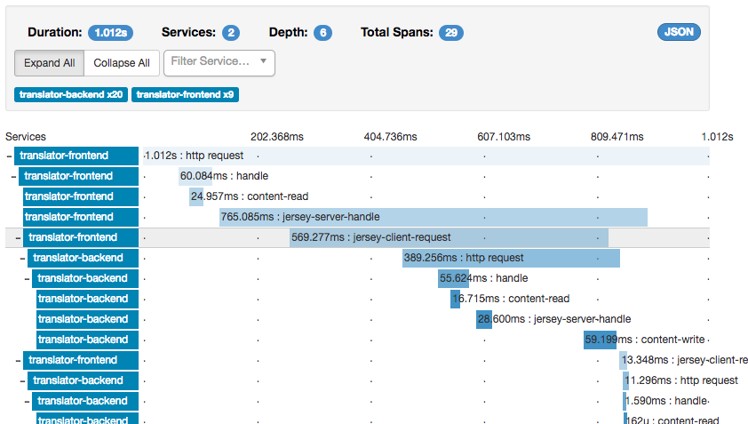

# Tracing

## Overview

Distributed tracing is a critical feature of microservice based applications, since it traces workflow both within a service and across multiple services. This provides insight to sequence and timing data for specific blocks of work, which helps you identify performance and operational issues. Helidon includes support for distributed tracing through its own API, backed by either [OpenTelemetry](https://opentelemetry.io/docs/instrumentation/js/api/tracing/), [Jaeger](https://www.jaegertracing.io/), or [Zipkin](https://zipkin.io/). Tracing is integrated with WebServer and Security.

> [!NOTE]
> As OpenTelemetry has subsumed [OpenTracing](https://opentracing.io), Helidon support for OpenTracing is deprecated and will likely be removed in a future release.

## Maven Coordinates

To enable Helidon Tracing, add the following dependency to your project’s `pom.xml` (see [Managing Dependencies](../about/managing-dependencies.md)).

``` xml
<dependencies>
    <dependency>
        <groupId>io.helidon.tracing</groupId>
        <artifactId>helidon-tracing</artifactId>    
    </dependency>
    <dependency>
        <groupId>io.helidon.webserver.observe</groupId>
        <artifactId>helidon-webserver-observe-tracing</artifactId> 
    </dependency>
</dependencies>
```

- Helidon tracing dependency.
- Observability dependencies for tracing.

To transmit tracing data from your service to a backend, you need to add a tracing provider to your project.

For Jaeger:

``` xml
<dependency>
    <groupId>io.helidon.tracing.providers</groupId>
    <artifactId>helidon-tracing-providers-jaeger</artifactId>
    <scope>runtime</scope>
</dependency>
```

For Zipkin:

``` xml
<dependency>
    <groupId>io.helidon.tracing.providers</groupId>
    <artifactId>helidon-tracing-providers-zipkin</artifactId>
    <scope>runtime</scope>
</dependency>
```

For OpenTelemetry:

``` xml
<dependency>
    <groupId>io.helidon.tracing.providers</groupId>
    <artifactId>helidon-tracing-providers-opentelemetry</artifactId>
    <scope>runtime</scope>
</dependency>
```

For OpenTracing (deprecated):

``` xml
<dependency>
    <groupId>io.helidon.tracing.providers</groupId>
    <artifactId>helidon-tracing-providers-opentracing</artifactId>
</dependency>
```

## Usage

This section explains a few concepts that you need to understand before you get started with tracing.

- In the context of this document, a *service* is synonymous with an application.
- A *span* is the basic unit of work done within a single service, on a single host. Every span has a name, starting timestamp, and duration. For example, the work done by a REST endpoint is a span. A span is associated to a single service, but its descendants can belong to different services and hosts.
- A *trace* contains a collection of spans from one or more services, running on one or more hosts. For example, if you trace a service endpoint that calls another service, then the trace would contain spans from both services. Within a trace, spans are organized as a directed acyclic graph (DAG) and can belong to multiple services, running on multiple hosts.
- *Baggage* is a collection of key-value pairs associated with a span.
- *Span context* captures data about a span not related to its duration, such as the tracer ID, the span ID, and baggage.

Support for specific tracers is abstracted. Your application can depend on the Helidon abstraction layer and provide a specific tracer implementation as a Java `ServiceLoader` service. Helidon provides such an implementation for:

- OpenTracing tracers, either using the `GlobalTracer`, provider resolver approach, or explicitly using Zipkin tracer
- OpenTelemetry tracers, either using the global OpenTelemetry instance, or explicitly using Jaeger tracer

### Setup WebServer

*Configuring `Tracer`*

``` java
Tracer tracer = TracerBuilder.create("helidon") 
        .build();

WebServer.builder()
        .addFeature(ObserveFeature.builder()
                            .addObserver(TracingObserver.create(tracer)) 
                            .build())
        .build()
        .start();
```

- Create a `Tracer`.
- Add an observability feature using the created `Tracer`.

### Creating Custom Spans

To create a custom span from tracer:

``` java
Span span = tracer.spanBuilder("name") 
        .tag("key", "value")
        .start();

try { 
    // do some work
    span.end();
} catch (Throwable t) { 
    span.end(t);
}
```

- Create span from tracer.
- Do some work and end span.
- End span with exception.

### Handling Baggage

Your application can set and read baggage associated with a [`Span`](/apidocs/io.helidon.tracing/io/helidon/tracing/Span.html). The `Span.baggage()` method returns a [`WritableBaggage`](/apidocs/io.helidon.tracing/io/helidon/tracing/WritableBaggage.html) instance.

Further, Helidon also provides read-only access to baggage linked to a [`SpanContext`](/apidocs/io.helidon.tracing/io/helidon/tracing/SpanContext.html). For example, HTTP headers can convey trace ID, span ID, and baggage information and Helidon puts such information into a `SpanContext`. Your code can create a `SpanContext` from other sources as well. The `SpanContext.baggage()` method returns a read-only [`Baggage`](/apidocs/io.helidon.tracing/io/helidon/tracing/Baggage.html) instance.

The JavaDoc for the types describes how to get and set baggage entries, get all the baggage keys, and check whether a baggage key exists in the baggage.

### Responding to Span Lifecycle Events

Applications and libraries can register listeners to be notified at several moments during the lifecycle of every Helidon span:

- Before a new span starts
- After a new span has started
- After a span ends
- After a span is activated (creating a new scope)
- After a scope is closed

The next sections explain how you can write and add a listener and what it can do. See the [`SpanListener`](/apidocs/io.helidon.tracing/io/helidon/tracing/SpanListener.html) Javadoc for more information.

#### Understanding What Listeners Do

A listener cannot affect the lifecycle of a span or scope it is notified about, but it can add tags and events and update the baggage associated with a span. Often a listener does additional work that does not change the span or scope such as logging a message.

When Helidon invokes the listener’s methods it passes proxies for the `Span.Builder`, `Span`, and `Scope` arguments. These proxies limit the access the listener has to the span builder, span, or scope, as summarized in the following table. If a listener method tries to invoke a forbidden operation, the proxy throws a [`SpanListener.ForbiddenOperationException`](/apidocs/io.helidon.tracing/io/helidon/tracing/SpanListener.ForbiddenOperationException.html) and Helidon then logs a `WARNING` message describing the invalid operation invocation.

| Tracing type | Changes allowed |
|----|----|
| [`Span.Builder`](/apidocs/io.helidon.tracing/io/helidon/tracing/Span.Builder.html) | Add tags |
| [`Span`](/apidocs/io.helidon.tracing/io/helidon/tracing/Span.html) | Retrieve and update baggage, add events, add tags |
| [`Scope`](/apidocs/io.helidon.tracing/io/helidon/tracing/Scope.html) | none |

Summary of Permitted Operations on Proxies Passed to Listeners

The following tables list specifically what operations the proxies permit.

| Method | Purpose | OK? |
|----|----|----|
| `build()` | Starts the span. | \- |
| `end` methods | Ends the span. | \- |
| `get()` | Starts the span. | \- |
| `kind(Kind)` | Sets the "kind" of span (server, client, internal, etc.) | \- |
| `parent(SpanContext)` | Sets the parent of the span to be created from the builder. | \- |
| `start()` | Starts the span. | \- |
| `start(Instant)` | Starts the span. | \- |
| `tag` methods | Add a tag to the builder before the span is built. | ✓ |
| `unwrap(Class)` | Cast the builder to the specified implementation type. † | ✓ |

[`io.helidon.tracing.Span.Builder`](/apidocs/io.helidon.tracing/io/helidon/tracing/Span.Builder.html) Operations

† Helidon returns the unwrapped object, not a proxy for it.

| Method | Purpose | OK? |
|----|----|----|
| `activate()` | Makes the span "current", returning a `Scope`. | \- |
| `addEvent` methods | Associate a string (and optionally other info) with a span. | ✓ |
| `baggage()` | Returns the `Baggage` instance associated with the span. | ✓ |
| `context()` | Returns the `SpanContext` associated with the span. | ✓ |
| `status(Status)` | Sets the status of the span. | \- |
| any `tag` method | Add a tag to the span. | ✓ |
| `unwrap(Class)` | Cast the span to the specified implementation type. † | ✓ |

[`io.helidon.tracing.Span`](/apidocs/io.helidon.tracing/io/helidon/tracing/Span.html) Operations

† Helidon returns the unwrapped object, not a proxy to it.

| Method       | Purpose                              | OK? |
|--------------|--------------------------------------|-----|
| `close()`    | Close the scope.                     | \-  |
| `isClosed()` | Reports whether the scope is closed. | ✓   |

[`io.helidon.tracing.Scope`](/apidocs/io.helidon.tracing/io/helidon/tracing/Scope.html) Operations

| Method | Purpose | OK? |
|----|----|----|
| `asParent(Span.Builder)` | Sets this context as the parent of a new span builder. | ✓ |
| `baggage()` | Returns `Baggage` instance associated with the span context. | ✓ |
| `spanId()` | Returns the span ID. | ✓ |
| `traceId()` | Returns the trace ID. | ✓ |

[`io.helidon.tracing.SpanContext`](/apidocs/io.helidon.tracing/io/helidon/tracing/SpanContext.html) Operations

#### Adding a Listener

##### Explicitly Registering a Listener on a [`Tracer`](/apidocs/io.helidon.tracing/io/helidon/tracing/Tracer.html)

Create a `SpanListener` instance and invoke the `Tracer#register(SpanListener)` method to make the listener known to that tracer.

##### Automatically Registering a Listener on all `Tracer` Instances

Helidon also uses Java service loading to locate listeners and register them automatically on all `Tracer` objects. Follow these steps to add a listener service provider.

1.  Implement the [`SpanListener`](/apidocs/io.helidon.tracing/io/helidon/tracing/SpanListener.html) interface.
2.  Declare your implementation as a service provider:
    1.  Create the file `META-INF/services/io.helidon.tracing.SpanListener` containing a line with the fully-qualified name of your class which implements `SpanListener`.
    2.  If your service has a `module-info.java` file add the following line to it:

        ``` java
        provides io.helidon.tracing.SpanListener with <your-implementation-class>;
        ```

The `SpanListener` interface declares default no-op implementations for all the methods, so your listener can implement only the methods it needs to.

Helidon invokes each listener’s methods in the following order:

| Method | When invoked |
|----|----|
| `starting(Span.Builder<?> spanBuilder)` | Just before a span is started from its builder. |
| `started(Span span)` | Just after a span has started. |
| `activated(Span span, Scope scope)` | After a span has been activated, creating a new scope. A given span might never be activated; it depends on the code. |
| `closed(Span span, Scope scope)` | After a scope has been closed. |
| `ended(Span span)` | After a span has ended successfully. |
| `ended(Span span, Throwable t)` | After a span has ended unsuccessfully. |

Order in which Helidon Invokes Listener Methods

#### Lifecycle Callbacks with OpenTelemetry Types

To use lifecycle callbacks, applications should normally work with the Helidon `Tracer`, `Span.Builder`, `Span`, and `Scope` types which automatically call back to each registered `SpanListener`.

In some cases application code might want to use a reference to an OpenTelemetry `Tracer` or `Span` *rather than* a reference to the Helidon counterpart but still want to respond to lifecycle events as the OpenTelemetry object goes through its lifecycle.

The [`HelidonOpenTelemetry`](/apidocs/io.helidon.tracing.providers.opentelemetry/io/helidon/tracing/providers/opentelemetry/HelidonOpenTelemetry.html) type provides several methods which enable callbacks for OpenTelemetry objects, as summarized in the following table.

| `HelidonOpenTelemetry` method | Return value |
|----|----|
| [`Tracer callbackEnabledFrom(helidonTracer)`](/apidocs/io.helidon.tracing.providers.opentelemetry/io/helidon/tracing/providers/opentelemetry/HelidonOpenTelemetry.html#callbackEnabledFrom(io.helidon.tracing.Tracer)) | Callback-enabled OpenTelemetry `Tracer` corresponding to the specified Helidon `Tracer`. |
| [ `Tracer callbackEnabledFrom(otelTracer)`](/apidocs/io.helidon.tracing.providers.opentelemetry/io/helidon/tracing/providers/opentelemetry/HelidonOpenTelemetry.html#callbackEnabledFrom(io.opentelemetry.api.trace.Tracer)) | Callback-enabled OpenTelemetry `Tracer` for the specified OpenTelemetry `Tracer`. |
| [ `Span callbackEnabledFrom(helidonSpan)`](/apidocs/io.helidon.tracing.providers.opentelemetry/io/helidon/tracing/providers/opentelemetry/HelidonOpenTelemetry.html#callbackEnabledFrom(io.helidon.tracing.Span)) | Callback-enabled OpenTelemetry `Span` corresponding to the specified Helidon `Span`. |
| [ `Span callbackEnabledFrom(otelSpan)`](/apidocs/io.helidon.tracing.providers.opentelemetry/io/helidon/tracing/providers/opentelemetry/HelidonOpenTelemetry.html#callbackEnabledFrom(io.opentelemetry.api.trace.Span)) | Callback-enabled OpenTelemetry `Span` for the specified OpenTelemetry `Span`. |

Enabling OpenTelemetry Objects for `SpanListener` Support

An OpenTelemetry object returned from a method on a callback-enabled object is itself callback-enabled automatically. Specifically:

- `SpanBuilder` returned from `Tracer#spanBuilder(String)`.
- `Span` returned from `SpanBuilder#startSpan`.
- `Scope` returned from `Span#makeCurrent`.

Each callback-enabled object is a new instance of a *Helidon* object which implements both the indicated OpenTelemetry interface and the Helidon [`Wrapper`](/apidocs/io.helidon.tracing/io/helidon/tracing/Wrapper.html) interface. These Helidon objects *do not* themselves implement other OpenTelemetry interfaces. To do type checks and casts on callback-enabled objects, invoke the `unwrap(Class<?>)` on a callback-enabled object as shown in the following example.

``` java
// Note that callbackEnabledSpan implements OpenTelemetry Span.
io.opentelemetry.api.trace.Span nativeOtelSpan = callbackEnabledSpan.unwrap(io.opentelemetry.api.trace.Span.class);
if (nativeOtelSpan instanceof io.opentelemetry.sdk.trace.ReadableSpan readableSpan) {
    // Work with the span as a ReadableSpan
}
```

Remember that operations on the `nativeOtelSpan` variable *do not* notify span listeners of lifecycle changes.

## Helidon Spans

## Traced spans

The following table lists all spans traced by Helidon components:

| component | span name | description |
|----|----|----|
| `web-server` | `HTTP Request` | The overall span of the Web Server from request initiation until response Note that in `Zipkin` the name is replaced with `jax-rs` span name if `jax-rs` tracing is used. |
| `web-server` | `content-read` | Span for reading the request entity |
| `web-server` | `content-write` | Span for writing the response entity |
| `security` | `security` | Processing of request security |
| `security` | `security:atn` | Span for request authentication |
| `security` | `security:atz` | Span for request authorization |
| `security` | `security:response` | Processing of response security |
| `security` | `security:outbound` | Processing of outbound security |
| `jax-rs` | A generated name | Span for the resource method invocation, name is generated from class and method name |
| `jax-rs` | `jersey-client-call` | Span for outbound client call |

Some of these spans `log` to the span. These log events can be (in most cases) configured:

| span name | log name | configurable | enabled by default | description |
|----|----|----|----|----|
| `HTTP Request` | `handler.class` | YES | YES | Each handler has its class and event logged |
| `security` | `status` | YES | YES | Logs either "status: PROCEED" or "status: DENY" |
| `security:atn` | `security.user` | YES | NO | The username of the user if logged in |
| `security:atn` | `security.service` | YES | NO | The name of the service if logged in |
| `security:atn` | `status` | YES | YES | Logs the status of security response (such as `SUCCESS`) |
| `security:atz` | `status` | YES | YES | Logs the status of security response (such as `SUCCESS`) |
| `security:outbound` | `status` | YES | YES | Logs the status of security response (such as `SUCCESS`) |

There are also tags that are set by Helidon components. These are not configurable.

| span name | tag name | description |
|----|----|----|
| `HTTP Request` | `component` | name of the component - `helidon-webserver`, or `jaxrs` when using MP |
| `HTTP Request` | `http.method` | HTTP method of the request, such as `GET`, `POST` |
| `HTTP Request` | `http.status_code` | HTTP status code of the response |
| `HTTP Request` | `http.url` | The path of the request (for SE without protocol, host and port) |
| `HTTP Request` | `error` | If the request ends in error, this tag is set to `true`, usually accompanied by logs with details |
| `security` | `security.id` | ID of the security context created for this request (if security is used) |
| `jersey-client-call` | `http.method` | HTTP method of the client request |
| `jersey-client-call` | `http.status_code` | HTTP status code of client response |
| `jersey-client-call` | `http.url` | Full URL of the request (such as `http://localhost:8080/greet`) |

## Configuration

The following configuration should be supported by all tracer implementations (if feasible)

## Configuration options

| Key | Kind | Type | Default Value | Description |
|----|----|----|----|----|
| <span id="ae09ad-boolean-tags"></span> `boolean-tags` | `MAP` | `Boolean` |   | Tracer level tags that get added to all reported spans |
| <span id="a6d3db-enabled"></span> `enabled` | `VALUE` | `Boolean` | `true` | When enabled, tracing will be sent |
| <span id="a701d5-global"></span> `global` | `VALUE` | `Boolean` | `true` | When enabled, the created instance is also registered as a global tracer |
| <span id="a7d2ab-host"></span> `host` | `VALUE` | `String` |   | Host to use to connect to tracing collector |
| <span id="ad8eb0-int-tags"></span> `int-tags` | `MAP` | `Integer` |   | Tracer level tags that get added to all reported spans |
| <span id="a912bb-path"></span> `path` | `VALUE` | `String` |   | Path on the collector host to use when sending data to tracing collector |
| <span id="ad6020-port"></span> `port` | `VALUE` | `Integer` |   | Port to use to connect to tracing collector |
| <span id="a3c6c7-protocol"></span> `protocol` | `VALUE` | `String` |   | Protocol to use (such as `http` or `https`) to connect to tracing collector |
| <span id="af9a68-service"></span> `service` | `VALUE` | `String` |   | Service name of the traced service |
| <span id="a0f568-tags"></span> `tags` | `MAP` | `String` |   | Tracer level tags that get added to all reported spans |

### Traced Spans Configuration

Each component and its spans can be configured using Config. The traced configuration has the following layers:

- `TracingConfig` - the overall configuration of traced components of Helidon
- `ComponentTracingConfig` - a component of Helidon that traces spans (such as `web-server`, `security`, `jax-rs`)
- `SpanTracingConfig` - a single traced span within a component (such as `security:atn`)
- `SpanLogTracingConfig` - a single log event on a span (such as `security.user` in span `security:atn`)

The components using tracing configuration use the `TracingConfigUtil`. This uses the `io.helidon.common.Context` to retrieve current configuration.

#### Configuration Using Builder

Builder approach, example that disables a single span log event:

*Configure tracing using a builder*

``` java
TracingConfig.builder()
        .addComponent(ComponentTracingConfig.builder("web-server")
                              .addSpan(SpanTracingConfig.builder("HTTP Request")
                                               .addSpanLog(SpanLogTracingConfig.builder("content-write")
                                                                   .enabled(false)
                                                                   .build())
                                               .build())
                              .build())
        .build();
```

#### Configuration using Helidon Config

Tracing configuration can be defined in a config file.

*Tracing configuration*

``` yaml
tracing:
    components:
      web-server:
        spans:
          - name: "HTTP Request"
            logs:
              - name: "content-write"
                enabled: false
```

*Use the configuration in web server*

``` java
Tracer tracer = TracerBuilder.create(config.get("tracing")).build(); 
server.addFeature(ObserveFeature.builder()
                          .addObserver(TracingObserver.create(tracer)) 
                          .build());
```

- Create `Tracer` using `TracerBuilder` from configuration.
- Add the `Tracer` as an observability feature.

#### Path-based Configuration in Helidon WebServer

For Web Server we have path-based support for configuring tracing, in addition to the configuration described above.

Configuration of path can use any path string supported by the WebServer. The configuration itself has the same possibilities as traced configuration described above. The path-specific configuration will be merged with global configuration (path is the "newer" configuration, global is the "older")

*Configuration in YAML*

``` yaml
tracing:
  paths:
    - path: "/favicon.ico"
      enabled: false
    - path: "/metrics"
      enabled: false
    - path: "/health"
      enabled: false
    - path: "/greet"
      components:
        web-server:
          spans:
          - name: "content-read"
            new-name: "read"
            enabled: false
```

#### Renaming top level span using request properties

To have a nicer overview in search pane of a tracer, you can customize the top-level span name using configuration.

Example:

*Configuration in YAML*

``` yaml
tracing:
  components:
    web-server:
      spans:
      - name: "HTTP Request"
        new-name: "HTTP %1$s %2$s"
```

This is supported ONLY for the span named "HTTP Request" on component "web-server".

Parameters provided:

1.  Method - HTTP method
2.  Path - path of the request (such as '/greet')
3.  Query - query of the request (may be null)

## Additional Information

### WebClient Span Propagation

Span propagation is supported with Helidon WebClient. Tracing propagation is automatic as long as the current span context is available in Helidon Context (which is automatic when running within a WebServer request).

``` xml
<dependencies>
    <dependency>
        <groupId>io.helidon.webclient</groupId>
        <artifactId>helidon-webclient</artifactId>
    </dependency>
    <dependency>
        <groupId>io.helidon.webclient</groupId>
        <artifactId>helidon-webclient-tracing</artifactId>
    </dependency>
</dependencies>
```

*Tracing propagation with Helidon WebClient*

``` java
WebClient client = WebClient.builder()
        .addService(WebClientTracing.create())
        .build();

String response = client.get()
        .uri(uri)
        .requestEntity(String.class);
```

### Jaeger Tracing

``` xml
<dependency>
    <groupId>io.helidon.tracing</groupId>
    <artifactId>helidon-tracing-providers-jaeger</artifactId>
</dependency>
```

## Configuring Jaeger

## Configuration options

| Key | Kind | Type | Default Value | Description |
|----|----|----|----|----|
| <span id="aed342-client-cert-pem"></span> [`client-cert-pem`](../config/io_helidon_common_configurable_Resource.md) | `VALUE` | `i.h.c.c.Resource` |   | Certificate of client in PEM format |
| <span id="a097b8-exporter-timeout"></span> `exporter-timeout` | `VALUE` | `Duration` | `PT10S` | Timeout of exporter requests |
| <span id="a24a43-max-export-batch-size"></span> `max-export-batch-size` | `VALUE` | `Integer` | `512` | Maximum Export Batch Size of exporter requests |
| <span id="ade69e-max-queue-size"></span> `max-queue-size` | `VALUE` | `Integer` | `2048` | Maximum Queue Size of exporter requests |
| <span id="a5d885-private-key-pem"></span> [`private-key-pem`](../config/io_helidon_common_configurable_Resource.md) | `VALUE` | `i.h.c.c.Resource` |   | Private key in PEM format |
| <span id="a65431-propagation"></span> [`propagation`](../config/io_helidon_tracing_providers_jaeger_JaegerTracerBuilder_PropagationFormat.md) | `LIST` | `i.h.t.p.j.J.PropagationFormat` | `JAEGER` | Add propagation format to use |
| <span id="aa4177-sampler-param"></span> `sampler-param` | `VALUE` | `Number` | `1` | The sampler parameter (number) |
| <span id="a28b35-sampler-type"></span> [`sampler-type`](../config/io_helidon_tracing_providers_jaeger_JaegerTracerBuilder_SamplerType.md) | `VALUE` | `i.h.t.p.j.J.SamplerType` | `CONSTANT` | Sampler type |
| <span id="a8ee29-schedule-delay"></span> `schedule-delay` | `VALUE` | `Duration` | `PT5S` | Schedule Delay of exporter requests |
| <span id="a1bdae-span-processor-type"></span> [`span-processor-type`](../config/io_helidon_tracing_providers_jaeger_JaegerTracerBuilder_SpanProcessorType.md) | `VALUE` | `i.h.t.p.j.J.SpanProcessorType` | `batch` | Span Processor type used |
| <span id="a667f5-trusted-cert-pem"></span> [`trusted-cert-pem`](../config/io_helidon_common_configurable_Resource.md) | `VALUE` | `i.h.c.c.Resource` |   | Trusted certificates in PEM format |

The following is an example of a Jaeger configuration, specified in the YAML format.

``` yaml
tracing:
    service: "helidon-full-http"
    protocol: "https"
    host: "jaeger"
    port: 14240
```

### Jaeger Tracing Metrics

As the [Jaeger Tracing](#jaeger-tracing) section describes, you can use Jaeger tracing in your Helidon application.

### Zipkin Tracing

``` xml
<dependency>
    <groupId>io.helidon.tracing.providers</groupId>
    <artifactId>helidon-tracing-providers-zipkin</artifactId>
</dependency>
```

## Configuring Zipkin

## Configuration options

| Key | Kind | Type | Default Value | Description |
|----|----|----|----|----|
| <span id="a3dd17-api-version"></span> [`api-version`](../config/io_helidon_tracing_providers_zipkin_ZipkinTracerBuilder_Version.md) | `VALUE` | `i.h.t.p.z.Z.Version` | `V2` | Version of Zipkin API to use |

The following is an example of a Zipkin configuration, specified in the YAML format.

``` yaml
tracing:
  zipkin:
    service: "helidon-service"
    protocol: "https"
    host: "zipkin"
    port: 9987
    api-version: 1
    # this is the default path for API version 2
    path: "/api/v2/spans"
    tags:
      tag1: "tag1-value"
      tag2: "tag2-value"
    boolean-tags:
      tag3: true
      tag4: false
    int-tags:
      tag5: 145
      tag6: 741
```

Example of Zipkin trace:

<figure>

</figure>

### OpenTelemetry Tracing

Helidon supports configuration of OpenTelemetry and OpenTelemetry tracing in two primary ways: using tracing or using telemetry. This page describes support for controlling OpenTelemetry tracing using the `tracing` config section and [`OpenTelemetryConfig` builder](/apidocs/io.helidon.tracing.providers.opentelemetry/io/helidon/tracing/providers/opentelemetry/OpenTelemetryTracerConfig.html). Users typically adopt this approach to ease migration from other tracing providers (such as Jaeger) to OpenTelemetry because the tracing settings supported for OpenTelemetry are very similar to those for Jaeger.

That said, Helidon’s support for OpenTelemetry using *tracing* does not afford as much control as do the Helidon *telemetry* settings. For example, using OpenTelemetry `tracing` config you can choose either the OTLP gRPC span exporter or the OTLP HTTP one; additional span exporters are available only using the `telemetry` settings.

The [telemetry doc page](../se/telemetry/open-telemetry.md) describes how to use the Helidon `telemetry` config section and the related builder to exert more control over OpenTelemetry and OpenTelemetry tracing behavior.

> [!NOTE]
> If you provide settings under both `telemetry` and `tracing`, Helidon uses the `telemetry` settings. Specifying both does not confuse Helidon but it might confuse users.

*Dependency for OpenTelemetry support using tracing*

``` xml
<dependency>
    <groupId>io.helidon.tracing.providers</groupId>
    <artifactId>helidon-tracing-providers-opentelemetry</artifactId>
</dependency>
```

## Configuring OpenTelemetry Tracing

## Configuration options

| Key | Kind | Type | Default Value | Description |
|----|----|----|----|----|
| <span id="aec0bf-exporter-type"></span> [`exporter-type`](../config/io_helidon_tracing_providers_opentelemetry_OtlpExporterProtocolType.md) | `VALUE` | `i.h.t.p.o.OtlpExporterProtocolType` | `GRPC` | Type of OTLP exporter to use for pushing span data |
| <span id="a0fe59-propagators"></span> `propagators` | `LIST` | `i.h.t.p.o.O.CustomMethods` |   | Context propagators |

*Example Helidon configuration for OpenTelemetry tracing*

``` yaml
tracing:
  service: helidon-otel-tracing-example 
  global: false      
  int-tags:
    example: 1       
  tags:
    direction: north 
```

- Specifies the OpenTelemetry service name.
- Indicates the configured tracer *should not* be made the global tracer (defaults to `true`).
- Assigns an integer-valued tag `example` the value `1`.
- Assigns a string-valued tag `direction` the value `north`.

By default, Helidon tracing support for OpenTelemetry uses OpenTelemetry’s OTLP gRPC exporter. Alternatively, you can choose to use OpenTelemetry’s HTTP exporter using protobuf by setting `exporter-type` to `http/proto`. To use other exporters OpenTelemetry offers, use the Helidon `telemetry` configuration instead of `tracing`.

## Reference

- [OpenTelemetry API](https://opentelemetry.io/docs/instrumentation/js/api/tracing/)
- [Opentracing Project (now part of OpenTelemetry)](https://opentracing.io/)
